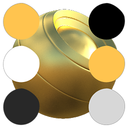

# Conversor de BaseColor / Metálico / Aspereza

<table>
<tr style="border: 0;">
<td width="33.33%" style="border: 0;" valign="top">

{width="128px"}

<b>Entrada:</b> Filtros Materiais > Utilitários PBR

</td>
<td width="100.00%" style="border: 0;" valign="top">

## Descrição

Este nó converte os mapas de Basecolor, Metallic e Roughness em diferentes saídas de modelo PBR, como o modelo de Specular/Textura reluzente. Alguns dos alvos de saída incluídos são motores de renderização bem conhecidos, como Vray, Corona, Redshift, Renderman e Arnold.

Isso é útil se você tiver gráficos ou materiais criados com um modelo de PBR, enquanto seu destino requer um modelo diferente.

</td>
</tr>
</table>

## Parâmetros

|  |  |
|:---|:---|
| <b>Usar entrada SpecularLevel</b> <i>Falso/Verdadeiro</i> | Expõe um slot de entrada extra para a entrada SpecularLevel. Isso também é levado em conta durante a conversão. |
| <b>Destino</b> <i>Difusões/Speculares/Brilho PBR, Vray (GGX), Corona, Corona 1.6+, Redshift 1.x, Arnold 4 (AiStandard), Arnold 4 (AlSurface), RenderMan (PxrSurface)</i> | Define o modelo de destino de conversão. |
