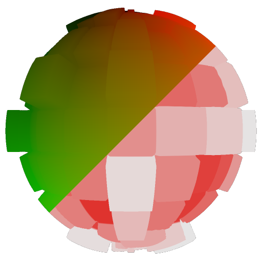

# Mapeamento de renderizações PBR

<table>
<tr style="border: 0;">
<td style="border: 0;" valign="top">

## Mapeamento de renderizações PBR (cor/tons de cinza)

**Entrada:** *Filtros de Material/Utilitários PBR*

**Simples**

</td>
<td style="border: 0;" valign="top">

## Descrição

Este é um nó de extensão para o [nó de Renderização PBR](../../../../../../compositing-graphs/nodes-reference-for-com/node-library/material-filters/pbr-utilities/pbr-render/pbr-render.md), que permite mapear uma textura separada na forma de uma [Renderização PBR](../../../../../../compositing-graphs/nodes-reference-for-com/node-library/material-filters/pbr-utilities/pbr-render/pbr-render.md) anterior. Seu principal objetivo é permitir que você remapeie cada canal separado de sua [Renderização PBR](../../../../../../compositing-graphs/nodes-reference-for-com/node-library/material-filters/pbr-utilities/pbr-render/pbr-render.md), de volta para a forma, para criar detalhamentos de canal de mapa compostos, como nos exemplos abaixo. Você pode criar seu próprio método composto e máscaras usando os nós de mapeamento de Renderização PBR como componente.

Existem versões de cor e tons de cinza para os dois tipos de dados: use cor para mapas difusos, use tons de cinza para mapas de aspereza, metálicos e outros mapas em tons de cinza.

### Entradas

* **Textura**: *Entrada Colorida/Em Tons De Cinza*\
  Textura para mapear na forma.
* **UVs**: *Entrada de cores* Entrada de dados UV obrigatória de um nó de Renderização PBR [.](../../../../../../compositing-graphs/nodes-reference-for-com/node-library/material-filters/pbr-utilities/pbr-render/pbr-render.md)

## Parâmetros

* **Cor do plano de fundo**: *(valor da cor)*Defina um valor de cor sólida para usar no plano de fundo.

## Imagens de exemplo

O exemplo é um composto de quatro nós de Mapeamento de Renderização PBR diferentes, usando uma [Seleção de histograma](../../../../../../compositing-graphs/nodes-reference-for-com/node-library/filters/adjustments/histogram-select/histogram-select.md) em um [Gradiente linear](../../../../../../compositing-graphs/nodes-reference-for-com/node-library/texture-generators/patterns/gradient-linear-1/gradient-linear-1.md) como máscaras.

{width="256px"}

{width="256px"}

</td>
</tr>
</table>
