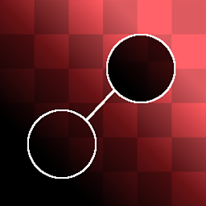
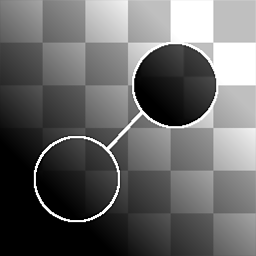

# Patch do clone

<table>
<tr style="border: 0;">
<td style="border: 0;" valign="top">

{width="128px"}

{width="128px"}

## Patch de clone / Tons de cinza do patch de clone

**Entrada:** *Filtros de Material/Processamento de Digitalização*

**Complexo**

</td>
<td style="border: 0;" valign="top">

## Descrição

Patch de clone é um nó “Carimbo” paramétrico e processual. Ele clona uma área de uma entrada para outra, ocultando detalhes potencialmente indesejados. Embora não seja tão rápido e fácil quanto usar uma ferramenta familiar em um aplicativo baseado em pincel, ele oferece a principal vantagem de não ser destrutivo e trabalhar em um fluxo de trabalho baseado em nó. Além disso, este nó executa uma análise inteligente da área de destino e de origem e tenta mesclar as coisas da melhor maneira possível com base no contraste, nos valores e nas formas.

Isso é destinado principalmente para aqueles momentos raros onde você deseja fazer uma correção manual de uma área específica, no caso de haver um detalhe indesejado em algum lugar.

Lembre-se de que isso não funciona como um pincel padrão, simples, de “carimbo”. A forma da área mesclada é baseada nas formas e valores das áreas com as quais você está trabalhando, o que significa que este é um nó bastante pesado que requer paciência, mas oferece excelentes resultados.

Também é importante entender o fato de que você pode mover a área de destino com um cursor, mas a área de origem precisa ser definida alterando os parâmetros da “Matriz de origem”.

>[!NOTE]
>
> Se você quiser isso para um material completo (como é o caso com mais frequência), consulte [Correção de clonagem de material](../../../../../../compositing-graphs/nodes-reference-for-com/node-library/material-filters/scan-processing/material-clone-patch/material-clone-patch.md).
> 
> Para os casos em que você deseja executar esta operação em várias entradas ao mesmo tempo (sem que seja um material), consulte [Patch de vários clones](../../../../../../compositing-graphs/nodes-reference-for-com/node-library/material-filters/scan-processing/multi-clone-patch/multi-clone-patch.md).

## Parâmetros

* **É Normal (somente para Cor)**: *Falso/Verdadeiro*\
  Define se a entrada é um mapa normal e se a mesclagem deve ser tratada como tal.
* **Forma**: *Quadrado, Disco* Define a forma do carimbo. Usado somente como base.
* **Borda**
  * **Limite**: *0.0 - 1.0* Define até onde a área mesclada deve chegar. Isso cresce em etapas, ao longo das formas na área de destino e tem muito pouco efeito com fundos uniformes*.*
  * **Desfoque**: *0.0 - 2.0* Desfoca as bordas da área do carimbo caso seja necessária uma transição mais suave.
  * **Smoothness**: *0.0 - 2.0* Arredonda as bordas da forma do carimbo, criando contornos mais suaves.
  * **Resolução da grade**: *1 - 11* Define a resolução de qualidade da análise de mesclagem. Um valor mais alto significa uma mesclagem mais precisa.
* **Transformações**
  * **Matriz de Origem**: *(Matriz de Transformação)*Transforma a origem (Escala e Rotação). Não pode ser feito na tela, altere somente através destes parâmetros.
  * **Deslocamento de Origem**: *-0.5 - 0.5* Converte o local de origem. Não pode ser feito na tela, altere somente através destes parâmetros. *Este parâmetro é provavelmente o principal que você deseja alterar!*
  * **Matriz de Destino**: *(Matriz de Transformação)*Transforma o local de destino (Escala e Rotação). Também pode ser feito por meio do gizmo na tela.
  * **Deslocamento de Destino**: *-0.5 - 0.5* Converte o local de destino. Também pode ser feito por meio do gizmo na tela.

## Imagens de exemplo

|  |
| --- |
| Não há imagens anexadas a esta página. |

</td>
</tr>
</table>
