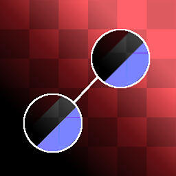

# Correção de Clonar de material

<table>
<tr style="border: 0;">
<td width="33.33%" style="border: 0;" valign="top">

{width="128px"}

<b>Entrada:</b> Filtros Materiais > Processamento de materiais escaneados

</td>
<td width="100.00%" style="border: 0;" valign="top">

## Descrição

Esta é a versão do material completo Multicanal do [Clonar Patch](../../../../../../compositing-graphs/nodes-reference-for-com/node-library/material-filters/scan-processing/clone-patch/clone-patch.md). Ele executa um Clonar Patch em todos e quaisquer canais de um material. [Consulte a versão original para obter mais informações!](../../../../../../compositing-graphs/nodes-reference-for-com/node-library/material-filters/scan-processing/clone-patch/clone-patch.md)

Isso é muito útil se você quiser remover um detalhe de todos os canais de um material. Gera uma saída de imagens de depuração para vários canais, para que a área de correção inteligente fique exatamente como ela é.

</td>
</tr>
</table>

## Entradas

|  |  |
|:---|:---|
| <b>Máscara</b> <i>Entrada em tons de cinza</i> | Slot de máscara usado para mascarar os efeitos do nó. Pode ser alternado com o parâmetro “Máscara”. |

## Parâmetros

|  |  |
|:---|:---|
| <b>Canais</b> | Ative e desative os canais de material neste grupo, por exemplo, ao usar mapas de Specular/Textura reluzente em vez de Metálico/Aspereza. |
| <b>Forma</b> <i>Quadrado, Disco</i> | Define a forma do carimbo. Usado somente como base. |
| <b>Borda</b> |  |
| <b>Limite (para vários canais)</b> <i>0.0 - 1.0</i> | Define o quanto a área mesclada deve chegar. Isso cresce em etapas, ao longo das formas na área de destino, por isso tem muito pouco efeito com fundos uniformes. Tenha cuidado ao alterar isso demais entre os canais, pois isso pode levar a discrepâncias visuais! |
| <b>Desfoque</b> <i>0.0 - 2.0</i> | Desfoca as bordas da área do carimbo caso seja necessária uma transição mais suave. |
| <b>Smoothness</b> <i>0.0 - 2.0</i> | Arredonda as bordas da forma do carimbo, criando contornos de fluxo mais suaves. |
| <b>Resolução da Grade</b> <i>1 - 11</i> | Define a resolução de qualidade da análise de mesclagem. Um valor mais alto significa uma mesclagem mais precisa. |
| <b>Transformações</b> |  |
| <b>Matriz de Origem</b> <i>(Matriz de Transformação)</i> | Transforma a origem (Dimensionamento e rotação). Não pode ser feito na tela, altere somente através destes parâmetros. |
| <b>Deslocamento de Origem</b> <i>-0.5 - 0.5</i> | Converte o local de origem. Não pode ser feito na tela, altere somente através destes parâmetros. *Este parâmetro é provavelmente o principal que você deseja alterar!* |
| <b>Matriz de Destino</b> <i>(Matriz de Transformação)</i> | Transforma o local de destino (Dimensionamento e rotação). Também pode ser feito por meio do gizmo na tela. |
| <b>Deslocamento de Destino</b> <i>-0.5 - 0.5</i> | Converte o local de destino. Também pode ser feito por meio do gizmo na tela. |
