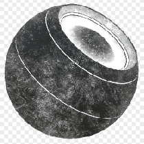

# Terra

<table>
<tr style="border: 0;">
<td style="border: 0;" valign="top">

{width="128px"}

## Terra

**Entrada:** *Geradores Baseados Em Malha**/Geradores De Máscara*

**Intermediário**

</td>
<td style="border: 0;" valign="top">

## Descrição

Gera uma máscara em preto e branco com base em mapas baked e configurações do usuário. Semelhante às [Máscaras Inteligentes](https://support.allegorithmic.com/documentation/display/SPDOC/Smart+Materials+and+Masks) do [Painter](https://support.allegorithmic.com/documentation/display/SPDOC/Substance+Painter).

Essa máscara representa dirt em bordas e cantos ocultos e afundados, com base no AO assado e na curvatura.

## Parâmetros

### Entradas

* **Curvatura**: *Entrada em tons de cinza*\
  Mapa baked usado para efeitos internos e mascaramento. Obrigatório!
* **Oclusão De Ambiente**: *Entrada Em Tons De Cinza*\
  Mapa baked usado para efeitos internos e mascaramento. Obrigatório!
* **Entrada de Desgaste**: *entrada em tons de cinza*\
  Entrada do mapa de desgaste personalizado, opcional, ativada por parâmetro.
* **Máscara (opcional)**: *Entrada em tons de cinza*\
  Slot de máscara usado para mascarar os efeitos do nó.
* **Espaço Mundial Normal**: *Entrada de Cores*\
  Usado apenas para Triplanar.
* **Posição**: *Entrada de cores*\
  Usado apenas para Triplanar.

### Parâmetros

* **Nível de Dirt**: *0.0 - 1.0* Controle principal para a quantidade de dirt.
* **Contraste de Dirt**: *0.0 - 1.0* Controla o contraste principal do dirt na máscara.
* **Quantidade de Desgastes**: *0.0 - 1.0* Define o nível de sujeira do dirt. Defina como 0 para um dirt perfeitamente suave.
* **Mascaramento de bordas**: *0.0 - 1.0* Quantidade de dirt a ser removida das bordas elevadas (com base no mapa de curvatura).
* **Usar Desgaste Personalizado**: *Falso/Verdadeiro* Habilita o uso da entrada do mapa de desgaste personalizado em vez do Desgaste interno.
* **Escala do Desgaste**: *1 - 16* Define a escala lado a lado dos detalhes do Desgaste.
* **Usar Triplanar**: *Falso/Verdadeiro* Usar a [projeção Triplanar](../../../../../../compositing-graphs/nodes-reference-for-com/node-library/mesh-based-generators/utilities-mesh-based-gen/tri-planar/tri-planar.md) para o mapeamento de Desgaste, remove as costuras.
* **Contraste de Mesclagem Triplanar**: *0.001 - 1.0* Define o contraste da projeção Triplanar.

## Imagens de exemplo

</td>
</tr>
</table>
