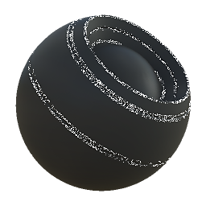

# Edge Speckle

<table>
<tr style="border: 0;">
<td width="33.33%" style="border: 0;" valign="top">

{width="128px"}

<b>Entrada:</b> Geradores > Geradores de máscara Baseados em Malha

</td>
<td width="100.00%" style="border: 0;" valign="top">

## Descrição

Gera uma máscara em preto e branco com base em mapas baked e configurações do usuário. Semelhante às [Máscaras Inteligentes](https://support.allegorithmic.com/documentation/display/SPDOC/Smart+Materials+and+Masks) do [Painter](https://support.allegorithmic.com/documentation/display/SPDOC/Substance+Painter).

Essa máscara representa as bordas com um leve respingo adicionado para quebrá-las. Consulte também [Dirt de borda](../../../../../../compositing-graphs/nodes-reference-for-com/node-library/mesh-based-generators/mask-generators/edge-dirt/edge-dirt.md).

</td>
</tr>
</table>

## Entradas

|  |  |
|:---|:---|
| <b>Curvatura</b> <i>Entrada em tons de cinza</i> | Mapa baked usado para realce de Aresta. Obrigatório! |
| <b>Máscara de Variação</b> <i>Entrada em tons de cinza</i> | Slot de máscara opcional usado para mascarar os efeitos do nó. Ative com “substituir máscara de variação”. |
| <b>Máscara (opcional)</b> <i>Entrada em tons de cinza</i> | Slot de máscara usado para mascarar os efeitos do nó. |

## Parâmetros

|  |  |
|:---|:---|
| <b>Nível</b> <i>0.0 - 1.0</i> | Define a quantidade total de realce de borda. |
| <b>Contraste</b> <i>0.0 - 1.0</i> | Ajusta o contraste do resultado. |
| <b>Seleção de borda</b> <i>0.0 - 1.0</i> | Define a influência de bordas convexas. |
| <b>Variação</b> <i>0.0 - 1.0</i> | Define a extensão em que a máscara de variação divide o efeito. |
| <b>Substituir máscara de variação</b> <i>Falso/Verdadeiro</i> | Substitui a máscara interna com o slot de entrada personalizado. |

## Exemplos

<table style="margin-top: 32px; margin-bottom: 32px">
    <tr style="border: 0">
        <td style="border: 0; background: transparent">
            
        </td>
    </tr>
</table>
