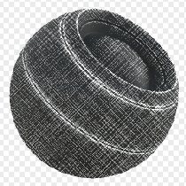

# Edge Wear de fibra de vidro

<table>
<tr style="border: 0;">
<td width="33.33%" style="border: 0;" valign="top">

{width="128px"}

<b>Entrada:</b> Geradores > Geradores de máscara Baseados em Malha

</td>
<td width="100.00%" style="border: 0;" valign="top">

## Descrição

Gera uma máscara em preto e branco com base em mapas baked e configurações do usuário. Semelhante às [Máscaras Inteligentes](https://support.allegorithmic.com/documentation/display/SPDOC/Smart+Materials+and+Masks) do [Painter](https://support.allegorithmic.com/documentation/display/SPDOC/Substance+Painter).

Representa uma máscara especificamente destinada a um tipo de desgaste de fibra de vidro, que talvez pudesse ser usada para tecidos. Devido à natureza muito ladrilhada e repetitiva das fibras, a mesclagem triplanar pode ser ativada opcionalmente.

</td>
</tr>
</table>

## Entradas

|  |  |
|:---|:---|
| <b>Curvatura</b> <i>Entrada em tons de cinza</i> | Mapa baked usado para realce de aresta. Obrigatório! |
| <b>Oclusão de ambiente</b> <i>Entrada em tons de cinza</i> | Mapa baked usado para mascarar áreas ocultadas. Não é necessário, mas definitivamente recomendado. |
| <b>Entrada de Desgaste</b> <i>Entrada em tons de cinza</i> | Slot personalizado opcional para substituir o padrão de fibra. |
| <b>Máscara (opcional)</b> <i>Entrada em tons de cinza</i> | Slot de máscara usado para mascarar os efeitos do nó. |
| <b>Espaço Mundial Normal</b> <i>Entrada de cores</i> | Usado apenas para Triplanar. |
| <b>Posição</b> <i>Entrada de cores</i> | Usado apenas para Triplanar. |

## Parâmetros

|  |  |
|:---|:---|
| <b>Nível de desgaste</b> <i>0.0 - 1.0</i> | Como uma [Verificação de histograma](../../../../../../compositing-graphs/nodes-reference-for-com/node-library/filters/adjustments/histogram-scan/histogram-scan.md), revela progressivamente o desgaste. |
| <b>Usar Contraste</b> <i>0.0 - 1.0</i> | Define o contraste total do efeito. |
| <b>Smoothness de bordas</b> <i>0.0 - 16.0</i> | Define a sangria/desfoque a partir das bordas destacadas. |
| <b>Valor do Desgaste</b> <i>0.0 - 1.0</i> | Define a quantidade do efeito de fibra a ser mesclada entre as bordas. Ajuste isso junto com o Nível de desgaste para obter o máximo de controle. |
| <b>Mascaramento de Oclusão de ambiente</b> <i>0.0 - 1.0</i> | Define a quantidade de influência que o AO tem sobre como ocultar o efeito. |
| <b>Espessura da Curvatura</b> <i>0.0 - 1.0</i> | Define a quantidade de influência que as bordas convexas da curvatura têm. |
| <b>Usar Desgaste Personalizado</b> <i>Falso/Verdadeiro</i> | Substitui as fibras incorporadas por um mapa personalizado. |
| <b>Usar Triplanar</b> <i>Falso/Verdadeiro</i> | Habilita o [Tri Planar](../../../../../../compositing-graphs/nodes-reference-for-com/node-library/mesh-based-generators/utilities-mesh-based-gen/tri-planar/tri-planar.md) para ocultar costuras. |
| <b>Contraste de Mesclagem Triplanar</b> <i>0.0 - 1.0</i> | Controla o contraste do efeito Triplanar. |

## Exemplos

<table style="margin-top: 32px; margin-bottom: 32px">
    <tr style="border: 0">
        <td style="border: 0; background: transparent">
            
        </td>
    </tr>
</table>
