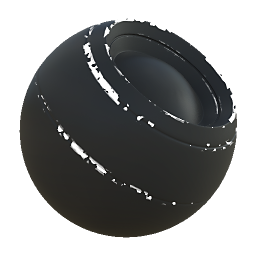

# Desgaste de tinta

<table>
<tr style="border: 0;">
<td style="border: 0;" valign="top">

{width="128px"}

## Desgaste de tinta

**Entrada:** *Geradores Baseados Em Malha**/Geradores De Máscara*

**Intermediário**

</td>
<td style="border: 0;" valign="top">

## Descrição

Gera uma máscara em preto e branco com base em mapas baked e configurações do usuário. Semelhante às [Máscaras Inteligentes](https://support.allegorithmic.com/documentation/display/SPDOC/Smart+Materials+and+Masks) do [Painter](https://support.allegorithmic.com/documentation/display/SPDOC/Substance+Painter).

Essa máscara representa a lasca de tinta e o desgaste nas bordas.

## Parâmetros

### Entradas

* **Oclusão De Ambiente**: *Entrada Em Tons De Cinza*\
  Mapa baked usado para efeitos internos e mascaramento.
* **Curvatura**: *Entrada em tons de cinza*\
  Mapa baked usado para efeitos internos e mascaramento.
* **Máscara de Variação**: *Entrada em Tons de Cinza*\
  Slot de máscara usado para mascarar os efeitos do nó.
* **Máscara (opcional)**: *Entrada em tons de cinza*\
  Slot de máscara usado para mascarar os efeitos do nó.

### Parâmetros

* **Nível**: *0.0 - 1.0*\
  Define a quantidade total de desgaste de tinta, revelando gradualmente.
* **Contraste**: *0.0 - 1.0*\
  Ajusta o contraste do resultado.
* **Oclusão**: *0.0 - 1.0* Define a quantidade de efeito que o AO assado tem sobre a prevenção de desgaste em áreas mais escuras.
* **Raio**: *0.0 - 2.0* Define até onde o efeito de lasca se espalha a partir das bordas convexas.
* **Variação**: *0.0 - 1.0* Defina o valor de variação (desgaste) a ser mesclado no efeito.
* **Substituir máscara de variação**: *Falso/Verdadeiro* Habilita o slot de entrada do mapa de variação personalizada (desgaste).

## Imagens de exemplo

</td>
</tr>
</table>
