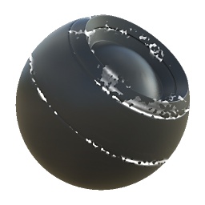

# Dirt seletivo

<table>
<tr style="border: 0;">
<td style="border: 0;" valign="top">

{width="128px"}

## Dirt seletivo

**Entrada:** *Geradores Baseados Em Malha**/Geradores De Máscara*

**Simples**

</td>
<td style="border: 0;" valign="top">

## Descrição

Gera uma máscara em preto e branco com base em mapas baked e configurações do usuário. Semelhante às [Máscaras Inteligentes](https://support.allegorithmic.com/documentation/display/SPDOC/Smart+Materials+and+Masks) do [Painter](https://support.allegorithmic.com/documentation/display/SPDOC/Substance+Painter).

Esta máscara do [Substance 3D Designer](https://www.adobe.com/br/products/substance3d-designer.html) representa um efeito de dirt simples em bordas convexas.

## Parâmetros

### Entradas

* **Curvatura**: *Entrada em tons de cinza*\
  Mapa baked usado para efeitos internos e mascaramento.
* **Máscara de Variação**: *Entrada em Tons de Cinza*\
  O mapa de variação opcional pode ser ativado por meio de parâmetros.
* **Máscara (opcional)**: *Entrada em tons de cinza*\
  Slot de máscara usado para mascarar os efeitos do nó.

### Parâmetros

* **Nível**: *0.0 - 1.0*\
  Define o nível total do efeito, revelando gradualmente.
* **Contraste**: *0.0 - 1.0*\
  Ajusta o contraste do resultado.
* **Variação**: *0.0 - 1.0* Define a quantidade de variação/desgaste a ser mesclada no efeito.
* **Substituir máscara de variação**: *Falso/Verdadeiro* Permite substituir a variação por um slot de entrada personalizado.

## Imagens de exemplo

</td>
</tr>
</table>
