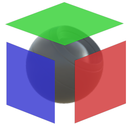

# Tri Planar

<table>
<tr style="border: 0;">
<td width="33.33%" style="border: 0;" valign="top">

{width="128px"}

{width="128px"}

<b>Entrada:</b> Geradores Baseados Em Malha > Utilitários

</td>
<td width="100.00%" style="border: 0;" valign="top">

## Descrição

Este nó avançado executa mapeamento de projeção triplanar em 2D, com base em dados de Posição feita bake e Espaço Mundial Normal. Isso significa que, essencialmente, converte completamente as coordenadas UV em um mapeamento (na maioria das vezes) sem costura com base na própria malha.

Esta é uma boa maneira de evitar costuras sem ter que reassentar cada vez (é possível conseguir algo semelhante com o baker). A desvantagem é que este nó é bastante pesado e, portanto, não rápido.

Lembre-se de que suas fazes bake devem ser de alta precisão: as fazes bake de 8 bits não levarão a resultados muito bons.

</td>
</tr>
</table>

## Entradas

|  |  |
|:---|:---|
| <b>Posição</b> <i>Entrada de cores</i> | Mapa da posição cozida. Idealmente, uma precisão de 16 bits ou superior. |
| <b>Espaço Mundial Normal</b> <i>Entrada de cores</i> | Feito bake World Space mapa normal, Idealmente 16-bit ou maior precisão. |
| <b>Entrada X</b> <i>Entrada de cores (entrada em tons de cinza)</i> | Mapa de entrada para remapear do UV para o espaço mundial através da projeção triplanar. Usado para todos os eixos quando Entradas de imagem estiver definido como 1; para o eixo X, se estiver definido como 3. |
| <b>Entrada Y</b> <i>Entrada de cores (entrada em tons de cinza)</i> | Somente se a opção Entradas de imagem estiver definida como 3. Mapa de entrada para remapear de UV para o espaço mundial no eixo Y. |
| <b>Entrada Z</b> <i>Entrada de cores (entrada em tons de cinza)</i> | Somente se a opção Entradas de imagem estiver definida como 3. Mapa de entrada para remapear de UV para o espaço mundial no eixo Z. |

## Parâmetros

|  |  |
|:---|:---|
| <b>Projeção</b> <i>Todos os eixos, somente X, somente Y, somente Z</i> | Define com quais eixos se misturar. |
| <b>Entradas de imagem</b> <i>1 entrada, 3 entradas</i> | Defina se deseja usar um Mapa para todos os Eixos ou um mapa específico por Eixo. |
| <b>Modo de Mesclagem</b> <i>linear, avançado</i> | Aumenta a precisão. |
| <b>Contraste de Mesclagem</b> <i>0.001 - 1.0</i> | Contraste da transição, misture entre transições suaves ou ásperas. |
| <b>Fator de Normalização</b> <i>0.0 - 1.0</i> | Melhora a mesclagem da projeção restaurando a perda de contraste na área de mesclagem. |
| <b>Divisão em blocos gráficos da Textura</b> <i>0.0 - 10.0</i> | Número de vezes para colocar as texturas de entrada lado a lado. |
| <b>Rotação global</b> <i>0.0 - 1.0</i> | Rotação global para todos os eixos. |
| <b>Corrigir Projeção Espelhada</b> <i>Falso/Verdadeiro</i> | Defina como lidar com projeções espelhadas. |
| <b>Rotação X</b> <i>0.0 - 1.0</i> | Rotação individual no eixo X da projeção. |
| <b>Rotação Y</b> <i>0.0 - 1.0</i> | Rotação individual no eixo Y de projeção. |
| <b>Rotação Z</b> <i>0.0 - 1.0</i> | Rotação individual sobre o eixo Z da projeção. |
| <b>Deslocamento X</b> <i>0.0 - 1.0</i> | Deslocamento sobre o eixo X da projeção. |
| <b>Deslocamento Aleatório X</b> <i>0.0 - 1.0</i> | Permitir a aleatoriedade do deslocamento do eixo X. |
| <b>Deslocamento Y</b> <i>0.0 - 1.0</i> | Deslocamento sobre o eixo Y da projeção. |
| <b>Deslocamento Aleatório Y</b> <i>0.0 - 1.0</i> | Permite a aleatorização do deslocamento do eixo Y. |
| <b>Deslocamento Z</b> <i>0.0 - 1.0</i> | Deslocamento sobre o eixo Z de projeção. |
| <b>Deslocamento Aleatório Z</b> <i>0.0 - 1.0</i> | Permite a aleatoriedade do deslocamento do eixo Z. |
