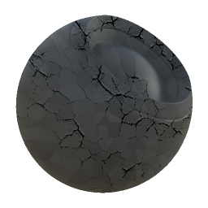

# Rachadura Weathering

<table>
<tr style="border: 0;">
<td width="33.33%" style="border: 0;" valign="top">

{width="128px"}

<b>Entrada:</b> Geradores Baseados em Malha > Clima

</td>
<td width="100.00%" style="border: 0;" valign="top">

## Descrição

Esse é um efeito de material completo que funciona em vários canais de uma só vez. Ele adiciona um padrão de rachadura aleatório, com controle sobre a propagação e a profundidade.

Certifique-se de entender corretamente os [Modos de Criação de Link](../../../../../../interface/the-graph-view/link-creation-modes/link-creation-modes.md) ao trabalhar com materiais completos.

</td>
</tr>
</table>

## Entradas

|  |  |
|:---|:---|
| <b>Curvatura</b> <i>Entrada em tons de cinza</i> | mapa feito bake ou gerado usado para efeitos internos e mascaramento. |
| <b>Height</b> <i>Entrada em tons de cinza</i> | mapa feito bake ou gerado usado para efeitos internos e mascaramento. |
| <b>Máscara</b> <i>Entrada em tons de cinza</i> | Slot de máscara usado para mascarar os efeitos do nó. Pode ser alternado com o parâmetro “Máscara”. |

## Parâmetros

|  |  |
|:---|:---|
| <b>Canais</b> | Ative e desative os canais de material neste grupo, por exemplo, ao usar mapas de Specular/Textura reluzente em vez de Metálico/Aspereza. |
| <b>Avançado</b> |  |
| <b>Formato Normal</b> <i>DirectX, OpenGL</i> | Alterna entre diferentes formatos de Mapas Normais (inverte o canal verde). |
| <b>Máscara</b> <i>Falso/Verdadeiro</i> | Ativa ou desativa o uso do Mapa de máscaras. |
| <b>Efeito</b> |  |
| <b>Propagação do Rachadura</b> <i>0.0 - 1.0</i> | Até onde as rachaduras devem se espalhar. Esse é o principal controle desse efeito. |
| <b>Profundidade DO Rachadura</b> <i>0.0 - 1.0</i> | Profundidade do efeito de fissura. Isso afeta principalmente o height e afeta ligeiramente o thickness visual. |
| <b>Mesclagem</b> | Controla a intensidade de mesclagem do efeito em cada canal resultante. |

## Exemplos

<table style="margin-top: 32px; margin-bottom: 32px">
    <tr style="border: 0">
        <td style="border: 0; background: transparent">
            
        </td>
    </tr>
</table>
