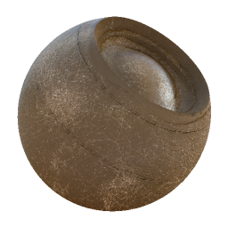

# Clima em couro

<table>
<tr style="border: 0;">
<td style="border: 0;" valign="top">

{width="128px"}

## Clima em couro

**Entrada:** *Geradores Baseados Em Malha**/Clima*

**Complexo**

</td>
<td style="border: 0;" valign="top">

## Descrição

Esse é um efeito de material completo que funciona em vários canais de uma só vez. Ele adiciona um efeito de desgaste de couro aleatório, com controle para idade e sujeira. É semelhante ao [Fabric Weathering](../../../../../../compositing-graphs/nodes-reference-for-com/node-library/mesh-based-generators/weathering/fabric-weathering/fabric-weathering.md), mas ajustado especificamente para o couro.\
Esse efeito não funciona muito bem, a menos que você tenha o AO assado e os World Space Normalmaps conectados, pois eles exigem que eles calculem e gerem tudo adequadamente.

Certifique-se de entender completamente os [Modos de Criação de Link](https://support.allegorithmic.com/documentation/display/SD5/Link+Creation+Modes) ao trabalhar com materiais completos.

## Parâmetros

### Entradas

* **Oclusão De Ambiente**: *Entrada Em Tons De Cinza*\
  Mapa baked usado para efeitos internos e mascaramento.
* **Espaço Normal Do Mundo**: *Entrada De Cores*
* **Máscara** : *Entrada Em Tons De Cinza*\
  Slot de máscara usado para mascarar os efeitos do nó. Pode ser alternado com o parâmetro “Máscara”.

### Parâmetros

* **Canais**
  * Ative e desative os canais de material neste grupo, por exemplo, ao usar mapas de Specular/Textura reluzente em vez de Metálico/Aspereza.
* **Avançado**
  * **Formato Normal**: *DirectX, OpenGL*\
    Alterna entre diferentes formatos de Mapas Normais (inverte o canal verde).
  * **Máscara**: *Falso/Verdadeiro*\
    Ativa ou desativa o uso do Mapa de máscaras.
* **Efeito**
  * **Dust**: *0.0 - 1.0* Combina em um efeito de dust mais escuro, com base nas áreas voltadas para cima no World Space Normalmap.
  * **Sujeira**: *0.0 - 1.0* Combina em um efeito de dirt/borrão global, com base principalmente em áreas ocultadas (escuras) no AO.
  * **Desgaste de bordas**: *0.0 - 1.0* Adiciona um efeito de nitidez/intensificação às bordas, com base no Normal do Material.
  * **Usado**: *0.0 - 1.0* Mistura em um visual de couro gasto global.
  * **Idade**: *0.0 - 1.0* Mistura em um look de couro desgastado em vincos com base em AO. A colocação é muito influenciada pelo limite de idade.
  * **Limite de Idade**: *0.0 - 1.0* Define o limite de aparência do efeito Idade.
  * **Escala do Rachadura**: *1.0 - 16.0* Define a profundidade do couro usado a partir do efeito Usado e Idade.
  * **Intensidade de distorção da Rachadura**: *0.0 - 1.0* Define a intensidade do couro usado a partir do efeito Usado e Idade.
  * **Escala de Scratches de Bordas Nítidas**: *1.0 - 32.0*
  * **Intensidade de distorção de Scratches de bordas cortantes**: *0.0 - 1.0*
  * **Redução da saturação do couro usado**: *0.0 - 1.0* Define a saturação da aparência de couro usado a partir dos efeitos Idade e Usado.
  * **Brilho do couro usado**: *0.0 - 1.0* Define o brilho da aparência de couro usado nos efeitos Idade e Usado.
* **Mesclagem**
  * **Intensidade Difusa**: *0.0 - 1.0*\
    Intensidade de mesclagem do Difusa.
  * **Intensidade de cor base**: *0.0 - 1.0*\
    Intensidade de mesclagem da Cor de base.
  * **Intensidade Normal**: *0.0 - 1.0*\
    Intensidade de mesclagem do Normal.
  * **Intensidade de Specular**: *0.0 - 1.0*\
    Intensidade de mistura do Specular.
  * **Intensidade de textura reluzente**: *0.0 - 1.0*\
    Intensidade de mistura da Textura reluzente.
  * **Intensidade de aspereza**: *0.0 - 1.0*\
    Intensidade de mistura da aspereza.
  * **Intensidade de Oclusão do ambiente**: *0.0 - 1.0*\
    Intensidade de mesclagem da Oclusão ambiente.
  * **Intensidade de Height**: *0.0 - 1.0*\
    Intensidade de mistura do Height.

## Imagens de exemplo

{width="233px"}

</td>
</tr>
</table>
