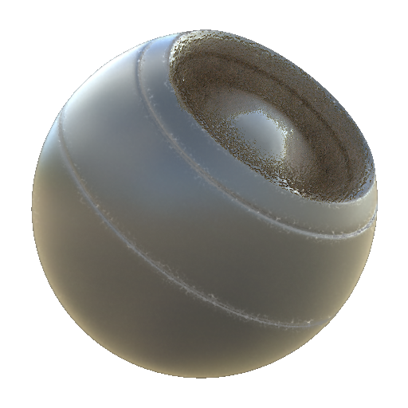

# Metálico

<table>
<tr style="border: 0;">
<td width="33.33%" style="border: 0;" valign="top">

{width="128px"}

<b>Entrada:</b> Geradores Baseados em Malha > Clima

</td>
<td width="100.00%" style="border: 0;" valign="top">

## Descrição

</td>
</tr>
</table>

## Entradas

|  |  |
|:---|:---|
| <b>WS normal</b> <i>Entrada de cores</i> | Mapa normal do espaço do mundo assado usado para efeitos internos e mascaramento. |
| <b>Oclusão de ambiente</b> <i>Entrada em tons de cinza</i> | Mapa baked usado para efeitos internos e mascaramento. |
| <b>Máscara</b> <i>Entrada em tons de cinza</i> | Slot de máscara usado para mascarar os efeitos do nó. Pode ser alternado com o parâmetro “Máscara”. |

## Parâmetros

|  |  |
|:---|:---|
| <b>Canais</b> | Ative e desative os canais de material neste grupo, por exemplo, ao usar mapas de Specular/Textura reluzente em vez de Metálico/Aspereza. |
| <b>Avançado</b> |  |
| <b>Formato Normal</b> <i>Direct X, Open GL</i> | Alterna entre diferentes formatos de Mapas Normais (inverte o canal verde). |
| <b>Máscara</b> <i>Falso/Verdadeiro</i> | Ativa ou desativa o uso do Mapa de máscaras. |
| <b>Efeito</b> |  |
| <b>Dust</b> <i>0.0 - 1.0</i> |  |
| <b>Sujeira</b> <i>0.0 - 1.0</i> |  |
| <b>Bordas Vestindo</b> <i>0.0 - 1.0</i> |  |
| <b>Descascamento da Tinta</b> <i>0.0 - 1.0</i> |  |
| <b>Ferrugem</b> <i>0.0 - 1.0</i> |  |
| <b>Descascamento da Ferrugem</b> <i>0.0 - 1.0</i> |  |
| <b>Ferrugem Verdículos</b> <i>Ferrugem, Verdigris</i> |  |
| <b>Tinta escala do Rachadura</b> <i>1.0 - 16.0</i> |  |
| <b>Intensidade de Distorção do Rachadura da Tinta</b> <i>0.0 - 1.0</i> |  |
| <b>Escala de Scratches de Bordas Nítidas</b> <i>1.0 - 32.0</i> |  |
| <b>Intensidade de distorção de Scratches de bordas cortantes</b> <i>0.0 - 1.0</i> |  |
| <b>Cor de metal bruta</b> <i>(Valor da cor)</i> |  |
| <b>Cor de Specular metálico bruto</b> <i>(Valor da cor)</i> |  |
| <b>Valor da Textura Reluzente Bruta</b> <i>(Valor em tons de cinza)</i> |  |
| <b>Valor de aspereza de metal bruto</b> <i>(Valor em tons de cinza)</i> |  |
| <b>Mesclagem</b> |  |
| <b>Intensidade de Difusão</b> <i>0.0 - 1.0</i> | Intensidade de mesclagem do Difusa. |
| <b>Intensidade de Cor de base</b> <i>0.0 - 1.0</i> | Intensidade de mesclagem da Cor de base. |
| <b>Intensidade normal</b> <i>0.0 - 64.0</i> | Intensidade de mesclagem do Normal. |
| <b>Intensidade de Specular</b> <i>0.0 - 1.0</i> | Intensidade de mistura do Specular. |
| <b>Intensidade de brilho</b> <i>0.0 - 1.0</i> | Intensidade de mistura da Textura reluzente. |
| <b>Intensidade de aspereza</b> <i>0.0 - 1.0</i> | Intensidade de mistura da aspereza. |
| <b>Intensidade metálica</b> <i>0.0 - 1.0</i> | Intensidade de mistura do Metálico. |
| <b>Intensidade de Oclusão de ambiente</b> <i>0.0 - 1.0</i> | Intensidade de mesclagem da Oclusão ambiente. |
| <b>Intensidade de Height</b> <i>0.0 - 1.0</i> | Intensidade de mistura do Height. |
