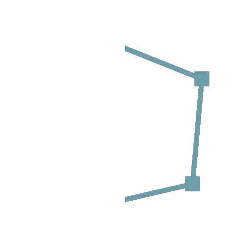
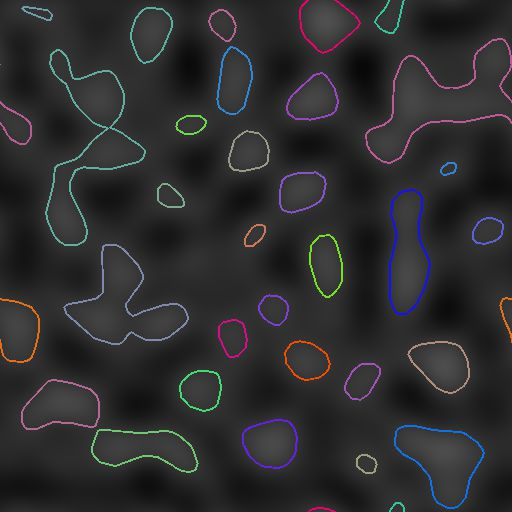
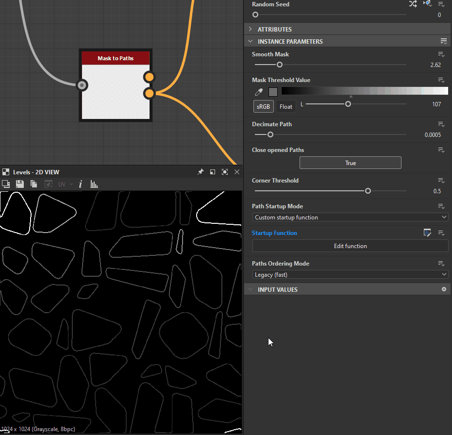

# Mascarar caminhos

<table>
<tr style="border: 0;">
<td width="33.33%" style="border: 0;" valign="top">

<b>Ferramentas de Spline e Caminho </b> > Ferramentas de Caminho

</td>
<td width="100.00%" style="border: 0;" valign="top">

## Descrição

Converte um padrão de entrada em tons de cinza <b>Máscara</b> em uma lista de segmentos de caminho codificados nos <b>Caminhos</b> de saída.

Controles sobre a posição inicial dos caminhos gerados, bem como sua ordem na lista, estão disponíveis.

Os Caminhos gerados podem ser processados posteriormente usando nós dedicados - Por exemplo, [Transformação de 2D de Caminho](../../../../../../compositing-graphs/nodes-reference-for-com/node-library/spline-paths-tools/path-tools/path-2d-transform/path-2d-transform.md), [Distorção de Caminhos](../../../../../../compositing-graphs/nodes-reference-for-com/node-library/spline-paths-tools/path-tools/paths-warp/paths-warp.md) - ou convertidos em splines usando o nó [Caminho para Spline](../../../../../../compositing-graphs/nodes-reference-for-com/node-library/spline-paths-tools/path-tools/paths-to-spline/paths-to-spline.md) para mapear ou dispersão formas ao longo deles.

</td>
</tr>
</table>

>[!NOTE]
>
> O método usado para codificar caminhos é explicado na página [Especificações de formato de caminhos](../../../../../../compositing-graphs/nodes-reference-for-com/node-library/spline-paths-tools/path-tools/paths-format-spe/paths-format-specifications.md).

## Conectores de entrada

<b>Máscara</b> *Tons de cinza*\
O padrão de entrada que deve ser convertido em uma lista de Caminhos.

## Conectores de saída

<b>Visualizar</b> *Cor* Uma visualização composta sobre a máscara para ajudar a visualizar os efeitos dos parâmetros.

<b>Caminhos</b> *Cor*\
Uma lista de caminhos codificados em uma imagem colorida. cada caminho descreve uma lista de segmentos codificados.\
O resultado pode ser processado usando outro nó de processamento de Caminhos ou enviado para um nó [Caminhos para Spline](../../../../../../compositing-graphs/nodes-reference-for-com/node-library/spline-paths-tools/path-tools/paths-to-spline/paths-to-spline.md) para processá-lo posteriormente como Splines.

## Parâmetros

<b>Máscara suave</b> *Flutuante*\
Aplique suavização na máscara de entrada.\
Útil quando o padrão de entrada tem bordas muito nítidas, o que geralmente causa artefatos.

<b>Valor de Limite de Máscara</b> *Flutuante* O valor em tons de cinza da <b>Máscara</b> que será usado para separar o exterior (valores &lt; Valor Limite da Máscara) e o interior (valores > Valor Limite da Máscara) da forma.

<b>Decimar Caminho</b> *Flutuante* controla implicitamente a quantidade de segmentos que será gerada.\
Uma alta quantidade de decimação tornará as formas arredondadas um pouco poligonais, enquanto nenhuma decimação irá gerar quase um segmento por pixel.\
Um valor razoável corresponderá melhor à forma de linhas retas e curvas sem criar muitos pontos intermediários para linhas retas.

<b>Fechar caminhos abertos</b> *Booleano* Crie um segmento entre os vértices inicial e final de caminhos abertos.\
Desativar essa opção poderá corrigir linhas indesejáveis que atravessam o seu padrão de uma forma inesperada, contudo os caminhos poderão deixar de ser fechados.

<b>Limite de Cantos</b> *Flutuante*\
Cada vértice codificado em caminhos pode conter uma bandeira indicando se é duro (ou seja, um canto) ou suave.\
Esse parâmetro permite marcar mais ou menos cantos de acordo com o ângulo entre os segmentos adjacentes.\
*Observação:* este sinalizador de &#39;canto&#39; não tem suporte atualmente em nenhum nó existente, mas está disponível para ser usado em um nó [Processador de Vértice de Caminho](../../../../../../compositing-graphs/nodes-reference-for-com/node-library/spline-paths-tools/path-tools/paths-vertex-processor/paths-vertex-processor.md). Você também pode visualizar os cantos com o nó [Visualizar caminhos](../../../../../../compositing-graphs/nodes-reference-for-com/node-library/spline-paths-tools/path-tools/preview-paths/preview-paths.md).

<b>Modo de Inicialização do Caminho</b> *Inteiro* O método de selecionar qual vértice deve ser o início de cada Caminho gerado ao redor das formas na Máscara.\
Isso tem um impacto significativo ao converter os <b>Caminhos para Splines</b> gerados usando o nó dedicado, pois vários nós de Spline usam o início e o fim dos Splines.\
*- Vértice mais agudo:* O vértice que forma o ângulo mais baixo com seus vértices anteriores e seguintes\
*- Vértice no extremo de uma direção especificada:* O último vértice em uma determinada direção\
*- Vértice mais próximo de uma posição especificada
* Vértice o mais distante de uma posição especificada
* Função de inicialização personalizada:* Use uma função personalizada para selecionar o vértice que deve ser usado como o início de cada caminho

<b>Direção da Inicialização</b> *Flutuante* O ângulo que descreve a direção usada para selecionar o vértice de inicialização. Para cada Caminho, o último vértice nessa direção é selecionado.\
O valor é um *número de rotações* usado para girar um vetor de direção à esquerda. Isso significa que 0 define um vetor de direção de (-1, 0) e 0,25 (90 graus) define um vetor de direção de (0, 1).\
*Observação:* este parâmetro está disponível quando o <b>Modo de Inicialização do Caminho</b> está definido como &#39;Vértice na extremidade de uma direção especificada&#39;

<b>Posição de Destino de Inicialização</b> *Flutuante2* A posição na imagem usada para selecionar o vértice de inicialização.\
Para cada Caminho, o vértice mais próximo ou mais distante desta posição é selecionado, de acordo com o <b>Modo de Inicialização do Caminho</b> selecionado.\
*Observação:* este parâmetro está disponível quando o <b>Modo de Inicialização do Caminho</b> está definido como &#39;Vértice mais próximo de uma posição especificada&#39; ou &#39;Vértice mais distante de uma posição especificada&#39;

<b>Função de Inicialização</b> *Flutuante* A função usada para selecionar o vértice de inicialização. Retorna um valor Float.\
Para cada vértice, a função é executada e o vértice para o qual a função retorna o *maior resultado* é selecionado.\
Variáveis disponíveis:\
*-* vertex.cornerness(Float)*:* A pontuação do vértice como candidato a ser um vértice\
*-* vertex.pos(Float2)*:* A posição do vértice no espaço da imagem\
*Observação:* este parâmetro está disponível quando o Modo de Inicialização do Caminho está definido como &#39;Vértice mais próximo de uma posição especificada&#39; ou &#39;Função de inicialização personalizada&#39;

<b>Modo de Pedido</b> *Inteiro* O método de ordenação dos Caminhos gerados.\
A *caixa delimitadora* (Bbox) dos Caminhos de posição ou tamanho pode ser usada como critério para ordenar os Caminhos.\
Isso tem um impacto significativo ao converter os <b>Caminhos para Splines</b> gerados usando o nó dedicado, pois vários nós de Spline usam a ordem dos Splines.\
*- Herdado (rápido):* O método usado na versão anterior deste nó, que oferece desempenho significativamente melhor\
*- Por posição central da caixa ao longo da direção:* Os caminhos são ordenados de acordo com a posição do centro de sua caixa, do primeiro ao último ao longo da direção especificada\
*- Por Bbox Bbox posição superior esquerda ao longo da direção:* Os caminhos são ordenados de acordo com a posição do canto superior esquerdo de sua Bbox, do primeiro ao último ao longo da direção especificada\
*- Por tamanho de Caixa - Do maior para o menor:* Os caminhos são ordenados de acordo com o tamanho de sua Caixa, do maior para o menor\
*- Por tamanho de Caixa - Do menor ao maior:* Os caminhos são ordenados de acordo com o tamanho de sua Caixa, do menor ao maior\
*- Função de ordenação personalizada:* Use uma função personalizada para ordenar os Caminhos

<b>Direção da ordem</b> *Flutuar* O ângulo que descreve a direção usada para ordenar os Caminhos do primeiro para o último ao longo dessa direção.\
O valor é um *número de voltas* usado para girar um vetor de direção à esquerda. Isso significa que 0 define um vetor de direção de (-1, 0) e 0,25 (90 graus) define um vetor de direção de (0, 1).

<b>Ordenando função</b> *Flutuante* A função usada para ordenar os Caminhos. Retorna um valor Float.\
Os caminhos são ordenados em *ordem crescente* de acordo com o valor desta função. Em outras palavras, o resultado da função para cada Caminho é a *chave de classificação* usada para ordenar os Caminhos.\
Variáveis disponíveis:
* bbox.center (Float2): a posição do centro da caixa Caminho
* bbox.topleft (Float2): a posição do canto superior esquerdo da caixa Caminho
* bbox.size (Float2): o tamanho da caixa Caminho (X: largura, Y: height)

## Exemplos

<table>
<tr style="border: 0;">
<td style="border: 0;" valign="top">

<table>
  <tr>
    <td>
      
       <i>Antes</i>
    </td>
    <td>
      
       <i>Depois</i>
    </td>
  </tr>
</table>

</td>
<td style="border: 0;" valign="top">

<table>
  <tr>
    <td>
      
       <i>Antes</i>
    </td>
    <td>
      
       <i>Depois</i>
    </td>
  </tr>
</table>

</td>
</tr>
</table>

<table>
<tr style="border: 0;">
<td style="border: 0;" valign="top">

{zoomable="yes"}

</td>
<td style="border: 0;" valign="top">

{zoomable="yes"}

</td>
</tr>
</table>

<table>
<tr style="border: 0;">
<td style="border: 0;" valign="top">

{zoomable="yes"}

</td>
<td style="border: 0;" valign="top">

{zoomable="yes"}

</td>
</tr>
</table>
