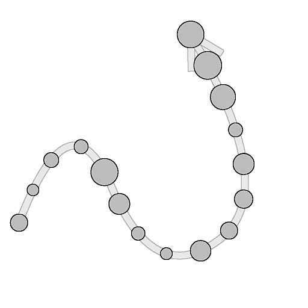

# Dispersão em Tons de Cinza Spline

<table>
<tr style="border: 0;">
<td width="33.33%" style="border: 0;" valign="top">

<b>Ferramentas De Spline E Caminho </b> Em: > Ferramenta de linha flexível

</td>
<td width="100.00%" style="border: 0;" valign="top">

## Descrição

Desenha o(s) padrão(ões) especificado(s) ao longo das linhas de entrada sobre o plano de fundo de entrada.

</td>
</tr>
</table>

O nó oferece profundas opções de personalização para controlar como os padrões são dispersos.

Alguns aspectos da dispersão podem ser controlados usando imagens de outros nós no gráfico para promover o aspecto dinâmico do resultado.

>[!NOTE]
>
> Consulte também [Dispersão na cor da spline](../../../../../../compositing-graphs/nodes-reference-for-com/node-library/spline-paths-tools/spline-tools/scatter-on-spline-color/scatter-on-spline-color.md).

## Conectores de entrada

<b>Plano de fundo </b>*Tons de Cinza* (Primário)A imagem em tons de cinza sobre a qual as linhas divisórias devem ser desenhadas.

<b>Cordas de spline</b> *Cor* As coordenadas dos pontos das splines de entrada codificadas nos canais RGBA de uma imagem colorida:\
<b> R</b> - Posição X\
<b> G</b> - posição Y\
<b> B</b> - Height\
<b>A</b> - Dados empacotados:\
* Sinal: Spline é fechado (negativo) ou aberto (positivo);\
* Valor absoluto: Thickness + 1.

<b>Dados de Spline</b> *Cor* Dados adicionais das splines de entrada codificados nos canais RGBA de uma imagem colorida.\
<b> R</b> - Tangentes X\
<b> G</b> - Tangentes Y\
<b> B</b> - Não Usado\
<b> A</b> - Não Usado

<b>Valor da spline</b> *Inteiro* O número de splines de entrada.

<b>Entrada de padrão #</b> *Tons de cinza* O(s) padrão(ões) que deve(m) ser espalhado(s) ao longo das splines.

<b>Mapa de Escala</b> *Escala de cinza* O mapa que controla a escala dos padrões dispersos. O efeito deste mapa é controlado pelo parâmetro “Scale Map Input Multiplier” e é combinado com os outros parâmetros do grupo “Size”.

<b>Mapa de Heights</b> *Tons de cinza* O mapa que controla o height dos padrões dispersos. O efeito deste mapa é controlado pelo parâmetro “Multiplicador de entrada de Height” e é combinado com os outros parâmetros “Cor” no grupo “Cor”.

<b>Mapa de máscaras</b> *Tons de cinza* O mapa que controla o mascaramento dos padrões dispersos. O efeito desse mapa é controlado pelo parâmetro “Limite de mapa da máscara” e é combinado com os outros parâmetros “Máscara” no grupo “Cor”.

## Conectores de saída

<b>Saída</b> *Tons de cinza* A imagem que representa o(s) padrão(ões) espalhado(s) ao longo da(s) spline(s) de entrada sobre o plano de fundo de entrada.

## Parâmetros

<b>Entrada de spline</b> *Inteiro* O método de selecionar quais splines devem ser usados para padrões de dispersão:
* *Todas as splines*: usar todas as splines da lista de entrada;
* *spline única*: use somente a spline especificada na lista de entrada;
* *Intervalo de spline*: use somente as splines no intervalo especificado da lista de entrada.

<b>Índice de Spline</b> *Inteiro* (Disponível quando “Entrada de spline” está definido como “Spline simples”)O índice de lista da spline que deve ser usado para padrões de dispersão.

<b>Intervalo de spline</b> *Inteiro2* (Disponível quando “Entrada de spline” está definido como “Intervalo de spline”)O intervalo de índices de lista, incluindo as splines, que deve ser usado para padrões de dispersão.

<b>Modo de Dispersão</b> *Inteiro* O método de dispersão dos padrões ao longo das splines, o que afeta a quantidade de padrões em cada spline:
* Quantidade da forma: a quantidade especificada de padrões com espaçamento uniforme é dispersa;
* Espaçamento entre formas: o número de padrões é ajustado automaticamente para se ajustar ao espaçamento uniforme especificado.\
  Em ambos os casos, o primeiro e o último padrões caem exatamente no início e no final de cada spline, respectivamente.

<b>Quantidade de forma</b> *Inteiro* (Disponível quando o “Modo de Dispersão” estiver definido como “Quantidade da forma”)A quantidade de padrões espaçados uniformemente espalhados ao longo de cada spline.

<b>Distribuição De Formas Ao Longo Da Spline</b> *Inteiro* (Disponível quando o &#39;Modo de Dispersão&#39; estiver definido como &#39;Quantidade da forma&#39;)O método de distribuição dos padrões ao longo de uma spline:
* *Da origem*: o espaçamento dos padrões é influenciado pelas tangentes do ponto de spline, onde as formas estão mais distantes perto de pontos com tangentes longas;
* *Uniforme*: os padrões são espaçados uniformemente ao longo da spline, independentemente de suas tangentes e trajetória.

<b>Espaçamento entre formas</b> *Flutuante* (Disponível quando o “Modo de Dispersão” está definido como “Espaçamento de forma”)A distância mínima ao longo de uma spline pela qual os padrões devem ser espaçados, enquanto ainda descarrega o primeiro e o último padrão no início e no final de cada spline, respectivamente.

<b>Iniciar</b> *Flutuante* Desloca o ponto do início de uma spline onde a dispersão começa. O valor é o comprimento normalizado de cada spline.

<b>Fim</b> *Flutuante* Desloca o ponto do início de uma spline onde a dispersão termina. O valor é o comprimento normalizado de cada spline.

<b>Tabela Dinâmica de Formas</b> *Flutuante2* Desloca a tabela dinâmica do padrão X e Y no espaço tangente da spline.\
Considerando que o pivô é o que é colocado no spline, isso efetivamente desloca os padrões ao longo ou perpendicularmente ao spline.\
Observação: as posições dos pivôs afetam o efeito dos parâmetros “Escala” e “Rotação (pivô)”.

+++Padrão
<b>Padrão</b> *Inteiro* O padrão que deve ser espalhado ao longo das linhas:\
*- Entrada de Padrão*: Usar os padrões fornecidos para as entradas ‘Entrada de Padrão #’;\
*- Quadrado;
* Disco;
* Paraboloide;
* Campainha;
* Gaussiana;
* Thorn
* Pirâmide;
* Tijolo;
* Gradação;
* Ondas;
* Meio-sino;
* Sino ondulado;
* Crescente
* Cápsula;
* Cone;
* Gradação w. offset;
* Hemisfério.*

<b>Número de Entrada de Padrão</b> *Inteiro* (Disponível quando “Padrão” está definido como “Entrada de Padrão”)Seleciona o índice do padrão de entrada que deve ser disperso.

<b>Distribuição de Entrada de Padrão</b> *Inteiro* (Disponível quando “Padrão” está definido como “Entrada de Padrão”)O método usado para selecionar quais dos padrões de entrada devem ser dispersos em uma determinada spline:\
*- Aleatório*: um padrão é selecionado aleatoriamente;\
*- Ao longo da spline*: o índice de padrão aumenta gradualmente ao longo da spline;\
*- Índice de Padrão*: Executa um loop sobre o índice de padrões de entrada ao longo de cada spline;\
*- Índice de Spline*: repete o índice de padrões de entrada de uma spline para a próxima na lista de splines de entrada.

<b>Tremulação de Distribuição</b> *Flutuante* (Disponível quando “Distribuição de Entrada de Padrão” está definida como “Ao Longo da Curva”)Aumenta ou diminui aleatoriamente o índice selecionado de padrões na curvatura.

<b>Substituir o primeiro padrão</b> *Booleano* Selecione manualmente o índice do padrão que deve ser colocado no início de cada spline.

<b>Primeiro Índice de Entrada de Padrão</b> *Inteiro* (Disponível quando “Substituir primeiro padrão” estiver definido como “Verdadeiro”)O índice do padrão que deve ser colocado no início de cada spline.

<b>Substituir último padrão</b> *Booleano* Selecione manualmente o índice do padrão que deve ser colocado no final de cada spline.

<b>Último Índice de Entrada de Padrão</b> *Inteiro* (Disponível quando “Substituir último padrão” estiver definido como “Verdadeiro”)O índice do padrão que deve ser colocado no final de cada spline.

+++

+++Duplicatas
<b>Modo de Distribuição</b> *Inteiro* O método usado para colocar os padrões duplicados:\
*- Linear*: as duplicatas são espaçadas uniformemente ao longo do normal da spline a partir do local original do padrão;\
*- Circular*: duplicado é organizado ao longo de um círculo virtual centralizado na spline no local original do padrão.

<b>Valor Duplicado</b> *Inteiro* O número de padrões duplicados.

<b>Deslocamento</b> *Flutuante2* (Disponível quando o “Modo de Distribuição” estiver definido como “Linear”)Aplica um deslocamento às posições das duplicatas ao longo da tangente (paralela) e do normal (perpendicular) da spline.\
As duplicatas em lados opostos da spline são movidas em direções opostas.

<b>Centro de Deslocamento</b> *Flutuante2* (Disponível quando ‘Modo de Distribuição’ estiver definido como ‘Linear’)Aplica um deslocamento às duplicatas ao longo da spline em X (paralelo) e Y (perpendicular).

<b>Ângulo de Propagação</b> *Flutuante* (Disponível quando o &#39;Modo de Distribuição&#39; está definido como &#39;Circular&#39;)O arco do círculo virtual ao longo do qual as duplicatas são distribuídas, como o ângulo desse arco onde 1 é o círculo completo.

<b>Distância de deslocamento</b> *Flutuante* (Disponível quando o &#39;Modo de Distribuição&#39; está definido como &#39;Circular&#39;)O raio do círculo virtual ao longo do qual as duplicatas são distribuídas.

<b>Rotação</b> *Flutuante* Gira o círculo virtual ao longo do qual as duplicatas são distribuídas.

<b>Atenuação De Início/Término De Deslocamento</b> *Flutuante2* Fatores na distância do ponto médio da spline até seu Início e Fim, ao aplicar deslocamentos a duplicatas.\
Isso significa que os deslocamentos são diminuídos para duplicatas mais próximas dos membros de um spline.

<b>Atenuação de deslocamento por Thickness</b> *Flutuar* Fatores no thickness da spline ao aplicar deslocamentos a duplicatas.\
Isso significa que os deslocamentos são diminuídos para duplicatas em uma parte de uma spline com um thickness inferior.

+++

+++Tamanho
<b>Modo de Tamanho</b> *Inteiro* O método de definir o tamanho dos padrões dispersos:\
*- Normal*: O tamanho é controlado uniformemente usando um parâmetro global &#39;Scale&#39;;\
*- Usar Thickness da spline*: o tamanho é determinado pelo thickness da spline.

<b>O Thickness Afeta</b> *Inteiro* (Disponível quando “Modo de Tamanho” estiver definido como “Usar Thickness da Spline”)Especifica qual eixo da escala de um padrão deve ser orientado pelo thickness da spline:
* X e Y: o Thickness é multiplicado pelo tamanho nos eixos X e Y;\
  - X: o Thickness é multiplicado somente em relação ao tamanho no eixo X;
* Y: o Thickness é multiplicado pelo tamanho somente no eixo Y.\
  Quando não multiplicada, a escala original do padrão é a extensão completa da imagem.\
  Isso significa que, no modo “X”, o tamanho no eixo Y é a extensão completa da imagem e precisa ser ajustado usando o parâmetro Size. O mesmo se aplica ao tamanho no eixo X quando se utiliza o modo “Y”.

<b>Tamanho</b> *Flutuante2* O tamanho original dos padrões em X e Y antes que outros ajustes sejam feitos por outros parâmetros.

<b>Tamanho aleatório</b> *Float2* Aplica um multiplicador aleatório até o valor especificado para reduzir o tamanho dos padrões em X e Y.

<b>Escala de Thickness</b> *Flutuante* (Disponível quando o &#39;Modo de Tamanho&#39; estiver definido como &#39;Usar Thickness da spline&#39;)Um multiplicador adicional para a escala dos padrões quando acionado pelo thickness da spline.

<b>Escala</b> *Flutuante* (Disponível quando ‘Modo de Tamanho’ estiver definido como ‘Normal’)Um controle global para o tamanho de todos os padrões, onde 1 é o tamanho total da imagem.\
A escala é aplicada relativamente à tabela dinâmica de um padrão. A posição de pivô pode ser deslocada usando o parâmetro “Tabela Dinâmica de Forma”.

<b>Escala aleatória</b> *Flutuante* Aplica um multiplicador aleatório até o valor especificado para diminuir o tamanho dos padrões.

<b>Multiplicador de Entrada de Mapa de Escala</b> *Flutuante* Controla a intensidade da entrada do Mapa de Escala. Esse mapa atua como um multiplicador para o tamanho atual dos padrões.\
O efeito deste mapa é combinado com os outros parâmetros do grupo “Tamanho”.

<b>Modo de Amostragem de Entrada de Escala</b> *Espaço de Textura* O método de mapear os valores no Mapa de Escala para as splines:\
*- Espaço de textura*: os valores são aplicados às splines nos quais estariam se fossem colocados em uma textura usando as coordenadas UV da textura. Isso aplica efetivamente o valor aos splines “in place”;\
*- Horizontal ao longo da spline*: os valores são aplicados diretamente às coordenadas das splines codificadas (consulte entrada de Coords da spline), onde cada linha é aplicada a uma spline diferente de cima para baixo;\
*- Hora. ao longo do spline (rand. deslocamento X)*: os valores são aplicados diretamente às coordenadas das splines codificadas (consulte entrada de Coords de spline), com um deslocamento horizontal aleatório no mapa de Escala para cada spline (ou seja, cada linha em Coords de spline);\
*- Hora. ao longo do spline (rand. deslocamento Y)*: os valores são aplicados diretamente às coordenadas das splines codificadas (consulte entrada de Coords de spline), com um deslocamento vertical aleatório no mapa de Escala para cada spline (ou seja, cada linha nas Coords de spline).

<b>Atenuação de Início/Término</b> *Flutuante2* Fatores na distância do ponto médio da spline até seu Início e Fim ao dimensionar os padrões.\
Isso significa que o tamanho é diminuído para padrões mais próximos aos membros de um spline.

+++

+++Posição
<b>Deslocamento local</b> *Flutuante2* Aplica um deslocamento às posições dos padrões ao longo da tangente (paralela) e do normal (perpendicular) da spline.

<b>Deslocamento Local Aleatório</b> *Flutuante2* Aplica um deslocamento aleatório adicional às posições dos padrões ao longo da tangente (paralela) e do normal (perpendicular) da spline.

<b>Centro Aleatório de Deslocamento Local</b> *Flutuante2* Desloca o centro do deslocamento aleatório aplicado pelo parâmetro Deslocamento Local Aleatório ao longo da tangente (paralela) e do normal (perpendicular) da spline.

<b>Atenuação De Início/Fim Do Deslocamento Local</b> *Flutuante2* Fator na distância do ponto médio da spline até seu Início e Fim ao aplicar deslocamentos de posição aos padrões.\
Isso significa que os deslocamentos são diminuídos para padrões mais próximos aos membros de uma spline.

<b>Atenuação de Deslocamento Local por Thickness</b> *Flutuar* Fatores no thickness da spline ao aplicar deslocamentos a padrões.\
Isso significa que os deslocamentos são diminuídos para duplicatas em uma parte de uma spline com um thickness inferior.

<b>Deslocamento na spline</b> *Flutuante* Aplica um deslocamento de posição aos padrões ao longo das linhas.

<b>Deslocamento aleatório na spline</b> *Flutuante* Aplica um deslocamento de posição adicional aos padrões ao longo das linhas divisórias.

+++

+++Giro
<b>Alinhar com Tangent</b> *Booleano* Gira os padrões para corresponder à direção da spline em seu local.

<b>Rotação (Dinâmica)</b> *Flutuar* Gira os padrões ao redor de suas tabelas dinâmicas.\
A posição de pivô pode ser deslocada usando o parâmetro “Tabela Dinâmica de Forma”.

<b>Rotação Aleatória (Dinâmica)</b> *Flutuante* Aplica uma rotação aleatória adicional aos padrões ao redor de suas tabelas dinâmicas.\
A posição de pivô pode ser deslocada usando o parâmetro “Tabela Dinâmica de Forma”.

<b>Rotação Aleatória Centralizada (Tabela Dinâmica)</b> *Flutuar* Gira em torno dos pivôs do padrão o centro das rotações aleatórias aplicadas pelo parâmetro Rotação Aleatória.

<b>Rotação (Centro)</b> *Flutuar* Gira os padrões ao redor de seu centro.

<b>Rotação aleatória (ao centro)</b> *Flutuante* Aplica uma rotação aleatória adicional aos padrões ao redor de seu centro.

<b>Rotação aleatória centralizada (centro)</b> *Flutuar* Gira em torno do centro do padrão o centro das rotações aleatórias aplicadas pelo parâmetro Rotação Aleatória.

+++

+++Cor
<b>Modo de Mesclagem</b> *Inteiro* O método de mesclar as cores de padrões com o plano de fundo e outros padrões sobrepostos:\
*- Máx*: Usar a cor mais clara;\
*- Adicionar*: adicione as cores juntas.

<b>Cor Base Da Forma</b> *Flutuante* A cor base dos padrões.

<b>Multiplicador de Cores Base da Forma</b> *Flutuante* A intensidade da Cor de Base da Forma dos padrões.\
Nota: A cor de saída é o resultado ponderado de todos os multiplicadores de cores.

<b>Multiplicador de Thickness de spline</b> *Flutuante* A intensidade com que a cor de cada padrão é multiplicada em relação ao thickness da spline em sua localização.\
Nota: A cor de saída é o resultado ponderado de todos os multiplicadores de cores.

<b>Multiplicador do Índice de Forma</b> *Flutuante* A intensidade com que a cor de cada padrão é multiplicada em relação ao seu índice normalizado.\
Nota: A cor de saída é o resultado ponderado de todos os multiplicadores de cores.

<b>Modo de Height do Hemisfério</b> *Inteiro* (Disponível quando “Padrão” está definido como “Hemisfério”)O efeito do height da spline em um padrão de Hemisfério espalhado nele:\
*- Deslocamento*: o height da spline é adicionado ao height do Hemisfério;\
*- Escala*: o height de spline é multiplicado em relação ao height do Hemisfério.

<b>Multiplicador de Height de spline</b> *Flutuante* A intensidade com que a cor de cada padrão é multiplicada em relação ao height da spline em sua localização.\
Nota: A cor de saída é o resultado ponderado de todos os multiplicadores de cores.

<b>Multiplicador de Escala de Forma</b> *Flutuante* A intensidade com que a cor de cada padrão é multiplicada em relação à sua escala.\
Nota: A cor de saída é o resultado ponderado de todos os multiplicadores de cores.

<b>Luminância aleatória</b> *Flutuante* Aplica um multiplicador aleatório até o valor especificado para diminuir a luminância dos padrões.\
Nota: A cor de saída é o resultado ponderado de todos os multiplicadores de cores.

<b>Multiplicador de Entrada de Height</b> *Flutuante* Controla a intensidade da entrada do Mapa de Heights. Esse mapa atua como um multiplicador da luminância atual dos padrões.\
O efeito deste mapa é combinado com os outros parâmetros do grupo “Cor”.\
Nota: A cor de saída é o resultado ponderado de todos os multiplicadores de cores.

<b>Modo de Amostragem de Entrada do Mapa de Heights</b> *Inteiro* O método de mapear os valores no Mapa de Heights para as linhas de spline:\
*- Espaço de textura*: os valores são aplicados às splines nos quais estariam se fossem colocados em uma textura usando as coordenadas UV da textura. Isso aplica efetivamente o valor aos splines “in place”;\
*- Horizontal ao longo da spline*: os valores são aplicados diretamente às coordenadas das splines codificadas (consulte entrada de Coords da spline), onde cada linha é aplicada a uma spline diferente de cima para baixo;\
*- Hora. ao longo do spline (rand. deslocamento X)*: os valores são aplicados diretamente às coordenadas das splines codificadas (consulte entrada de Coords de spline), com um deslocamento horizontal aleatório no mapa de Escala para cada spline (ou seja, cada linha em Coords de spline);\
*- Hora. ao longo do spline (rand. deslocamento Y)*: os valores são aplicados diretamente às coordenadas das splines codificadas (consulte entrada de Coords de spline), com um deslocamento vertical aleatório no mapa de Escala para cada spline (ou seja, cada linha nas Coords de spline).

<b>Máscara aleatória</b> *Flutuante* Ajusta o intervalo do mascaramento aleatório de padrões, onde 0 significa que nenhum padrão está mascarado e 1 significa que todos os padrões estão.

<b>Limite de mapa de máscaras</b> *Flutuante* Os valores no Mapa de Máscara abaixo desse valor limite são processados como preto, enquanto os valores acima do limite são processados como branco.\
Isso significa que todos os padrões em áreas do Mapa de máscara abaixo desse valor serão mascarados.

<b>Modo de Amostragem de Entrada do Mapa de Máscaras</b> *Inteiro* O método de mapear os valores no Mapa de Máscara para as splines:\
*- Espaço de textura*: os valores são aplicados às splines nos quais estariam se fossem colocados em uma textura usando as coordenadas UV da textura. Isso aplica efetivamente o valor aos splines “in place”;\
*- Horizontal ao longo da spline*: os valores são aplicados diretamente às coordenadas das splines codificadas (consulte entrada de Coords da spline), onde cada linha é aplicada a uma spline diferente de cima para baixo;\
*- Hora. ao longo do spline (rand. deslocamento X)*: os valores são aplicados diretamente às coordenadas das splines codificadas (consulte entrada de Coords de spline), com um deslocamento horizontal aleatório no mapa de Escala para cada spline (ou seja, cada linha em Coords de spline);\
*- Hora. ao longo do spline (rand. deslocamento Y)*: os valores são aplicados diretamente às coordenadas das splines codificadas (consulte entrada de Coords de spline), com um deslocamento vertical aleatório no mapa de Escala para cada spline (ou seja, cada linha nas Coords de spline).

<b>Inverter mapa de máscara</b> *Booleano* Inverte os valores do Mapa de Máscara usando uma operação ‘Um menos’ (1 - x).

<b>Inversão de máscara</b> *Booleano* Inverte o mascaramento dos padrões.

+++

<b>Correção Não Quadrada</b> *Booleano* Ajuste as posições dos pontos para manter a forma de spline em resoluções não quadradas.

## Exemplos

<table>
<tr style="border: 0;">
<td style="border: 0;" valign="top">

<table>
  <tr>
    <td>
      
       <i>Antes</i>
    </td>
    <td>
      
       <i>Depois</i>
    </td>
  </tr>
</table>

</td>
<td style="border: 0;" valign="top">

<table>
  <tr>
    <td>
      
       <i>Antes</i>
    </td>
    <td>
      
       <i>Depois</i>
    </td>
  </tr>
</table>

</td>
</tr>
</table>

<table>
<tr style="border: 0;">
<td style="border: 0;" valign="top">

</td>
<td style="border: 0;" valign="top">

</td>
</tr>
</table>
