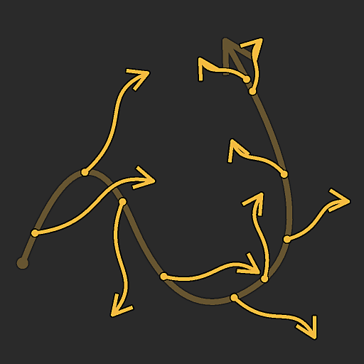

# Dispersão Splines em Splines

<table>
<tr style="border: 0;">
<td width="33.33%" style="border: 0;" valign="top">

<b>Ferramentas De Spline E Caminho </b> Em: > Ferramenta de linha flexível

</td>
<td width="100.00%" style="border: 0;" valign="top">

## Descrição

Coloca as splines ao longo das splines principais de entrada.

O nó oferece opções de personalização detalhadas para controlar como as splines são dispersas e permite dispersão splines retas simples ou suas próprias splines personalizadas.

O nó permite criar estruturas intrincadas para mapear cores e imagens usando os nós [Mapeador de spline](../../../../../../compositing-graphs/nodes-reference-for-com/node-library/spline-paths-tools/spline-tools/spline-mapper-grayscale/spline-mapper-grayscale.md) ou usado como um esqueleto para inserir formas usando os nós [Dispersão no Spline](../../../../../../compositing-graphs/nodes-reference-for-com/node-library/spline-paths-tools/spline-tools/scatter-spline-grayscale/scatter-on-spline-grayscale.md).

</td>
</tr>
</table>

<table>
<tr style="border: 0;">
<td style="border: 0;" valign="top">

### Tutorial

Clique na imagem à direita para acessar nosso <b>tutorial dedicado</b>, para obter um tour guiado sobre os recursos do nó e seu uso no contexto de um fluxo de trabalho baseado em spline.

</td>
<td style="border: 0;" valign="top">

</td>
</tr>
</table>

## Entradas

|  |  |
|:---|:---|
| <b>Visualizar</b> *Tons de cinza* | A visualização das linhas de entrada como uma imagem em tons de cinza. |
| <b>Cordas de spline</b> *Cor* | As coordenadas dos pontos das splines pai codificadas nos canais RGBA de uma imagem colorida: <b>R</b> - posição X <b>G</b> - posição Y <b>B</b> - Height <b>A</b> - Dados empacotados: - Sinal: a spline está fechada (negativa) ou aberta (positiva) - Valor absoluto: Thickness + 1 |
| <b>Dados de Spline</b> *Cor* | Dados adicionais das splines pai codificadas nos canais RGBA de uma imagem colorida: <b>R</b> - Tangentes X <b>G</b> - Tangentes Y <b>B</b> - Tangentes Z <b>A</b> - Não Usados |
| <b>Valor da spline</b> *Inteiro* | O número de splines pai. |
| <b>Cordas de Spline Personalizadas</b> *Cor* | As coordenadas dos pontos das splines personalizadas codificadas nos canais RGBA de uma imagem colorida: <b>R</b> - posição X <b>G</b> - posição Y <b>B</b> - Height <b>A</b> - Dados empacotados: - Sinal: a spline está fechada (negativa) ou aberta (positiva) - Valor absoluto: Thickness + 1 |
| <b>Dados de Spline Personalizados</b> *Cor* | Dados adicionais das splines personalizadas codificadas nos canais RGBA de uma imagem colorida: <b>R</b> - Tangentes X <b>G</b> - Tangentes Y <b>B</b> - Tangentes Z <b>A</b> - Não Usadas |
| <b>Valor de Spline Personalizado</b> *Inteiro* | O número de splines personalizados. |
| <b>Mapa de Escala</b> *Tons de cinza* | O mapa em tons de cinza que controla a escala dos splines dispersos.  O efeito deste mapa é controlado pelo parâmetro <b>Multiplicador de Entrada de Mapa de Escala</b> e é combinado com outros parâmetros no grupo <b>Tamanho</b>. |
| <b>Mapa de rotação</b> *Tons de cinza* | O mapa em tons de cinza que controla a rotação dos splines dispersos.  O efeito desse mapa é controlado pelo parâmetro <b>Multiplicador de Entrada de Mapa de rotação</b> e é combinado com outros parâmetros no grupo <b>Rotação</b>. |

## Saídas

|  |  |
|:---|:---|
| <b>Visualizar</b> *Tons de cinza* | A visualização das splines dispersas como uma imagem em tons de cinza. |
| <b>Cordas de spline</b> *Cor* | As coordenadas dos pontos das splines dispersas codificadas nos canais RGBA de uma imagem colorida: <b>R</b> - posição X <b>G</b> - posição Y <b>B</b> - Height <b>A</b> - Dados empacotados: - Sinal: a spline está fechada (negativa) ou aberta (positiva) - Valor absoluto: Thickness + 1 |
| <b>Dados de Spline</b> *Cor* | Dados adicionais das linhas dispersas codificadas nos canais RGBA de uma imagem colorida: <b>R</b> - Tangentes X <b>G</b> - Tangentes Y <b>B</b> - Não Usados <b>A</b> - Não Usados |
| <b>Valor da spline</b> *Inteiro* | O número de splines dispersos. |

## Parâmetros

|  |  |
|:---|:---|
| <b>Lado</b> *Inteiro* | Controla em que lado(s) das splines pai as splines devem ser espalhadas, considerando que &#39;forward&#39; é a direção das splines *pai*:  - <b>Esquerda</b> Coloque as splines no lado esquerdo. - <b>Direita</b> Coloque as splines no lado direito. - <b>Esquerda + Direita</b> Coloque as splines em ambos os lados. - <b>Esquerda / Direita - Alternativa</b> Coloque as splines à esquerda e à direita alternativamente (Por exemplo, todos os outros lados). - <b>Esquerda/Direita - Aleatório</b> Escolha o lado aleatoriamente para cada spline. |
| <b>Modo de Valor</b> *Inteiro* | O método de dispersão das linhas divisórias ao longo das linhas divisórias pai, que afeta a quantidade de linhas divisórias dispersas em cada linha divisória pai:  - <b>Quantidade fixa por linha divisória</b> A quantidade especificada de linhas divisórias com espaçamento uniforme está dispersa. - <b>Espaçamento</b> A quantidade de linhas divisórias é ajustada automaticamente para se ajustar ao espaçamento uniforme especificado.  Em ambos os casos, o primeiro e o último spline espalhados caem exatamente no início e no final de cada spline pai, respectivamente. |
| <b>Quantidade De Spline Por Spline</b> *Inteiro* | A quantidade de splines com espaçamento uniforme espalhados ao longo de cada spline pai. |
| <b>Espaçamento da spline</b> *Flutuante* | A distância mínima ao longo das linhas divisórias principais pela qual as linhas divisórias devem ser espaçadas, ainda aterrando a primeira e última linha divisória no início e no fim de cada linha divisória principal, respectivamente. |
| <b>Tipo de Spline</b> *Inteiro* | Seleciona que tipo de spline deve ser espalhado nas splines pai:  - <b>Reta</b> Uma spline simples e reta. - <b>Curva personalizada</b> A(s) spline(s) fornecida(s) para as entradas da <b>Curva personalizada</b>. Várias splines são compatíveis quando anexadas juntas em uma lista. |
| <b>Seleção de Spline Personalizada</b> *Inteiro* | Ao usar várias splines personalizadas anexadas a uma lista, esse parâmetro permite que você selecione como essas splines devem ser distribuídas na dispersão.  - <b>Lista inteira</b> Todas as splines estão dispersas juntas como um grupo. - <b>Sequenciais</b> Cada spline individual está dispersa em ordem, repetindo em torno da lista. - <b>Aleatório</b> Uma spline aleatória é selecionada na lista para cada spline dispersa. |
| <b>Iniciar</b> *Flutuante* | Desloca o ponto a partir do início das splines principais onde a dispersão começa. O valor é o comprimento normalizado de cada spline pai. |
| <b>Fim</b> *Flutuante* | Desloca o ponto a partir do início das splines principais onde a dispersão termina. O valor é o comprimento normalizado de cada spline pai. |
| <b>Inverter Direção</b> *Booleano* | Inverte a direção dos splines dispersos. |
| <b>Modo de Simetria Esquerda/Direita</b> *Inteiro* | O método de simetria aplicado às linhas de spline espalhadas em cada lado das linhas de spline pai.  - <b>Desabilitado</b> Nenhuma simetria é aplicada, as linhas de spline são colocadas em cada lado usando uma rotação simples. - <b>simetria esquerda</b> A linha de spline à esquerda é simétrica à da direita relativamente à linha de spline pai. - <b>simetria direita</b> A linha de spline à direita é simétrica à da esquerda relativamente à linha de spline pai. |
| <b>Vínculo Aleatório à Esquerda/Direita</b> *Booleano* | Controla se os splines em cada lado do spline pai devem usar os mesmos valores ao usar rotação aleatória, dimensionamento aleatório etc. Em outras palavras:  - <i>False:</i> cada spline usa valores aleatórios separados - <i>True:</i> ambas as splines compartilham os mesmos valores aleatórios |
| <b>Modo de Tabela Dinâmica de Spline</b> *Inteiro* | Define o método de inserção da tabela dinâmica de splines dispersos, o que afeta a rotação e o dimensionamento. Observe que a tabela dinâmica é *sempre colocada na spline pai* e seus controles afetam a spline dispersa. Em outras palavras: o pivô não se move, é a spline dispersa que se move e dimensiona relativamente a ela.  - <b>Posição ao longo da spline</b> Mova o pivô ao longo da spline dispersa. - <b>Posição absoluta</b> Defina uma posição arbitrária para o pivô. |
| <b>Posição de pivô ao longo da spline</b> *Flutuante* | A posição normalizada do pivô ao longo da spline dispersa, onde 0 é o início e 1 é o fim. Observe que a tabela dinâmica segue a *direção* da spline dispersa e a orientação da spline pode mudar para preservar a posição e a rotação da tabela dinâmica em relação à spline pai. |
| <b>Posição Absoluta da Tabela Dinâmica</b> *Flutuante2* | A posição no espaço UV do pivô. |
| <b>Correção Não Quadrada</b> *Booleano* | Ajuste as posições e o thickness das splines para manter sua forma em resoluções não quadradas. <i>Observação:</i> ao usar splines personalizados, a spline personalizada deve usar a *mesma proporção de imagem* dos nós <b>Splines de Dispersão</b>. |
| <b>Tamanho</b> |  |
| <b>Escala de spline</b> *Flutuante* | Um controle global para o tamanho de todos os splines, em que 1 é o tamanho original completo. O dimensionamento é aplicado relativamente à tabela dinâmica de uma spline. A posição de pivô pode ser deslocada usando o parâmetro <b>Tabela Dinâmica de Spline</b>. |
| <b>Escala de spline aleatória</b> *Flutuante* | Aplica um multiplicador aleatório até o valor especificado para diminuir o tamanho das splines. |
| <b>Multiplicador de Entrada de Mapa de Escala</b> *Flutuante* | Controla a intensidade da entrada do <b>Mapa de Escala</b>. Esse mapa atua como um multiplicador para o tamanho atual dos padrões. O efeito deste mapa é combinado com outros parâmetros no grupo <b>Tamanho</b>. |
| <b>Modo de Amostragem de Entrada de Mapa de Escala</b> *Inteiro* | O método de mapear os valores no <b>Mapa de Escala</b> para as linhas:  - <b>espaço de Textura</b> Os valores são aplicados às linhas onde estariam se fossem colocados em uma textura usando as coordenadas UV da textura. Isso aplica efetivamente o valor às linhas de spline &#39;no local&#39; - <b>Horizontal ao longo da linha de spline</b>. Os valores são aplicados diretamente às coordenadas das linhas de spline codificadas (consulte a entrada <b>Cordas de spline</b>), onde cada linha é aplicada a uma linha de spline diferente de cima para baixo - <b>Hor. ao longo do spline (rand. deslocamento X)</b> Os valores são aplicados diretamente às coordenadas das splines codificadas (consulte a entrada <b>Coords de spline</b>), com um deslocamento horizontal aleatório no <b>Mapa de Escala</b> para cada spline (isto é, cada linha nas <b>Coords de spline</b>) - <b>Hora. ao longo do spline (rand. deslocamento Y)</b> Os valores são aplicados diretamente às coordenadas das splines codificadas (consulte entrada <b>Coords de spline</b>), com um deslocamento vertical aleatório no <b>Mapa de Escala</b> para cada spline (isto é, cada linha em <b>Coords de spline</b>) |
| <b>Atenuação de Início/Término</b> *Flutuante2* | Fatores na distância do ponto médio da spline até seu <b>Início</b> e <b>Fim</b> ao dimensionar as splines. Isso significa que o tamanho é diminuído para splines mais próximos aos extremidades de um spline. |
| <b>Posição</b> |  |
| <b>Deslocamento local</b> *Flutuante2* | Aplica um deslocamento às posições das splines ao longo da tangente (paralela) e do normal (perpendicular) da spline pai. |
| <b>Deslocamento no Intervalo de Spline</b> *Inteiro* | Define o intervalo de deslocamento aplicado às linhas divisórias dispersas ao longo das linhas divisórias pai.  - <b>Intervalo</b> O intervalo abrange o intervalo *entre* cada linha divisória dispersa. - <b>Linha divisória pai</b> O intervalo abrange o *comprimento total* da linha divisória pai. |
| <b>Deslocamento na spline</b> *Flutuante* | Aplica um deslocamento de posição às linhas ao longo das linhas pai. |
| <b>Intervalo de deslocamento aleatório</b> *Inteiro* | Define o intervalo de deslocamento aleatório aplicado às splines dispersas ao longo das splines pai.  - <b>Intervalo</b> O intervalo abrange o intervalo *entre* cada spline dispersa. - <b>spline pai</b> O intervalo abrange o *comprimento total* da spline pai. |
| <b>Deslocamento aleatório na spline</b> *Flutuante* | Aplica um deslocamento de posição adicional às splines ao longo das splines principais. |
| <b>Deslocamento por Thickness</b> *Flutuante* | Aplica um deslocamento às linhas divisórias dispersas ao longo do normal das linhas divisórias pai, até o thickness das linhas divisórias pai. Efetivamente, um valor de 1 permite colocar as linhas divisórias dispersas na *superfície* do envelope das linhas divisórias pai. |
| <b>Rotação</b> |  |
| <b>Alinhamento de Spline Personalizado</b> *Inteiro* | Controla a orientação inicial da(s) spline(s) personalizada(s) nas splines pai.  - <b>Tangente do primeiro ponto</b> As splines são orientadas de acordo com a tangente do primeiro ponto. Em outras palavras, elas saem das splines pai na direção definida pelo primeiro ponto. - <b>Espaço da imagem</b> As splines são colocadas como aparecem originalmente, sem nenhum ajuste adicional na posição ou orientação, como se a imagem que as representa estivesse na spline pai. |
| <b>Modo de rotação</b> *Inteiro* | Define a orientação inicial das linhas divisórias dispersas.  - <b>Da linha divisória</b> As linhas divisórias são orientadas para corresponder à *normal* das linhas divisórias pai em seu local. - <b>Absoluta</b> Todas as linhas divisórias são orientadas da *mesma maneira*, independentemente da direção das linhas divisórias pai. |
| <b>Rotação</b> *Precisão decimal* | Gira os splines ao redor de seus pivôs, em número de voltas. A posição de pivô pode ser deslocada usando o parâmetro <b>Tabela Dinâmica de Spline</b>. |
| <b>Rotação aleatória</b> *Precisão decimal* | Aplica uma rotação aleatória adicional aos splines ao redor de seus pivôs, em número de voltas. A posição de pivô pode ser deslocada usando o parâmetro <b>Tabela Dinâmica de Spline</b>. |
| <b>Ângulo esquerdo/direito</b> *Precisão decimal* | Controla o ângulo de rotação simétrica aplicado às splines em cada lado das splines pai, em número de voltas. |
| <b>Ângulo Aleatório à Esquerda/Direita</b> *Precisão decimal* | Adiciona uma quantidade aleatória de rotação simétrica às splines de cada lado das splines pai, em número de voltas. |
| <b>Multiplicador de Entrada de Mapa de rotação</b> *Precisão decimal* | Controla a intensidade da entrada de <b>Mapa de rotação</b>. Este mapa atua como um multiplicador para a rotação atual dos padrões. O efeito deste mapa é combinado com outros parâmetros no grupo <b>Rotação</b>. |
| <b>Modo de Amostragem de Entrada de Mapa de rotação</b> *Inteiro* | O método de mapear os valores no <b>Mapa de rotação</b> para as linhas:  - <b>espaço de Textura</b> Os valores são aplicados às linhas onde estariam se fossem colocados em uma textura usando as coordenadas UV da textura. Isso aplica efetivamente o valor às linhas de spline &#39;no local&#39;, - <b>Horizontal ao longo da linha de spline</b>. Os valores são aplicados diretamente às coordenadas das linhas de spline codificadas (consulte a entrada <b>Cordas de spline</b>), onde cada linha é aplicada a uma linha de spline diferente de cima para baixo, - <b>Hor. ao longo do spline (rand. deslocamento X)</b> Os valores são aplicados diretamente às coordenadas das splines codificadas (consulte a entrada <b>Coords de spline</b>), com um deslocamento horizontal aleatório no <b>Mapa de rotação</b> para cada spline (isto é, cada linha nas <b>Coords de spline</b>). - <b>Hora. ao longo do spline (rand. deslocamento Y)</b> Os valores são aplicados diretamente às coordenadas das splines codificadas (consulte a entrada <b>Coords de spline</b>), com um deslocamento vertical aleatório no <b>Mapa de rotação</b> para cada spline (isto é, cada linha nas <b>Coords de spline</b>)<b>.</b> |
| <b>A Entrada Do Mapa de rotação Afeta</b> *Inteiro* | Seleciona o parâmetro de rotação afetado pelo <b>Mapa de rotação</b>:  - <b>Rotação da spline</b>. O mapa afeta a rotação global das splines no sentido horário. - <b>Ângulo esquerdo/direito</b>. O mapa afeta a rotação simétrica das splines <b>Esquerda/direita</b>. |
| <b>Height</b> |  |
| <b>Iniciar Modo de Height</b> *Inteiro* | O método de calcular o height inicial das splines dispersas.  - <b>Manual</b> Defina o mesmo valor absoluto para todas as splines dispersas. - <b>Da spline pai (+ spline personalizada)</b> Use o height da spline pai e adicione o height da spline personalizada usando a <b>Mult de height inicial de spline personalizada.</b> parameter. - <b>Da spline personalizada</b> Use o height da spline personalizada como está.  <i>Observação:</i> defina o <b>Tipo de Spline</b> como &#39;Spline Personalizada&#39; e conecte as entradas da <b>Spline Personalizada</b> para usar o height de splines personalizadas. |
| <b>Mult de Height de Início de Spline Personalizado.</b> *Flutuante* | Controla a contribuição do próprio height inicial da spline personalizada para o height inicial das splines dispersas, onde 1 significa que o height completo da spline personalizada é usado. O height da spline personalizada é usado de forma diferente, de acordo com o <b>Modo de Height Inicial</b> selecionado: - <i>Da spline pai (+ spline personalizada):</i> O height é adicionado à spline pai - <i>Da spline personalizada:</i> O height é usado diretamente |
| <b>Iniciar Deslocamento de Height</b> *Flutuante* | Aplica um deslocamento absoluto ao height inicial da spline dispersa. |
| <b>Iniciar Height</b> *Flutuante* | Define um valor absoluto para o height inicial da spline dispersa. |
| <b>Encerrar Modo de Height</b> *Inteiro* | O método de calcular o height final das splines dispersas.  - <b>Manual</b> Defina o mesmo valor absoluto para todas as splines dispersas. - <b>Da spline pai (+ spline personalizada)</b> Use o height da spline pai e adicione o height da spline personalizada usando o <b>Módulo de Height de Extremidade de Spline Personalizada.</b> parameter. - <b>Da spline personalizada</b> Use o height da spline personalizada como está.  <i>Observação:</i> defina o <b>Tipo de Spline</b> como Spline Personalizada e conecte as entradas da <b>Spline Personalizada</b> para usar o height de splines personalizadas. |
| <b>Mult de Height de Fim de Spline Personalizado.</b> *Flutuante* | Controla a contribuição do próprio height final da spline personalizada para o height final das splines dispersas, onde 1 significa que o height completo da spline personalizada é usado. O height da spline personalizada é usado de forma diferente, de acordo com o <b>Modo de Height Final</b> selecionado: - <i>Da spline pai (+ spline personalizada):</i> O height é adicionado à spline pai - <i>Da spline personalizada:</i> O height é usado diretamente |
| <b>Deslocamento do Height Final</b> *Flutuante* | Aplica um deslocamento absoluto ao height final da spline dispersa. |
| <b>Encerrar Height</b> *Flutuante* | Define um valor absoluto para o height final da spline dispersa. |
| <b>Thickness</b> |  |
| <b>Iniciar Modo de Thickness</b> *Inteiro* | O método de calcular o thickness inicial das splines dispersas.  - <b>Manual</b> Defina o mesmo valor absoluto para todas as splines dispersas. - <b>Da spline pai</b> Use o thickness da spline pai. - <b>Da spline personalizada</b> Use o thickness da spline personalizada.  <i>Observação:</i> Defina o <b>Tipo de Spline</b> como Spline Personalizada e conecte as entradas da <b>Spline Personalizada</b> para usar o thickness splines personalizados. |
| <b>Iniciar Multiplicador de Thickness</b> *Flutuante* | Dimensiona o thickness inicial dos splines dispersos, onde 1 é o thickness completo. |
| <b>Iniciar Deslocamento de Thickness</b> *Flutuante* | Aplica um deslocamento absoluto ao thickness inicial da spline dispersa. |
| <b>Iniciar Thickness</b> *Flutuante* | Define um valor absoluto para o thickness inicial da spline dispersa. |
| <b>Encerrar Modo de Thickness</b> *Inteiro* | O método de calcular o thickness final das splines dispersas.  - <b>Manual</b> Defina o mesmo valor absoluto para todas as splines dispersas. - <b>Da spline pai</b> Use o thickness da spline pai. - <b>Da spline personalizada</b> Use o thickness da spline personalizada.  <i>Observação:</i> Defina o <b>Tipo de Spline</b> como Spline Personalizada e conecte as entradas da <b>Spline Personalizada</b> para usar o thickness splines personalizados. |
| <b>Encerrar Multiplicador de Thickness</b> *Flutuante* | Dimensiona o thickness inicial dos splines dispersos, onde 1 é o thickness completo. |
| <b>Deslocamento do Thickness Final</b> *Flutuante* | Aplica um deslocamento absoluto ao thickness final da spline dispersa. |
| <b>Encerrar Thickness</b> *Flutuante* | Define um valor absoluto para o thickness final da spline dispersa. |
| <b>Visualizar</b> |  |
| <b>Mostrar Auxiliar de Direção</b> *Booleano* | Exibe um ponto no início da spline e uma ponta de seta no final da saída de <b>Visualização</b>. |
| <b>Mostrar Envelope de Thickness</b> *Booleano* | Exibe linhas adicionais nas bordas do thickness da spline. |
| <b>Thickness (px)</b> *Flutuante* | Ajusta o thickness da visualização da spline na saída de <b>Visualização</b>, em número de pixels. |
| <b>Valor de Segmentos</b> *Inteiro* | Ajusta o número de segmentos usados para desenhar a visualização de spline na saída de <b>Visualização</b>. Um valor mais alto resulta em uma linha mais suave. |
| <b>Intensidade de fundo</b> *Flutuante* | A intensidade da entrada <b>Visualizar</b> na visualização de saída <b>Visualizar</b>. |

## Exemplos

<table>
<tr style="border: 0;">
<td style="border: 0;" valign="top">

{zoomable="yes"}

</td>
<td style="border: 0;" valign="top">

{zoomable="yes"}

</td>
</tr>
</table>

<table>
<tr style="border: 0;">
<td style="border: 0;" valign="top">

{zoomable="yes"}

</td>
<td style="border: 0;" valign="top">

{zoomable="yes"}

</td>
</tr>
</table>

## Renderizações

<table>
<tr style="border: 0;">
<td style="border: 0;" valign="top">

{zoomable="yes"}

</td>
<td style="border: 0;" valign="top">

{zoomable="yes"}

</td>
</tr>
</table>

{zoomable="yes"}
