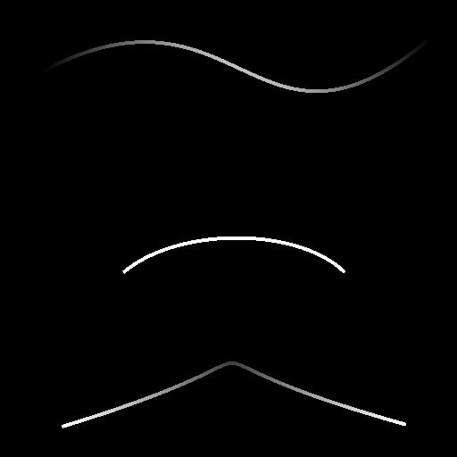

# Mapeador da ponte de spline em tons de cinza

<table>
<tr style="border: 0;">
<td width="33.33%" style="border: 0;" valign="top">

<b>Ferramentas De Spline E Caminho </b> Em: > Ferramenta de linha flexível

</td>
<td width="100.00%" style="border: 0;" valign="top">

## Descrição

Mapeia uma imagem em tons de cinza em uma lista de splines de entrada para que a imagem atravesse as splines na ordem.

</td>
</tr>
</table>

>[!TIP]
>
> O mapeamento vai do primeiro spline na lista até o último e atravessa os splines intermediários seguindo estritamente a ordem desses splines na lista.
> 
> Portanto, você deve ter cuidado com a ordem na qual você acrescenta splines com antecedência.

>[!NOTE]
>
> Consulte também [Cor do mapeador da ponte de spline](../../../../../../compositing-graphs/nodes-reference-for-com/node-library/spline-paths-tools/spline-tools/spline-bridge-mapper-col/spline-bridge-mapper-color.md).

## Conectores de entrada

<b>Cordas de spline</b> *Cor* As coordenadas dos pontos das splines de entrada codificadas nos canais RGBA de uma imagem colorida:

<b> R</b> - Posição X\
<b> G</b> - posição Y\
<b> B</b> - Height\
    <b>A</b> - Dados empacotados:\
        * Sinal: Spline é fechado (negativo) ou aberto (positivo);\
        * Valor absoluto: Thickness + 1.

<b>Dados de Spline</b> *Cor* Dados adicionais das splines de entrada codificados nos canais RGBA de uma imagem colorida.\
<b> R</b> - Tangentes X\
<b> G</b> - Tangentes Y\
<b> B</b> - Não Usado\
<b> A</b> - Não Usado

<b>Valor da spline</b> *Inteiro* O número de splines de entrada.

<b>Mapa de cores </b>*Tons de cinza* A imagem em tons de cinza de entrada que deve ser mapeada nas linhas divisórias de entrada.

## Conectores de saída

<b>Cor</b> *Tons de cinza* Resultado do mapeamento da imagem colorida de entrada nas linhas como uma imagem em tons de cinza.

<b>Height</b> *Tons de cinza* O height das splines mapeadas através delas, como uma imagem em tons de cinza.

<b>UV</b> *Cor* Os UVs (isto é, as coordenadas) da imagem mapeada, codificados nos canais vermelho (U) e verde (V) de uma imagem colorida.

<b>Máscara</b> *Tons de cinza* Uma máscara do mapeamento nas linhas.

## Parâmetros

<b>Valor de Segmentos</b> *Inteiro* As splines são simplificadas em segmentos antes que as coordenadas da imagem os atravessem.\
Uma quantidade maior de segmentos resulta em um mapeamento mais suave ao longo das curvas.

<b>Reduzir Ampliação de UVs</b> *Booleano* Ajusta o método usado para interpolar as coordenadas da imagem de uma spline para a próxima para minimizar o alongamento quando a distância entre as splines é irregular.

<b>Escala UV</b> *Flutuante2* Ajusta a escala das coordenadas da imagem. Valores mais altos resultam em uma imagem ladrilhada mais densa.

<b>Rotação UV</b> *Flutuar* Gira as coordenadas da imagem em torno de seu centro.

## Exemplos

<table>
<tr style="border: 0;">
<td style="border: 0;" valign="top">

<table>
  <tr>
    <td>
      
       <i>Antes</i>
    </td>
    <td>
      
       <i>Depois</i>
    </td>
  </tr>
</table>

</td>
<td style="border: 0;" valign="top">

</td>
</tr>
</table>

<table>
<tr style="border: 0;">
<td style="border: 0;" valign="top">

</td>
<td style="border: 0;" valign="top">

</td>
</tr>
</table>
