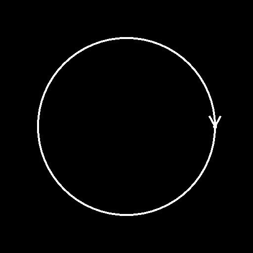

# Círculo com Spline

<table>
<tr style="border: 0;">
<td width="33.33%" style="border: 0;" valign="top">

<b>Ferramentas De Spline E Caminho </b> Em: > Ferramenta de linha flexível

</td>
<td width="100.00%" style="border: 0;" valign="top">

## Descrição

Gera uma única spline na forma de um círculo.

</td>
</tr>
</table>

## Entradas

|  |  |
|:---|:---|
| <b>Visualizar</b> <i>Tons de cinza</i> | A visualização das linhas de entrada como uma imagem em tons de cinza. |
| <b>Cordas de spline</b> <i>Cor</i> | As coordenadas dos pontos das linhas divisórias de entrada codificadas nos canais RGBA de uma imagem colorida: <b>R</b> - Posição X <b>G</b> - Posição Y <b>B</b> - Height <b>A</b> - Dados empacotados: - Sinal: a linha divisória é fechada (negativa) ou aberta (positiva); - Valor absoluto: Thickness + 1. |
| <b>Dados de Spline</b> <i>Cor</i> | Dados adicionais das splines de entrada codificadas nos canais RGBA de uma imagem colorida. <b>R</b> - Tangentes X <b>G</b> - Tangentes Y <b>B</b> - Não Usadas <b>A</b> - Não Usadas |
| <b>Valor da spline</b> <i>Inteiro</i> | O número de splines de entrada. |

## Saídas

|  |  |
|:---|:---|
| <b>Visualizar</b> <i>Tons de cinza</i> | A visualização das linhas de saída como uma imagem em tons de cinza. |
| <b>Cordas de spline</b> <i>Cor</i> | As coordenadas dos pontos das linhas divisórias de saída codificadas nos canais RGBA de uma imagem colorida. <b>R</b> - Posição X <b>G</b> - Posição Y <b>B</b> - Height <b>A</b> - Dados empacotados: - Sinal: a linha divisória é fechada (negativa) ou aberta (positiva); - Valor absoluto: Thickness + 1. |
| <b>Dados de Spline</b> <i>Cor</i> | Dados adicionais das splines de saída codificadas nos canais RGBA de uma imagem colorida. <b>R</b> - Tangentes X <b>G</b> - Tangentes Y <b>B</b> - Não Usadas <b>A</b> - Não Usadas |
| <b>Valor da spline</b> <i>Inteiro</i> | O número de splines de saída. |

## Parâmetros

|  |  |
|:---|:---|
| <b>Raio do círculo</b> <i>Flutuante</i> | Ajusta o raio do círculo no espaço de textura. |
| <b>Pré-rotação do Círculo</b> <i>Flutuante</i> | Aplica uma rotação ao círculo base antes que o Tamanho seja aplicado. |
| <b>Tamanho do Círculo</b> <i>Flutuante2</i> | Ajusta o tamanho horizontal (X) e o tamanho vertical (Y) do círculo. |
| <b>Pós-rotação do círculo</b> <i>Flutuante</i> | Aplica uma rotação ao círculo base após a aplicação do Tamanho. |
| <b>Posição do Círculo</b> <i>Flutuante2</i> | Define a posição do centro do círculo no espaço de textura. |
| <b>Iniciar Thickness</b> <i>Flutuante</i> | Ajusta o thickness do ponto inicial do círculo. Este thickness é interpolado ao longo da spline até o Thickness Final. Observação: o Thickness é usado por nós Spline específicos. |
| <b>Encerrar Thickness</b> <i>Flutuante</i> | Ajusta o thickness do ponto final do círculo. Este thickness é interpolado ao longo da spline para o Thickness de Início. Observação: o Thickness é usado por nós de spline específicos. |
| <b>Iniciar Height</b> <i>Flutuante</i> | Ajusta o height do ponto inicial do círculo, onde um valor mais baixo significa um local mais baixo ou mais profundo. Esse height é interpolado ao longo da spline até o Height final. |
| <b>Encerrar Height</b> <i>Flutuante</i> | Ajusta o height do ponto final do círculo onde um valor mais baixo significa um local mais baixo ou mais profundo. Esse height é interpolado ao longo da spline a partir do Height inicial. |
| <b>Cortar</b> <i>Flutuante2</i> | Desloca os pontos inicial e final da spline ao longo do círculo. Esses valores são normalizados. |
| <b>Espiral</b> <i>Flutuante</i> | Desloca o ponto inicial do círculo de seu raio para seu centro. A distância do centro é então interpolada ao longo do spline até o final do spline. Este valor está normalizado. |
| <b>Rotações em espiral</b> <i>Flutuante</i> | Define o número de voltas feitas pela espiral ao redor de seu centro. |
| <b>Energia em espiral</b> <i>Flutuante</i> | Aplica uma curva de potência à distância do centro usada para desenhar a espiral. Um valor maior do que um significa que uma porção maior da espiral permanece próxima ao centro. |
| <b>Inverter Direção</b> <i>Booleano</i> | Inverte a direção da spline. |
| <b>Distribuição Uniforme</b> <i>Booleano</i> | Quando verdadeiro, os pontos da spline ficam com espaçamento uniforme do início ao fim. |
| <b>Acrescentar Spline de Entrada</b> <i>Booleano</i> | Adiciona a spline gerada ao final da lista de splines conectadas às entradas de <b>spline</b>. |
| <b>Correção Não Quadrada</b> <i>Booleano</i> | Ajuste as posições e o thickness dos pontos para manter a forma de spline em resoluções não quadradas. Isso também afeta a distribuição uniforme. |
| <b>Visualizar</b> |  |
| <b>Mostrar Auxiliar de Direção</b> <i>Booleano</i> | Exibe um ponto no início da spline e uma ponta de seta no final da saída de Visualização. |
| <b>Mostrar Envelope de Thickness</b> <i>Booleano</i> | Exibe linhas adicionais nas bordas do thickness da spline. |
| <b>Valor de Segmentos</b> <i>Inteiro</i> | Ajusta o número de segmentos usados para desenhar a visualização de spline na saída da Visualização. Um valor mais alto resulta em uma linha mais suave. |
| <b>Thickness (px)</b> <i>Flutuante</i> | Ajusta o thickness em pixels da visualização de spline na saída da Visualização. |

## Exemplos

<table>
<tr style="border: 0;">
<td style="border: 0;" valign="top">

</td>
<td style="border: 0;" valign="top">

</td>
</tr>
</table>

<table>
<tr style="border: 0;">
<td style="border: 0;" valign="top">

</td>
<td style="border: 0;" valign="top">

</td>
</tr>
</table>
