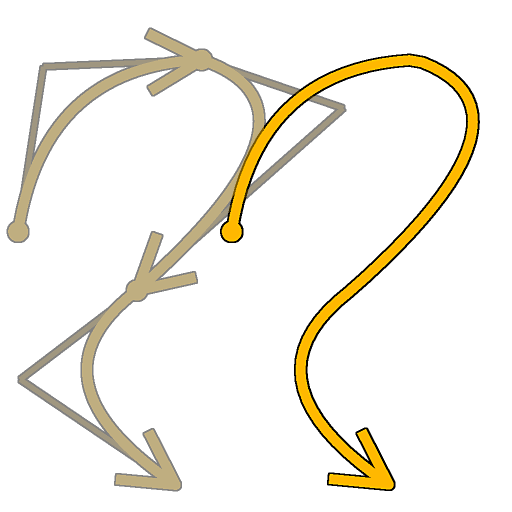

# Lista de mesclagem de spline

<table>
<tr style="border: 0;">
<td style="border: 0;" valign="top">

<table>
<tr style="border: 0;">
<td width="33.33%" style="border: 0;" valign="top">

<b>Ferramentas De Spline E Caminho </b> Em: > Ferramenta de linha flexível

</td>
<td width="100.00%" style="border: 0;" valign="top">

## Descrição

Mescla todas as linhas na lista de entrada em uma única linha.

</td>
</tr>
</table>

## Conectores de entrada

<b>Cordas de spline</b> *Cor* As coordenadas dos pontos das splines de entrada codificadas nos canais RGBA de uma imagem colorida:\
<b> R</b> - Posição X\
<b> G</b> - posição Y\
<b> B</b> - Height\
    <b>A</b> - Dados empacotados:\
        * Sinal: Spline é fechado (negativo) ou aberto (positivo);\
        * Valor absoluto: Thickness + 1.

<b>Dados de Spline</b> *Cor* Dados adicionais das splines de entrada codificados nos canais RGBA de uma imagem colorida.\
<b> R</b> - Tangentes X\
<b> G</b> - Tangentes Y\
<b> B</b> - Não Usado\
<b> A</b> - Não Usado

<b>Valor da spline</b> *Inteiro* O número de splines de entrada.

## Conectores de saída

<b>Visualizar</b> *Tons de cinza* A visualização das splines mescladas como uma imagem em tons de cinza.

<b>Cordas de spline</b> *Cor* As coordenadas dos pontos de splines mesclados codificados nos canais RGBA de uma imagem colorida.\
    <b>R</b> - Posição X\
    <b>G</b> - posição Y\
    <b>B</b> - Height\
    <b>A</b> - Dados empacotados:\
        * Sinal: Spline é fechado (negativo) ou aberto (positivo);\
        * Valor absoluto: Thickness + 1.

<b>Dados de Spline</b> *Cor* Dados adicionais das splines mescladas codificadas nos canais RGBA de uma imagem colorida.\
    <b>R</b> - Tangentes X\
    <b>G</b> - Tangentes Y\
    <b>B</b> - Não Usado\
    <b>A</b> - Não Usado

<b>Valor da spline</b> *Inteiro* O número de splines mescladas.

## Parâmetros

<b>Limite de Distância da Curva Fechada</b> *Flutuação* A distância no espaço de textura abaixo da qual duas extremidades de uma mesma spline são processadas como um único ponto fechando essa spline.\
Isso evita sobreposições ao espalhar formas ou mapear imagens ao longo das splines.

+++Visualização
<b>Valor de Segmentos</b> *Inteiro* Ajusta o número de segmentos usados para desenhar a visualização de spline na saída da Visualização.\
Um valor mais alto resulta em uma linha mais suave.

<b>Mostrar Auxiliar de Direção</b> *Booleano* Exibe um ponto no início da spline e uma ponta de seta no final da saída de Visualização.

<b>Mostrar Envelope de Thickness</b> *Booleano*\
Exibe linhas adicionais nas bordas do thickness da spline.

<b>Thickness (px)</b> *Flutuante* Ajusta o thickness da visualização da spline em pixels na saída da Visualização.

+++

## Exemplos

<table>
<tr style="border: 0;">
<td style="border: 0;" valign="top">

<table>
  <tr>
    <td>
      
       <i>Antes</i>
    </td>
    <td>
      
       <i>Depois</i>
    </td>
  </tr>
</table>

</td>
<td style="border: 0;" valign="top">

<table>
  <tr>
    <td>
      
       <i>Antes</i>
    </td>
    <td>
      
       <i>Depois</i>
    </td>
  </tr>
</table>

</td>
</tr>
</table>

</td>
<td style="border: 0;" valign="top">

</td>
<td style="border: 0;" valign="top">

</td>
</tr>
</table>
