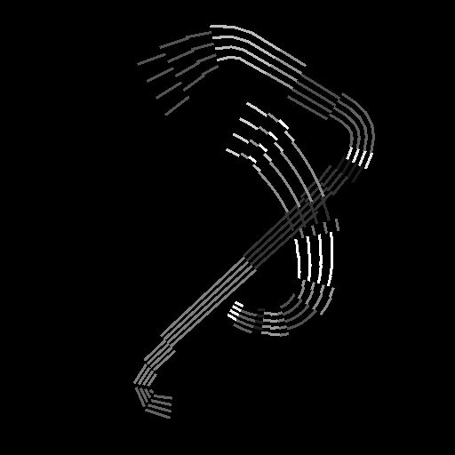

# Renderização de spline

<table>
<tr style="border: 0;">
<td style="border: 0;" valign="top">

<table>
<tr style="border: 0;">
<td width="33.33%" style="border: 0;" valign="top">

<b>Ferramentas De Spline E Caminho </b> Em: > Ferramenta de linha flexível

</td>
<td width="100.00%" style="border: 0;" valign="top">

## Descrição

Desenha cadeias de segmentos ao longo das <b>Splines</b> de entrada sobre o <b>Fundo</b> de entrada.

</td>
</tr>
</table>

## Conectores de entrada

<b>Fundo </b>*Tons de Cinza* A imagem em tons de cinza sobre a qual as linhas divisórias devem ser desenhadas.

<b>Cordas de spline</b> *Cor* As coordenadas dos pontos das splines de entrada codificadas nos canais RGBA de uma imagem colorida:\
<b> R</b> - Posição X\
<b> G</b> - posição Y\
<b> B</b> - Height\
    <b>A</b> - Dados empacotados:\
        * Sinal: Spline é fechado (negativo) ou aberto (positivo);\
        * Valor absoluto: Thickness + 1.

<b>Dados de Spline</b> *Cor* Dados adicionais das splines de entrada codificados nos canais RGBA de uma imagem colorida.\
<b> R</b> - Tangentes X\
<b> G</b> - Tangentes Y\
<b> B</b> - Não Usado\
<b> A</b> - Não Usado

<b>Valor da spline</b> *Inteiro* O número de splines de entrada.

## Conectores de saída

<b>Saída</b> *Tons de cinza*\
A imagem resultante do desenho dos splines de entrada sobre o plano de fundo.

## Parâmetros

<b>Modo</b> *Inteiro* O método de selecionar quais splines devem ser desenhadas:
* *Desenhar lista de splines*: desenhe todas as splines na lista de entrada;
* *Desenhar spline única*: desenhe somente a spline especificada da lista de entrada;
* *Desenhar Intervalo de spline*: desenhe somente as splines no intervalo especificado da lista de entrada.

<b>Desenhar Índice de Spline</b> *Inteiro* (Disponível quando ‘Mode’ está definido como ‘Draw Single Spline’)O índice da spline que deve ser desenhado.

<b>Desenhar Intervalo De Spline</b> *Inteiro2* (Disponível quando ‘Mode’ estiver definido como ‘Draw Spline Range’)O intervalo de índices para as splines que deve ser desenhado.

<b>Mostrar Auxiliar de Direção</b> *Booleano* Para cada spline, desenha um ponto no início da spline e uma ponta de seta no final.

<b>Valor de Segmentos</b> *Inteiro* Ajusta o número de segmentos desenhados ao longo das splines.\
Um valor mais alto resulta em linhas mais suaves.

<b>Quantidade de spline do envelope</b> *Inteiro*\
O número de segmentos duplicados que devem ser desenhados ao longo do thickness de cada spline.

<b>Iniciar</b> *Flutuante* Desloca o início da parte da spline que deve ser desenhada.\
O valor representa o comprimento normalizado da spline.

<b>Fim</b> *Flutuante* Desloca a extremidade da parte da spline que deve ser desenhada.\
O valor representa o comprimento normalizado da spline.

<b>Modo de Tamanho de Thickness</b> *Inteiro* O método de calcular o thickness dos segmentos desenhados:
* *Imagem*: o valor é normalizado no espaço de textura, onde 1 é a largura total da imagem. O thickness é relativo à resolução da textura;
* *Pixel*: o valor é um número absoluto de pixels na textura, onde 1 é um pixel completo. O thickness é separado da resolução da textura.

<b>Thickness (imagem)</b> *Flutuante* (disponível quando ‘Modo de Tamanho de Thickness’ está definido como Imagem)O thickness dos segmentos desenhados normalizados no espaço de textura, onde 1 é a largura total da imagem.

<b>Thickness (px)</b> *Flutuante* (disponível quando ‘Modo de Tamanho de Thickness’ está definido como Pixel)O thickness dos segmentos desenhados como um número absoluto de pixels na textura, onde 1 é um pixel completo.

<b>Habilitar Junções</b> *Booleano* Preenche as lacunas entre os segmentos individuais desenhados ao longo das splines, usando discos.

<b>Correção não quadrada </b>*Booleana* Ajuste as posições e o thickness dos pontos para manter a forma de spline em resoluções não quadradas.\
Isso também afeta a distribuição uniforme.

+++Cor
<b>Intensidade de fundo</b> *Flutuante* O valor multiplicado em relação à imagem de entrada do plano de fundo.

<b>Estilo de Spline</b> *Inteiro* O método usado para colorir as splines:
* *Sólidos*: os segmentos são desenhados usando um valor uniforme em tons de cinza;
* *Degradê*: um degradê de preto para branco é aplicado ao longo de cada sequência de segmentos do início ao fim;
* *Height*: o height das splines é usado como valor de tons de cinza para desenhar os segmentos.

<b>Cor da spline</b> *Flutuante* O valor uniforme de tons de cinza usado para desenhar os segmentos.\
Quando um Estilo de spline diferente de “Sólido” é selecionado, essa cor é multiplicada pela cor estilizada.

<b>Luminância aleatória</b> *Flutuante* Para cada cadeia de caracteres de segmentos não recortados em uma spline, aplica um deslocamento aleatório no intervalo especificado ao valor de tons de cinza usado para desenhar essa cadeia de caracteres.

<b>Modo de Mesclagem</b> *Inteiro* O método de mesclar as cores do plano de fundo e os segmentos sobrepostos desenhados ao longo das splines:
* *Máx*: o valor mais claro é usado;
* *Adicionar*: os valores são adicionados juntos.

+++

+++Segmentos aleatórios
<b>Início de Segmentos Aleatórios</b> *Flutuante* Ajusta a probabilidade de corte da cadeia de segmentos próxima ao início da spline.

<b>Fim de Segmentos Aleatórios</b> *Flutuante* Ajusta a probabilidade de corte da cadeia de segmentos próxima ao final da spline.

<b>Deslocamento Aleatório</b> *Flutuante* Define a quantidade máxima de deslocamento aplicado a cada segmento cortado ao longo de seu normal.\
Esse parâmetro não tem efeito quando Start e End estão definidos como 0.

<b>Centro de Deslocamento Aleatório</b> *Flutuante* Desloca o centro do deslocamento aleatório aplicado a cada segmento cortado ao longo de seu normal.

+++

## Exemplos

<table>
<tr style="border: 0;">
<td style="border: 0;" valign="top">

<table>
  <tr>
    <td>
      
       <i>Antes</i>
    </td>
    <td>
      
       <i>Depois</i>
    </td>
  </tr>
</table>

</td>
<td style="border: 0;" valign="top">

<table>
  <tr>
    <td>
      
       <i>Antes</i>
    </td>
    <td>
      
       <i>Depois</i>
    </td>
  </tr>
</table>

</td>
</tr>
</table>

<table>
<tr style="border: 0;">
<td style="border: 0;" valign="top">

<table>
  <tr>
    <td>
      
       <i>Antes</i>
    </td>
    <td>
      
       <i>Depois</i>
    </td>
  </tr>
</table>

</td>
<td style="border: 0;" valign="top">

</td>
</tr>
</table>

</td>
<td style="border: 0;" valign="top">

</td>
<td style="border: 0;" valign="top">

</td>
</tr>
</table>
