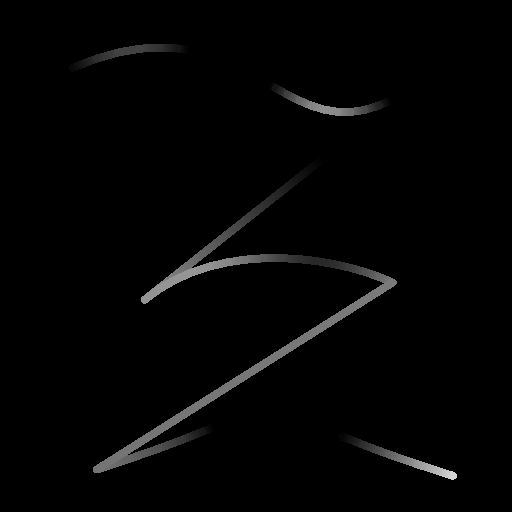

# Height de amostra de spline

<table>
<tr style="border: 0;">
<td width="33.33%" style="border: 0;" valign="top">

<b>Ferramentas De Spline E Caminho </b> Em: > Ferramenta de linha flexível

</td>
<td width="100.00%" style="border: 0;" valign="top">

## Descrição

Modifica o height das splines de entrada mapeando um mapa de altura de entrada nelas.

O efeito do mapa de height mapeado pode ser ajustado alterando seu modo de mesclagem e a opacidade desse efeito.

</td>
</tr>
</table>

## Entradas

|  |  |
|:---|:---|
| <b>Visualizar</b> <i>Tons de cinza</i> | A visualização das linhas de entrada como uma imagem em tons de cinza. |
| <b>Cordas de spline</b> <i>Cor</i> | As coordenadas dos pontos das linhas divisórias de entrada codificadas nos canais RGBA de uma imagem colorida: <b>R</b> - posição X <b>G</b> - posição Y <b>B</b> - Height <b>A</b> - Dados empacotados:  - Sinal: a linha divisória é fechada (negativa) ou aberta (positiva);  - Valor absoluto: Thickness + 1. |
| <b>Dados de Spline</b> <i>Cor</i> | Dados adicionais das splines de entrada codificadas nos canais RGBA de uma imagem colorida. <b>R</b> - Tangentes X <b>G</b> - Tangentes Y <b>B</b> - Não Usadas <b>A</b> - Não Usadas |
| <b>Valor da spline</b> <i>Inteiro</i> | O número de splines de entrada. |
| <b>Mapa de Heights</b> <i>Tons de cinza</i> | A imagem em tons de cinza de entrada usada para alterar o height da spline de entrada. |

## Saídas

|  |  |
|:---|:---|
| <b>Visualizar</b> <i>Tons de cinza</i> | A visualização das linhas de saída como uma imagem em tons de cinza. |
| <b>Cordas de spline</b> <i>Cor</i> | As coordenadas dos pontos das linhas divisórias de saída codificadas nos canais RGBA de uma imagem colorida. <b>R</b> - Posição X <b>G</b> - Posição Y <b>B</b> - Height <b>A</b> - Dados empacotados:  - Sinal: a linha divisória é fechada (negativa) ou aberta (positiva);  - Valor absoluto: Thickness + 1. |
| <b>Dados de Spline</b> <i>Cor</i> | Dados adicionais das splines de saída codificadas nos canais RGBA de uma imagem colorida. <b>R</b> - Tangentes X <b>G</b> - Tangentes Y <b>B</b> - Não Usadas <b>A</b> - Não Usadas |
| <b>Valor da spline</b> <i>Inteiro</i> | O número de splines de saída. |

## Parâmetros

|  |  |
|:---|:---|
| <b>Modo de amostragem</b> <i>Inteiro</i> | O método de mapear os valores no Mapa de Altura para os splines: - <i>espaço de Textura</i>: os valores são aplicados aos splines nos quais estariam se colocados em uma textura usando as coordenadas UV da textura. Isso aplica efetivamente o valor às linhas de spline “no local”; - <i>Horizontal ao longo da linha de spline</i>: os valores são aplicados diretamente às coordenadas das linhas de spline codificadas (consulte a entrada de Palavras de spline), onde cada linha é aplicada a uma linha de spline diferente de cima para baixo; - <i>Hor. ao longo do spline (rand. deslocamento X)</i>: os valores são aplicados diretamente às coordenadas das splines codificadas (consulte a entrada de Coords de spline), com um deslocamento horizontal aleatório no mapa de Escala para cada spline (ou seja, cada linha nas Coords de Spline); - <i>Hora. ao longo do spline (rand. deslocamento Y)</i>: os valores são aplicados diretamente às coordenadas das splines codificadas (consulte entrada de Coords de spline), com um deslocamento vertical aleatório no mapa de Escala para cada spline (ou seja, cada linha nas Coords de spline). |
| <b>Opacidade</b> <i>Flutuante</i> | Um multiplicador da intensidade da contribuição da entrada do Mapa de altura para o height da spline. |
| <b>Modo de Mesclagem</b> <i>Inteiro</i> | O método de mesclar os dados do Mapa de Altura com o height da spline de entrada: - <i>Copiar</i>: substituir o height da spline pelos valores do Mapa de Altura; - <i>Adicionar</i>: adicionar os valores do Mapa de Altura ao height da spline; - <i>Subtrair</i>: Subtrair os valores do Mapa de Altura ao height da spline; - <i>Multiplicar</i>: multiplicar os valores do Mapa de Altura em relação ao height da spline. |
| <b>Visualizar</b> |  |
| <b>Valor de Segmentos</b> <i>Inteiro</i> | Ajusta o número de segmentos usados para desenhar a visualização de spline na saída da Visualização. Um valor mais alto resulta em uma linha mais suave. |
| <b>Mostrar Auxiliar de Direção</b> <i>Booleano</i> | Exibe um ponto no início da spline e uma ponta de seta no final da saída de Visualização. |
| <b>Mostrar Envelope de Thickness</b> <i>Booleano</i> | Exibe linhas adicionais nas bordas do thickness da spline. |
| <b>Thickness (px)</b> <i>Flutuante</i> | Ajusta o thickness da visualização da spline em pixels na saída da Visualização. |

## Exemplos

<table>
<tr style="border: 0;">
<td style="border: 0;" valign="top">

<table>
  <tr>
    <td>
      
       <i>Antes</i>
    </td>
    <td>
      
       <i>Depois</i>
    </td>
  </tr>
</table>

</td>
<td style="border: 0;" valign="top">

<table>
  <tr>
    <td>
      
       <i>Antes</i>
    </td>
    <td>
      
       <i>Depois</i>
    </td>
  </tr>
</table>

</td>
</tr>
</table>

<table>
<tr style="border: 0;">
<td style="border: 0;" valign="top">

</td>
<td style="border: 0;" valign="top">

</td>
</tr>
</table>
