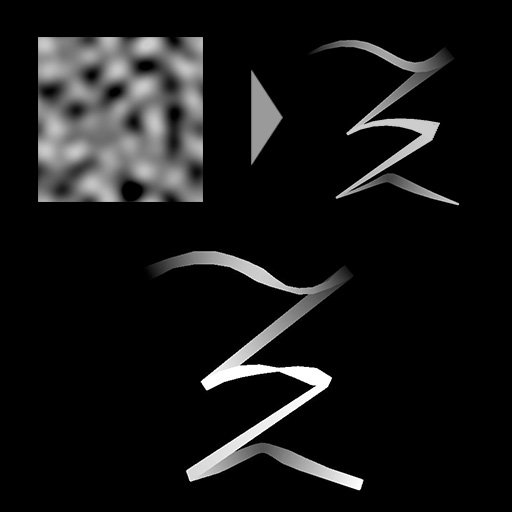

# Thickness de amostra de spline

<table>
<tr style="border: 0;">
<td style="border: 0;" valign="top">

<table>
<tr style="border: 0;">
<td width="33.33%" style="border: 0;" valign="top">

<b>Ferramentas De Spline E Caminho </b> Em: > Ferramenta de linha flexível

</td>
<td width="100.00%" style="border: 0;" valign="top">

## Descrição

Modifica o thickness das splines de entrada mapeando um mapa de Thickness de entrada nelas.

O efeito do mapa de height mapeado pode ser ajustado alterando seu modo de mesclagem e a opacidade desse efeito.

</td>
</tr>
</table>

## Conectores de entrada

<b>Visualizar</b> *Tons de cinza* A visualização das linhas divisórias de entrada como uma imagem em tons de cinza.

<b>Cordas de spline</b> *Cor* As coordenadas dos pontos das splines de entrada codificadas nos canais RGBA de uma imagem colorida:\
<b> R</b> - Posição X\
<b> G</b> - posição Y\
<b> B</b> - Height\
<b>A</b> - Dados empacotados:\
* Sinal: Spline é fechado (negativo) ou aberto (positivo);\
* Valor absoluto: Thickness + 1.

<b>Dados de Spline</b> *Cor* Dados adicionais das splines de entrada codificados nos canais RGBA de uma imagem colorida.\
<b> R</b> - Tangentes X\
<b> G</b> - Tangentes Y\
<b> B</b> - Não Usado\
<b> A</b> - Não Usado

<b>Valor da spline</b> *Inteiro* O número de splines de entrada.

<b>Mapa de Thicknesss</b> *Tons de cinza* A imagem em tons de cinza de entrada usada para alterar o thickness da spline de entrada.

## Conectores de saída

<b>Visualizar</b> *Tons de cinza* A visualização das linhas divisórias de saída como uma imagem em tons de cinza.

<b>Cordas de spline</b> *Cor* As coordenadas dos pontos das linhas divisórias de saída codificadas nos canais RGBA de uma imagem colorida.\
<b>R</b> - Posição X\
<b>G</b> - posição Y\
<b>B</b> - Height\
<b>A</b> - Dados empacotados:\
* Sinal: Spline é fechado (negativo) ou aberto (positivo);\
* Valor absoluto: Thickness + 1.

<b>Dados de Spline</b> *Cor* Dados adicionais das splines de saída codificados nos canais RGBA de uma imagem colorida.\
<b>R</b> - Tangentes X\
<b>G</b> - Tangentes Y\
<b>B</b> - Não Usado\
<b>A</b> - Não Usado

<b>Valor da spline</b> *Inteiro* O número de splines de saída.

## Parâmetros

<b>Modo de amostragem</b> *Inteiro* O método de mapear os valores no Mapa de Thicknesss para as linhas de spline:\
*- Espaço de textura*: os valores são aplicados às splines nos quais estariam se fossem colocados em uma textura usando as coordenadas UV da textura. Isso aplica efetivamente o valor aos splines “in place”;\
*- Horizontal ao longo da spline*: os valores são aplicados diretamente às coordenadas das splines codificadas (consulte entrada de Coords da spline), onde cada linha é aplicada a uma spline diferente de cima para baixo;\
*- Hora. ao longo do spline (rand. deslocamento X)*: os valores são aplicados diretamente às coordenadas das splines codificadas (consulte entrada de Coords de spline), com um deslocamento horizontal aleatório no mapa de Escala para cada spline (ou seja, cada linha em Coords de spline);\
*- Hora. ao longo do spline (rand. deslocamento Y)*: os valores são aplicados diretamente às coordenadas das splines codificadas (consulte entrada de Coords de spline), com um deslocamento vertical aleatório no mapa de Escala para cada spline (ou seja, cada linha nas Coords de spline).

<b>Opacidade</b> *Flutuante* Um multiplicador para a intensidade da contribuição da entrada do Mapa de Thickness para o thickness da spline.<b></b>

<b>Modo de Mesclagem</b> *Inteiro* O método de mesclar os dados do Mapa de Thickness com o thickness da spline de entrada:\
*- Copiar*: substitui o thickness da spline pelos valores do Mapa de Height;\
*- Adicionar*: adiciona os valores de Mapa de Thickness ao thickness da spline;\
*- Subtrair*: subtrai os valores do Mapa de Thickness ao thickness da spline;\
*- Multiplicar*: multiplica os valores do Mapa de Thickness em relação ao thickness da spline.

+++Visualização
<b>Valor de Segmentos</b> *Inteiro* Ajusta o número de segmentos usados para desenhar a visualização de spline na saída da Visualização.\
Um valor mais alto resulta em uma linha mais suave.

<b>Mostrar Auxiliar de Direção</b> *Booleano* Exibe um ponto no início da spline e uma ponta de seta no final da saída de Visualização.

<b>Mostrar Envelope de Thickness</b> *Booleano*\
Exibe linhas adicionais nas bordas do thickness da spline.

<b>Thickness (px)</b> *Flutuante* Ajusta o thickness da visualização da spline em pixels na saída da Visualização.

+++

## Exemplos

<table>
<tr style="border: 0;">
<td style="border: 0;" valign="top">

<table>
  <tr>
    <td>
      
       <i>Antes</i>
    </td>
    <td>
      
       <i>Depois</i>
    </td>
  </tr>
</table>

</td>
<td style="border: 0;" valign="top">

<table>
  <tr>
    <td>
      
       <i>Antes</i>
    </td>
    <td>
      
       <i>Depois</i>
    </td>
  </tr>
</table>

</td>
</tr>
</table>

<table>
<tr style="border: 0;">
<td style="border: 0;" valign="top">

</td>
<td style="border: 0;" valign="top">

</td>
</tr>
</table>

</td>
<td style="border: 0;" valign="top">

</td>
<td style="border: 0;" valign="top">

</td>
</tr>
</table>
