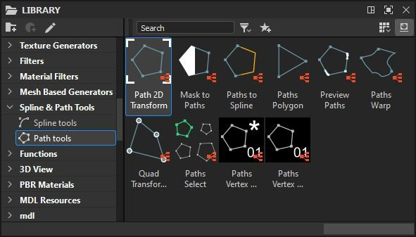
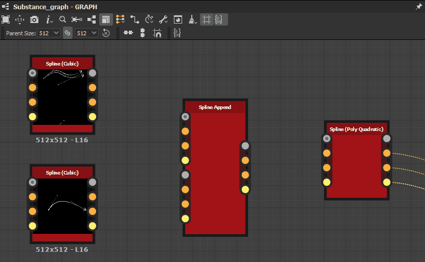

# Trabalhar com caminhos e Ferramentas de linha flexível

O conjunto de ferramentas Caminho e linhas é uma coleção de nós que permite criar e editar formas e curvas de resolução agnóstica usadas para desenhar, mapear e dispersão imagens.

## Visão geral

### O que são caminhos e splines?

<b>Caminhos</b> são uma série de pontos conectados em linhas retas.

<b>Splines</b> são curvas suaves cujas trajetórias são moldadas por pontos de controle e tangentes desses pontos.\
Cada ponto também controla o height de uma spline e os atributos de thickness que são usados para orientar o mapeamento, deformação e dispersão de imagens.

Cada um pode criar formas fechadas ou abertas.

<table>
<tr style="border: 0;">
<td width="100.00%" style="border: 0;" valign="top">

### Saída do nó

Os nós geram imagens que carregam <b>dados codificados</b> representando caminhos e splines.

Por exemplo, a imagem à direita representa a saída de imagem por um nó [Polígono de caminhos](../../../../../compositing-graphs/nodes-reference-for-com/node-library/spline-paths-tools/path-tools/paths-polygon/paths-polygon.md).

</td>
<td width="33.33%" style="border: 0;" valign="top">

</td>
</tr>
</table>

Portanto, as imagens que produzem não são diretamente utilizáveis como um elemento gráfico. Eles precisam ser processados por outros nós no conjunto de ferramentas que podem convertê-los em um resultado gráfico que pode ser usado com o restante dos nós disponíveis para gráficos de Substance.

À medida que trabalha com caminhos e splines, você pode visualizar esses objetos mapeados em uma imagem usando o nó dedicado [Caminhos de visualização](../../../../../compositing-graphs/nodes-reference-for-com/node-library/spline-paths-tools/path-tools/preview-paths/preview-paths.md) para caminhos e a saída dedicada <b>Visualizar</b> para splines.

<table>
<tr style="border: 0;">
<td width="100.00%" style="border: 0;" valign="top">

### interação com o Visualização 2D

Um número significativo de nós no conjunto de ferramentas oferece a capacidade de executar edições diretamente no [Visualização 2D](../../../../../interface/2d-view/2d-view.md) usando gizmos de controle. Esses gizmos incluem o gizmo de posição e a matriz de transformação.

Por exemplo, os nós de geração de spline, como [Spline (Cúbico)](../../../../../compositing-graphs/nodes-reference-for-com/node-library/spline-paths-tools/spline-tools/spline-cubic/spline-cubic.md) ou [Spline (Quadrático Polar)](../../../../../compositing-graphs/nodes-reference-for-com/node-library/spline-paths-tools/spline-tools/spline-poly-quadratic/spline-poly-quadratic.md), permitem mover os pontos de controle das splines. Para caminhos, o [Transformo Quad no Caminho](../../../../../compositing-graphs/nodes-reference-for-com/node-library/spline-paths-tools/path-tools/quad-transform-on-path/quad-transform-on-path.md) tem controles semelhantes quando selecionado.

</td>
<td width="33.33%" style="border: 0;" valign="top">

</td>
</tr>
</table>

### Desempenho

O Path e o ferramenta de linha flexível exigem cálculos intensos, de modo que você deve ter em mente algumas configurações para garantir o melhor desempenho e agilidade ao trabalhar com o conjunto de ferramentas:

1. O conjunto de ferramentas faz amplo uso de recursos <b>Substance Engine</b> que são executados muito mais rapidamente na GPU. Portanto, use a versão de GPU do mecanismo do sistema: <b>Direct3D</b> (Windows) ou <b>OpenGL</b> (macOS).\
   Você pode alternar o mecanismo pressionando a tecla <b>F9</b> ou acessando <b>Ferramentas > Alternar mecanismo...</b> na barra de menu principal.
1. Em seguida, recomendamos desativar a <b>Edição no contexto</b> na seção <b>Gráfico</b> das [Preferências](../../../../../interface/preferences-window/preferences-window.md) (vá para <b>Editar > Preferências...</b> na barra de menu principal para acessar esta janela).\
   A edição do contexto permite abrir nós de instância no contexto do gráfico host, que é reconhecidamente muito conveniente, mas tem o efeito colateral de aumentar exponencialmente os cálculos exigidos pelo cache de imagem do conjunto de ferramentas.

Você deve notar uma melhora significativa no desempenho ao alterar qualquer uma dessas duas configurações para o estado recomendado.

## Ferramentas de caminho

### Gerando caminhos

O [Polígono dos caminhos](../../../../../compositing-graphs/nodes-reference-for-com/node-library/spline-paths-tools/path-tools/paths-polygon/paths-polygon.md) gera um caminho na forma de um polígono com o raio e o número de lados especificados.

Como alternativa, os caminhos podem ser extraídos de uma imagem em tons de cinza usando o nó [Máscara para caminhos](../../../../../compositing-graphs/nodes-reference-for-com/node-library/spline-paths-tools/path-tools/mask-to-paths/mask-to-paths.md).\
Atualmente, esta é a única maneira de produzir formas complexas e permite aproveitar toda a biblioteca de [nós de gráfico de Substance](../../../../../compositing-graphs/nodes-reference-for-com/nodes-reference-for-substance-compositing-graphs.md) para produzir as formas que eventualmente serão convertidas em caminhos.

{width="600px"}

### Edição de demarcadores

O [Transformo 2D do caminho](../../../../../compositing-graphs/nodes-reference-for-com/node-library/spline-paths-tools/path-tools/path-2d-transform/path-2d-transform.md), a [Distorção de caminhos](../../../../../compositing-graphs/nodes-reference-for-com/node-library/spline-paths-tools/path-tools/paths-warp/paths-warp.md) e o [Quad Transformo no caminho](../../../../../compositing-graphs/nodes-reference-for-com/node-library/spline-paths-tools/path-tools/quad-transform-on-path/quad-transform-on-path.md) permitem editar a forma dos caminhos.

Você também pode remover caminhos indesejados selecionando caminhos por índice ou comprimento usando o nó [Seleção de caminhos](../../../../../compositing-graphs/nodes-reference-for-com/node-library/spline-paths-tools/path-tools/paths-select/paths-select.md).

Processamento mais complexo pode ser feito em cada ponto de um caminho com a ajuda do nó [Processador de vértice de caminhos](../../../../../compositing-graphs/nodes-reference-for-com/node-library/spline-paths-tools/path-tools/paths-vertex-processor/paths-vertex-processor.md). Existe uma [versão mais simples](../../../../../compositing-graphs/nodes-reference-for-com/node-library/spline-paths-tools/path-tools/paths-vertex-processor-1/paths-vertex-processor-simple.md) para ajustes mais claros.

<table>
<tr style="border: 0;">
<td width="100.00%" style="border: 0;" valign="top">

### Nó Caminhos de visualização

A visualização do resultado dos nós Caminhos é feita com o nó dedicado [Visualizar Caminhos](../../../../../compositing-graphs/nodes-reference-for-com/node-library/spline-paths-tools/path-tools/preview-paths/preview-paths.md).\
Este nó não tem saídas. Clique duas vezes no LMB no nó para exibir a visualização em [Visualização 2D](../../../../../interface/2d-view/2d-view.md).

Caminhos separados têm uma cor única na visualização para diferenciar cada caminho com facilidade.

</td>
<td width="33.33%" style="border: 0;" valign="top">

</td>
</tr>
</table>

### Caminhos para a spline

Você pode aproveitar todo o conjunto de ferramentas dedicado a splines com caminhos, convertendo caminhos em splines usando o nó [Caminhos para spline](../../../../../compositing-graphs/nodes-reference-for-com/node-library/spline-paths-tools/path-tools/paths-to-spline/paths-to-spline.md).

Lembre-se de que splines são curvas e, portanto, não podem manter a nitidez dos caminhos. Você encontrará um pouco de suavização nas formas ao converter caminhos em splines.

Uma combinação muito útil para aproveitar o conjunto de ferramentas splines por meio de caminhos é a seguinte:

<b>Máscara > Máscara para caminhos > Caminhos para spline</b>

### Especificações de formato de caminho

O nó Caminhos de visualização é necessário porque os nós Caminhos informam os dados dos caminhos codificados em uma imagem colorida.\
Esta codificação segue uma especificação descrita na página [Especificações de Formato de Caminhos](../../../../../compositing-graphs/nodes-reference-for-com/node-library/spline-paths-tools/path-tools/paths-format-spe/paths-format-specifications.md).

Você pode usar essa especificação para produzir seus próprios nós usando esse formato e aproveitar ao máximo os nós [Processador de Vértice de Caminhos](../../../../../compositing-graphs/nodes-reference-for-com/node-library/spline-paths-tools/path-tools/paths-vertex-processor/paths-vertex-processor.md).

## Ferramentas de linha flexível

### Gerando splines

As splines podem ser geradas usando nós como [Círculo de spline](../../../../../compositing-graphs/nodes-reference-for-com/node-library/spline-paths-tools/spline-tools/spline-circle/spline-circle.md), [Spline (Cúbico)](../../../../../compositing-graphs/nodes-reference-for-com/node-library/spline-paths-tools/spline-tools/spline-cubic/spline-cubic.md) ou [Spline (Poli Quadrático)](../../../../../compositing-graphs/nodes-reference-for-com/node-library/spline-paths-tools/spline-tools/spline-poly-quadratic/spline-poly-quadratic.md). Esses nós permitem desenhar uma spline de uma trajetória arbitrária usando diferentes controles, dependendo do nó.

Como alternativa, as splines podem ser extraídas de caminhos usando o nó [Caminhos para spline](../../../../../compositing-graphs/nodes-reference-for-com/node-library/spline-paths-tools/path-tools/paths-to-spline/paths-to-spline.md).\
Lembre-se de que splines são curvas e, portanto, não podem manter a nitidez dos caminhos. Você encontrará um pouco de suavização nas formas ao converter caminhos em splines.

Uma combinação muito útil para aproveitar o conjunto de ferramentas splines por meio de caminhos é a seguinte:

<b>Máscara > Máscara para caminhos > Caminhos para spline</b>

As splines também podem ajudar a gerar mais splines. Por exemplo, a [Ponte de spline (2 splines)](../../../../../compositing-graphs/nodes-reference-for-com/node-library/spline-paths-tools/spline-tools/spline-bridge-2-splines/spline-bridge-2-splines.md) e a [Ponte de spline (Lista)](../../../../../compositing-graphs/nodes-reference-for-com/node-library/spline-paths-tools/spline-tools/spline-bridge-list/spline-bridge-list.md) geram splines atravessando uma lista de splines na ordem.

### Edição de splines

[Transformação 2D de spline](../../../../../compositing-graphs/nodes-reference-for-com/node-library/spline-paths-tools/spline-tools/spline-2d-transform/spline-2d-transform.md) e [Distorção de spline](../../../../../compositing-graphs/nodes-reference-for-com/node-library/spline-paths-tools/spline-tools/spline-warp/spline-warp.md) permitem editar a forma das splines.

Também é possível remover splines indesejadas selecionando caminhos por índice, bem como aparar splines usando o nó [Seleção de spline](../../../../../compositing-graphs/nodes-reference-for-com/node-library/spline-paths-tools/spline-tools/spline-select/spline-select.md).

Além de sua trajetória, as propriedades de height e thickness das splines podem ser ajustadas após o fato usando o [Height de Amostra de Spline](../../../../../compositing-graphs/nodes-reference-for-com/node-library/spline-paths-tools/spline-tools/spline-sample-height/spline-sample-height.md) e o [Thickness de Amostra de Spline](../../../../../compositing-graphs/nodes-reference-for-com/node-library/spline-paths-tools/spline-tools/spline-sample-thickness/spline-sample-thickness.md).

Finalmente, splines separados podem ser mesclados em uma única spline graças ao nó [Lista de mesclagem de spline](../../../../../compositing-graphs/nodes-reference-for-com/node-library/spline-paths-tools/spline-tools/spline-merge-list/spline-merge-list.md).

### Acrescentar splines

Ao criar e editar splines, talvez seja necessário combinar várias splines para ajustá-las ou usá-las juntas.

É importante ter em mente que as splines são armazenadas e processadas como uma <b>lista ordenada</b>.

A combinação de splines é feita usando o nó [Acrescentar spline](../../../../../compositing-graphs/nodes-reference-for-com/node-library/spline-paths-tools/spline-tools/spline-append/spline-append.md). Acrescentar é o ato de adicionar algo no final de uma entidade ordenada. De fato, o nó combina duas listas de splines adicionando o segundo conjunto no final do primeiro conjunto.

Portanto, é muito importante considerar a ordem na qual você acrescenta splines.

Isso afeta os nós que precisam combinar splines, como [Ponte de spline (Lista)](../../../../../compositing-graphs/nodes-reference-for-com/node-library/spline-paths-tools/spline-tools/spline-bridge-list/spline-bridge-list.md), [Mapeador da Ponte de Spline](../../../../../compositing-graphs/nodes-reference-for-com/node-library/spline-paths-tools/spline-tools/spline-bridge-mapper-gra/spline-bridge-mapper-grayscale.md) e [Lista de Mesclagem de Spline](../../../../../compositing-graphs/nodes-reference-for-com/node-library/spline-paths-tools/spline-tools/spline-merge-list/spline-merge-list.md).

### Entradas e saídas de spline

As splines são passadas de um nó para outro usando um grupo de conectores:

* <b>Coordos de spline </b>*Cor* As coordenadas dos pontos de spline de entrada codificadas nos canais RGBA de uma imagem colorida.
* <b>Dados de Spline </b>*Cor* Dados adicionais das splines de entrada codificados nos canais RGBA de uma imagem colorida.
* <b>Valor da spline </b>*Inteiro* O número de splines de entrada.

Cada conector de saída do nó de origem deve ser conectado ao conector de entrada de nome correspondente no nó de destino.

Para fazer essas conexões mais rapidamente, você pode usar <b>Material</b> ou <b>Material compacto</b> [modos de criação de link](../../../../../interface/the-graph-view/link-creation-modes/link-creation-modes.md). Isso permite conectar os três conectores spline em uma única operação.

<table>
<tr style="border: 0;">
<td style="border: 0;" valign="top">

### Visualizar saída

A maioria dos nós oferece uma saída de <b>Visualização</b> que renderiza os splines em uma imagem para que você tenha uma ideia de quais são suas trajetórias e propriedades.

Esta visualização pode ser ajustada nos parâmetros do nó, usando os parâmetros no grupo <b>Visualização</b>.

</td>
<td style="border: 0;" valign="top">

</td>
</tr>
</table>

<table>
<tr style="border: 0;">
<td width="100.00%" style="border: 0;" valign="top">

### Renderizar como segmentos

Splines são curvas sem resolução inerente, o que significa que podem ser aumentadas ou reduzidas indefinidamente, com o único limite para representá-las com precisão sendo a precisão usada para armazenar seus dados.

Para desenhar spline como pixels, o conjunto de ferramentas os simplifica em linhas ou segmentos desenhados ao longo da trajetória das splines.

</td>
<td width="33.33%" style="border: 0;" valign="top">

</td>
</tr>
</table>

Isso significa que talvez seja necessário prestar atenção ao número de segmentos usados para desenhar uma spline em uma imagem, pois esse número pode ser muito baixo para desenhar curvas suaves ou muito alto e desperdiçado para a resolução de destino.

Os nós que desenham splines em uma imagem têm um parâmetro de <b>Quantidade de segmentos</b> que permite controlar essa quantidade de segmentos. Um valor mais alto resulta em curvas mais suaves, em detrimento do desempenho.

### Criação de imagens a partir de splines

Quando terminar de criar e editar splines, elas poderão ser usadas para produzir imagens que podem aproveitar o restante dos nós de Substance.

Há três formas principais de usar splines para gerar gráficos:

* Renderize a spline usando sua forma e propriedades com o nó [Renderização da spline](../../../../../compositing-graphs/nodes-reference-for-com/node-library/spline-paths-tools/spline-tools/spline-render/spline-render.md) ou [Preenchimento de spline](../../../../../compositing-graphs/nodes-reference-for-com/node-library/spline-paths-tools/spline-tools/spline-fill/spline-fill.md);
* Mapeie imagens ao longo de splines com nós de mapeamento, como [Mapeador de spline](../../../../../compositing-graphs/nodes-reference-for-com/node-library/spline-paths-tools/spline-tools/spline-mapper-grayscale/spline-mapper-grayscale.md), [Mapeador de ponte de spline](../../../../../compositing-graphs/nodes-reference-for-com/node-library/spline-paths-tools/spline-tools/spline-bridge-mapper-gra/spline-bridge-mapper-grayscale.md) e [Mapeador de fluxo de spline](../../../../../compositing-graphs/nodes-reference-for-com/node-library/spline-paths-tools/spline-tools/spline-flow-mapper/spline-flow-mapper.md);
* Dispersão padrões ao longo das linhas divisórias com o nó [Dispersão na Linha divisória](../../../../../compositing-graphs/nodes-reference-for-com/node-library/spline-paths-tools/spline-tools/scatter-spline-grayscale/scatter-on-spline-grayscale.md).
