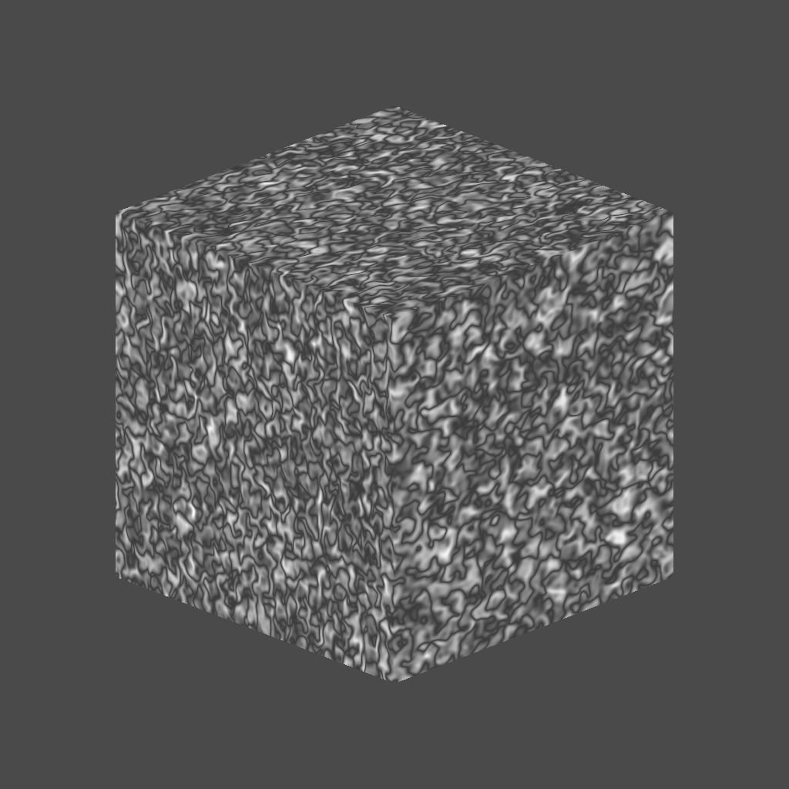

# Ruído Perlin 3D

<table>
<tr style="border: 0;">
<td width="33.33%" style="border: 0;" valign="top">

{width="200px"}

<b>Entrada:</b> Geradores de Textura > Ruídos

</td>
<td width="100.00%" style="border: 0;" valign="top">

## Descrição

O nó <b>Ruído de Perlin 3D</b> gera um ruído de Perlin no espaço 3D com base na entrada do <b>Mapa de Posições</b>.

Este nó pode ser testado com [GBuffers 3D de cubo](../../../../../../compositing-graphs/nodes-reference-for-com/node-library/texture-generators/patterns/cube-3d-gbuffers/cube-3d-gbuffers.md) como entrada em vez de um mapa baked real (como visto na Imagem de Exemplo abaixo).

</td>
</tr>
</table>

>[!WARNING]
>
> Este ruído deve ser usado somente com o <i>mecanismo de GPU</i> (por exemplo, <b>Direct3D</b> ou <b>OpenGL</b>). Vá para <b>Ferramentas > Alternar mecanismo...</b> ou pressione a tecla <b>F9</b> para selecionar o mecanismo desejado.

## Parâmetros

|  |  |
|:---|:---|
| <b>Inverter</b> <i>Booleano</i> | Inverte a imagem de saída. |
| <b>Escala</b> <i>Flutuante</i> | Controla a escala do ruído de Perlin 3D. |
| <b>Tamanho</b> <i>Flutuante3</i> | Controla o tamanho do ruído de Perlin 3D nos eixos <b>X</b>, <b>Y</b> e <b>Z</b>. Valores não uniformes resultam em um efeito de <i>amplificação ou esmagamento</i>. |
| <b>Deslocamento</b> <i>Flutuante3</i> | Aplica um deslocamento à <i>posição</i> do ruído de Perlin 3D nos eixos <b>X</b>, <b>Y</b> e <b>Z</b>. |
| <b>Intensidade de Distorção</b> <i>Flutuante</i> | Controla a intensidade de um <i>efeito de distorção</i> aplicado no ruído 3D Perlin. |
| <b>Multiplicador de Escala de Distorção</b> <i>Flutuante</i> | Controla a escala do <i>padrão de deformação</i> usado no efeito de distorção controlado pela <b>Intensidade de Distorção</b>. |
| <b>Linha de base</b> <i>Flutuante</i> | Aplica um <i>deslocamento</i> ao valor de <i>luminância</i> da linha de base para a distribuição do valor de ruído Perlin 3D. |
| <b>Contraste</b> <i>Flutuante</i> | Ajusta o contraste do ruído de Perlin 3D. |
| <b>Absoluto</b> <i>Booleano</i> | Usa valores absolutos no ruído Perlin 3D. Isso efetivamente <i>inverte</i> a distribuição de valores <i>abaixo de 0,5</i>. |
| <b>Habilitar divisão em blocos</b> <i>Booleano</i> | Ajusta o ruído de Perlin 3D para que seu padrão resultante <i>se repita</i> nos eixos X, Y e Z. |

## Exemplos

<table style="margin-top: 32px; margin-bottom: 32px">
    <tr style="border: 0">
        <td style="border: 0; background: transparent">
            
        </td>
        <td style="border: 0; background: transparent">
            
        </td>
        <td style="border: 0; background: transparent">
            
        </td>
    </tr>
</table>
