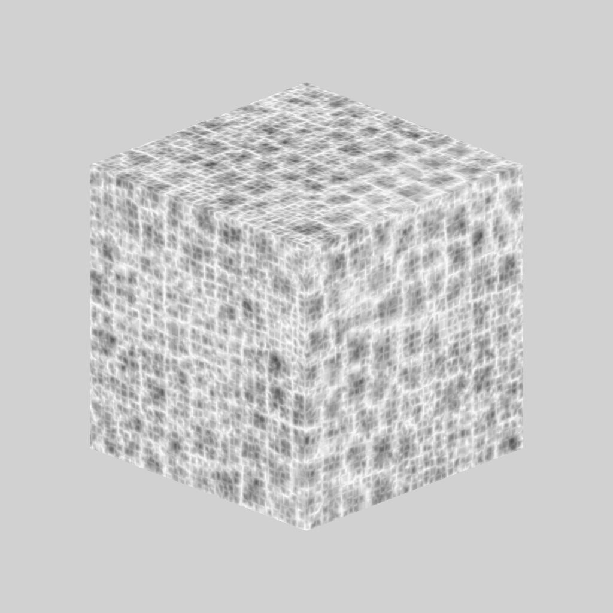

# 3D voronoi fractal

<table>
<tr style="border: 0;">
<td width="41.60%" style="border: 0;" valign="top">

{width="200px"}

**Entrada:** *Geradores De Textura* */Ruídos*

**Intermediário**

</td>
<td width="58.30%" style="border: 0;" valign="top">

## Descrição

O nó **3D voronoi fractal** gera um ruído Voronoi *fractal* no espaço 3D com base na entrada do **Mapa de Posições**.

Este nó pode ser testado com [GBuffers 3D de cubo](../../../../../../compositing-graphs/nodes-reference-for-com/node-library/texture-generators/patterns/cube-3d-gbuffers/cube-3d-gbuffers.md) como entrada em vez de um mapa baked real (como visto na Imagem de Exemplo abaixo).

>[!WARNING]
>
> Este ruído deve ser usado somente com o *mecanismo de GPU* (por exemplo, **Direct3D** ou **OpenGL**). Vá para **Ferramentas > Alternar mecanismo...** ou pressione a tecla **F9** para selecionar o mecanismo desejado.

</td>
</tr>
</table>

## Parâmetros

* **Inverter** *Booleano*\
  Inverte a imagem de saída.
* **Escala** *Flutuante*\
  Controla a escala do ruído fractal de Voronoi 3D.\
  *Observação*: quando o **lado a lado** está habilitado em *qualquer eixo*, o ajuste de escala é *escalonado*. Isso é esperado.
* **Tamanho** *Flutuante3*\
  Controla o tamanho do ruído fractal de Voronoi 3D nos eixos **X**, **Y** e **Z**. Valores não uniformes resultam em um efeito de *amplificação ou esmagamento*.\
  *Observação*: quando a **Divisão em blocos gráficos** está habilitada em *qualquer eixo*, o ajuste de tamanho é *escalonado*. Isso é esperado.
* **Deslocamento** *Flutuante3*\
  Aplica um deslocamento à *posição* do ruído fractal de Voronoi 3D nos eixos **X**, **Y** e **Z**.
* **Desordem** *Flutuante3*\
  A intensidade do *deslocamento aleatório* aplicado a cada ponto do ruído nos eixos **X**, **Y** e **Z**.
* **Intensidade de Distorção** *Flutuante*\
  Controla a intensidade de um *efeito de distorção* aplicado no ruído fractal de Voronoi 3D.
* **Multiplicador de Escala de Distorção** *Flutuante*\
  Controla a escala do *padrão de deformação* usado no efeito de distorção controlado pela **Intensidade de Distorção**.
* **Nível mínimo** *Inteiro*\
  O *nível mínimo de repetição* usado no padrão fractal. Um intervalo mínimo/máximo mais amplo resulta em um *padrão mais rico* com variação em intervalos de frequência mais amplos.
* **Nível Máximo** *Inteiro*\
  O *nível máximo de repetição* usado no padrão fractal. Um intervalo mínimo/máximo mais amplo resulta em um *padrão mais rico* com variação em intervalos de frequência mais amplos.
* **Aspereza** *Flutuante*\
  Controla o *equilíbrio* entre *níveis de repetição* baixos e altos no padrão fractal.\
  *Observação*: um valor de **0** resulta em uma saída que *não está alinhada* com outros valores baixos que a seguem. Isso é esperado.\
  *Observação 2*: este parâmetro só está disponível quando o parâmetro **Modo de Mesclagem** está definido como *Adicionar*.
* **Lacunaridade** *Flutuante*\
  Controla como o padrão fractal *aplicado preenche o espaço*. Um valor *mais alto* resulta em *menos lacunas* no padrão e em um ruído *mais denso*.
* **Opacidade Global** *Flutuante*\
  Controla o *intervalo* dos valores de ruído fractal de Perlin 3D de 0.
* **Curva arredondada** *Flutuante*\
  Arredonda a *inclinação* em torno de cada ponto do ruído para torná-lo *convexo*.\
  *Observação*: este parâmetro não está disponível quando o parâmetro **Estilo** está definido como *Borda*.
* **Escala de distância** *Flutuante*\
  Ajusta a *distância do gradiente* ao redor de cada ponto do ruído.
* **Modo de distância** *Inteiro*\
  Define o método para *calcular o gradiente de distância* ao redor de cada ponto do ruído:
  * *Euclidiano*
  * *Manhattan*
  * *Chebyshev*
  * *Minkowski*
* **Número de Minkowski** *Flutuante*\
  A ordem *p* da distância de Minkowski. Se dividirmos o gradiente de distância em quadrantes, esse número afetará esses quadrantes da seguinte maneira:
  * p é *exatamente* 1: direto
  * p é *mais baixo* do que 1: côncavo
  * p é *maior* do que 1: convexo\
    Valores interessantes:\
    *- 1.0*: Distância de Manhattan\
    *- 2.0*: distância euclidiana\
    *- Infinito*: distância de Chebyshev\
    *Observação*: este parâmetro só está disponível quando o parâmetro **Modo de Distância** está definido como *Minkowski*.
* **Modo de Mesclagem** *Inteiro*\
  Define o método de mesclagem dos valores de *células sobrepostas* no espaço 3D:
  * *Adicionar*: adicione os valores
  * *Máx*: manter o valor *mais alto*
  * *Mín*: manter o valor *mais baixo*
* **Estilo** *Inteiro* Define o método *renderizando os dados* do ruído fractal de Voronoi 3D, considerando que o ruído é baseado em um conjunto de pontos no espaço 3D:
  * *F1*: a distância até o *ponto mais próximo* no espaço 3D
  * *F2*: a distância até o *segundo ponto mais próximo* no espaço 3D
  * *F2-F1*- *F1\* F2 *-* F1/F2 *-* Borda *: a* borda entre cada célula* do ruído no espaço 3D
  * *Cor aleatória*: atribua uma *cor simples aleatória* a cada célula do ruído no espaço 3D
* **Thickness de Borda** *Flutuante* Ajusta o thickness das bordas detectadas entre células do ruído fractal de Voronoi 3D. As bordas são detectadas nos eixos X, Y e Z, portanto, algumas espessuras podem aumentar mais rapidamente do que outras, dependendo da *profundidade* das células.\
  *Observação*: este parâmetro só está disponível quando o parâmetro **Estilo** está definido como *Borda*.
* **Habilitar divisão em blocos** *Booleano*\
  Ajusta o ruído fractal de Voronoi 3D para que seu padrão resultante *se repita* nos eixos X, Y e Z.

## Imagens de exemplo

<table>
<tr style="border: 0;">
<td style="border: 0;" valign="top">

{width="256px"}

</td>
<td style="border: 0;" valign="top">

{width="256px"}

</td>
<td style="border: 0;" valign="top">

{width="256px"}

</td>
<td style="border: 0;" valign="top">

{width="256px"}

</td>
<td style="border: 0;" valign="top">

{width="256px"}

</td>
<td style="border: 0;" valign="top">

{width="256px"}

</td>
</tr>
</table>
