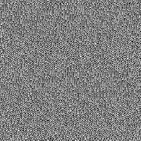

# Ruído azul rápido

<table>
<tr style="border: 0;">
<td width="33.33%" style="border: 0;" valign="top">

{width="128px"}

<b>Entrada:</b> Geradores de Textura > Ruídos

</td>
<td width="100.00%" style="border: 0;" valign="top">

## Descrição

Um ruído simples, rápido, em escala de pixels.

</td>
</tr>
</table>

## Parâmetros

|  |  |
|:---|:---|
| <b>Rotação</b> <i>0.0 - 1.0</i> | Gira o efeito de cálculos internos. Isso pode alterar a aparência visual do ruído um pouco: quanto mais distante estiver de 1, menor será a escala de pixels do efeito e mais visíveis serão as “ondas” introduzidas. |

## Exemplos

<table style="table-layout:fixed">
    <tr style="border: 0;">
        <td style="border: 0;">
            
        </td>
        <td style="border: 0;"></td>
        <td style="border: 0;"></td>
    </tr>
</table>
