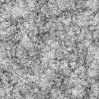

# Nuvens 1

<table>
<tr style="border: 0;">
<td style="border: 0;" valign="top">

<table>
<tr style="border: 0;">
<td width="33.33%" style="border: 0;" valign="top">

{width="200px"}

<b>Entrada:</b> geradores de Textura > Ruídos

</td>
<td width="100.00%" style="border: 0;" valign="top">

## Descrição

Uma variação dos ruídos ásperos de <b>Nuvens</b>.

Veja também: [Nuvens 2](../../../../../../compositing-graphs/nodes-reference-for-com/node-library/texture-generators/noises/clouds-2/clouds-2.md), [Nuvens 3](../../../../../../compositing-graphs/nodes-reference-for-com/node-library/texture-generators/noises/clouds-3/clouds-3.md)

</td>
</tr>
</table>

## Saídas

|  |  |
| --- | --- |
| <b>Saída</b> *Tons de cinza* | O ruído gerado como bitmap em tons de cinza. |

## Parâmetros

|  |  |
| --- | --- |
| <b>Escala</b> Inteiro | A subdivisão da grade usada para gerar os blocos de ruído.    Um valor mais alto resulta no desenho de mais ladrilhos e em um ruído mais denso. |
| Precisão decimal de <b>Distúrbio</b> | Desloca os ingredientes do ruído.    Isso pode ser usado para animar o ruído. |
| <b>Velocidade do distúrbio</b> Precisão decimal | Ajusta a distância de deslocamento aplicada pelo parâmetro <b>Desordem</b>.    Isso pode ser usado para controlar a velocidade de deslocamento ao animar o ruído. |
| Precisão decimal de <b>anisotropia de distúrbio</b> | Controla a extensão das direções do deslocamento aplicadas pelo parâmetro <b>Desordem</b>, em que um valor mais alto resulta em uma direção mais estreita e definida.    A direção é controlada pelo parâmetro <b>ângulo de anisotropia de Desordem</b>. |
| Precisão decimal de <b>ângulo de anisotropia de desordem</b> | Controla a direção do deslocamento aplicado pelo parâmetro <b>Desordem</b> quando o parâmetro <b>anisotropia de Desordem</b> não é zero. |
| <b>Deslocamento do bloco</b> Precisão decimal 2 | Controla a posição da parte de plano infinito usada para renderizar o ruído. |
| <b>Expansão não quadrada</b> Booleana | Em imagens não quadradas, mantém o ladrilho gerado quadrado e expande a geração de ruído até os limites da imagem. |

## Exemplos

<table>
<tr style="border: 0;">
<td style="border: 0;" valign="top">

{zoomable="yes"}

</td>
<td style="border: 0;" valign="top">

{zoomable="yes"}

</td>
</tr>
</table>

<table>
<tr style="border: 0;">
<td style="border: 0;" valign="top">

{zoomable="yes"}

</td>
<td style="border: 0;" valign="top">

{zoomable="yes"}

</td>
</tr>
</table>

</td>
<td style="border: 0;" valign="top">

</td>
<td style="border: 0;" valign="top">

</td>
</tr>
</table>
