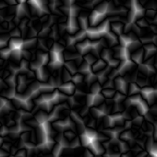

# Cristal 1

<table>
<tr style="border: 0;">
<td width="33.33%" style="border: 0;" valign="top">

{width="128px"}

<b>Entrada:</b> Geradores de Textura > Ruídos

</td>
<td width="100.00%" style="border: 0;" valign="top">

## Descrição

Gera um ruído do tipo Worlye Voronoi, com uma métrica de distância um pouco mais angular. Pode ser útil para determinadas finalidades angulars e geométricas.

</td>
</tr>
</table>

## Parâmetros

|  |  |
|:---|:---|
| <b>Escala</b> <i>1 - 256</i> | Define a escala global do efeito. |
| <b>Desordem</b> <i>0.0 - 1.0</i> | Muda a fase do ruído para introduzir uma pequena variação. |
| <b>Expansão não quadrada</b> <i>Falso/Verdadeiro</i> | Permite a compensação de esmagamento e alongamento com proporções não quadradas. |

## Exemplos

<table style="margin-top: 32px; margin-bottom: 32px">
    <tr style="border: 0">
        <td style="border: 0; background: transparent">
            
        </td>
    </tr>
</table>
