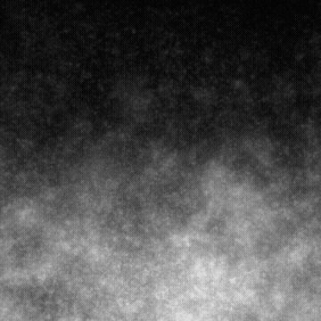

# Degradê de dirt

<table>
<tr style="border: 0;">
<td style="border: 0;" valign="top">

<table>
<tr style="border: 0;">
<td width="33.33%" style="border: 0;" valign="top">

{width="200px"}

<b>Entrada:</b> geradores de textura > Ruídos

</td>
<td width="100.00%" style="border: 0;" valign="top">

## Descrição

Uma variação dos ruídos granulados de <b>Dirt</b>, com um gradiente de queda direcional.

Veja também: [Dirt 1](../../../../../../compositing-graphs/nodes-reference-for-com/node-library/texture-generators/noises/dirt-1/dirt-1.md), [Dirt 2](../../../../../../compositing-graphs/nodes-reference-for-com/node-library/texture-generators/noises/dirt-2/dirt-2.md), [Dirt 3](../../../../../../compositing-graphs/nodes-reference-for-com/node-library/texture-generators/noises/dirt-3/dirt-3.md), [Dirt 4](../../../../../../compositing-graphs/nodes-reference-for-com/node-library/texture-generators/noises/dirt-4/dirt-4.md), [Dirt 5](../../../../../../compositing-graphs/nodes-reference-for-com/node-library/texture-generators/noises/dirt-5/dirt-5.md)

</td>
</tr>
</table>

## Saídas

|  |  |
| --- | --- |
| <b>Saída</b> *Tons de cinza* | O ruído gerado como bitmap em tons de cinza. |

## Parâmetros

|  |  |
| --- | --- |
| <b>Desordem</b> Flutuante | Desloca os ingredientes do ruído.    Isso pode ser usado para animar o ruído. |
| <b>Velocidade do distúrbio</b> flutuante | Ajusta a distância de deslocamento aplicada pelo parâmetro <b>Desordem</b>.    Isso pode ser usado para controlar a velocidade de deslocamento ao animar o ruído. |
| <b>anisotropia de desordem</b> flutuante | Controla a extensão das direções do deslocamento aplicadas pelo parâmetro <b>Desordem</b>, em que um valor mais alto resulta em uma direção mais estreita e definida.    A direção é controlada pelo parâmetro <b>Ângulo de anisotropia de desordem</b>. |
| <b>Ângulo de anisotropia do distúrbio</b> flutuante | Controla a direção do deslocamento aplicado pelo parâmetro <b>Desordem</b> quando o parâmetro <b>anisotropia de Desordem</b> não é zero. |
| <b>Expansão não quadrada</b> Booleana | Em imagens não quadradas, mantém o ladrilho gerado quadrado e expande a geração de ruído até os limites da imagem. |

## Exemplos

<table>
<tr style="border: 0;">
<td style="border: 0;" valign="top">

{zoomable="yes"}

</td>
<td style="border: 0;" valign="top">

{zoomable="yes"}

</td>
</tr>
</table>

<table>
<tr style="border: 0;">
<td style="border: 0;" valign="top">

{zoomable="yes"}

</td>
<td style="border: 0;" valign="top">

{zoomable="yes"}

</td>
</tr>
</table>

</td>
<td style="border: 0;" valign="top">

</td>
<td style="border: 0;" valign="top">

</td>
</tr>
</table>
