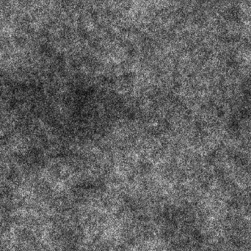

# SOMA FRACTAL 1

<table>
<tr style="border: 0;">
<td width="33.33%" style="border: 0;" valign="top">

{width="200px"}

<b>Entrada:</b> geradores de Textura > Ruídos

</td>
<td width="100.00%" style="border: 0;" valign="top">

## Descrição

Uma variação dos ruídos de <b>Soma fractal</b>.

Veja também: [base de Soma fractal](../../../../../../compositing-graphs/nodes-reference-for-com/node-library/texture-generators/noises/fractal-sum-base/fractal-sum-base.md), [Soma fractal 2](../../../../../../compositing-graphs/nodes-reference-for-com/node-library/texture-generators/noises/fractal-sum-2/fractal-sum-2.md), [Soma fractal 3](../../../../../../compositing-graphs/nodes-reference-for-com/node-library/texture-generators/noises/fractal-sum-3/fractal-sum-3.md), [Soma fractal 4](../../../../../../compositing-graphs/nodes-reference-for-com/node-library/texture-generators/noises/fractal-sum-4/fractal-sum-4.md)

</td>
</tr>
</table>

## Saídas

|  |  |
|:---|:---|
| <b>Saída</b> <i>Tons de cinza</i> | O ruído gerado como bitmap em tons de cinza. |

## Parâmetros

|  |  |
|:---|:---|
| <b>Desordem</b> <i>Precisão decimal</i> | Desloca os ingredientes do ruído.    Isso pode ser usado para animar o ruído. |
| <b>Velocidade do distúrbio</b> <i>Precisão decimal</i> | Ajusta a distância de deslocamento aplicada pelo parâmetro <b>Desordem</b>.    Isso pode ser usado para controlar a velocidade de deslocamento ao animar o ruído. |
| <b>Expansão não quadrada</b> <i>Booleano</i> | Em imagens não quadradas, mantém o ladrilho gerado quadrado e expande a geração de ruído até os limites da imagem. |

## Exemplos

<table>
<tr style="border: 0;">
<td style="border: 0;" valign="top">

{zoomable="yes"}

</td>
<td style="border: 0;" valign="top">

{zoomable="yes"}

</td>
</tr>
</table>
