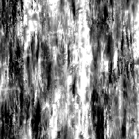

# Mapa do desgaste 002

<table>
<tr style="border: 0;">
<td style="border: 0;" valign="top">

{width="128px"}

## Mapa do desgaste 002

**Entrada:** *Geradores De Textura**/Ruídos*

**Simples**

</td>
<td style="border: 0;" valign="top">

## Descrição

Gera um Noisemap complexo e combinado. Esse nó pode ser muito útil como um procedimento detalhado, mas lembre-se de que esse processo exige muito desempenho e, portanto, é mais lento.

## Parâmetros

* **Saldo**: *0.0 - 1.0*\
  Alterna o equilíbrio do resultado entre preto ou branco, como um ajuste de brilho.
* **Contraste**: *0.0 - 1.0*\
  Ajusta o contraste do resultado.
* **Inverter**: *Falso/Verdadeiro*\
  Inverte o resultado.
* **Padrão de Pincel**: *0.0 - 1.0* Adiciona uma máscara ao redor das bordas, para quando usado como um alfa de pincel.
* **Expansão não quadrada**: *Falso/Verdadeiro*\
  Permite a compensação de esmagamento e alongamento com proporções não quadradas.

## Imagens de exemplo

</td>
</tr>
</table>
