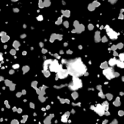

# Mapa do desgaste 004

<table>
<tr style="border: 0;">
<td width="33.33%" style="border: 0;" valign="top">

{width="128px"}

<b>Entrada:</b> geradores de textura > Ruídos

</td>
<td width="100.00%" style="border: 0;" valign="top">

## Descrição

Isso gera um Noisemap complexo e combinado. Pode ser muito útil como um procedimento detalhado, mas tenha em mente que eles exigem muito desempenho e, portanto, são mais lentos de gerar.

</td>
</tr>
</table>

## Parâmetros

|  |  |
|:---|:---|
| <b>Saldo</b> <i>0.0 - 1.0</i> | Alterna o equilíbrio do resultado entre preto ou branco, como um ajuste de brilho. |
| <b>Contraste</b> <i>0.0 - 1.0</i> | Ajusta o contraste do resultado. |
| <b>Inverter</b> <i>Falso/Verdadeiro</i> | Inverte o resultado. |
| <b>Padrão de pincel</b> <i>0.0 - 1.0</i> | Adiciona uma máscara ao redor das bordas, para quando usada como um alfa de pincel. |
| <b>Expansão não quadrada</b> <i>Falso/Verdadeiro</i> | Permite a compensação de esmagamento e alongamento com proporções não quadradas. |

## Exemplos

<table style="table-layout:fixed">
    <tr style="border: 0;">
        <td style="border: 0;">
            
        </td>
        <td style="border: 0;"></td>
        <td style="border: 0;"></td>
    </tr>
</table>
