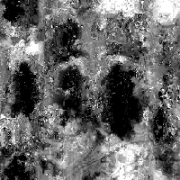

# Mapa do desgaste 014

<table>
<tr style="border: 0;">
<td style="border: 0;" valign="top">

{width="128px"}

## Mapa do desgaste 014

**Entrada:** *Geradores De Textura**/Ruídos*

**Simples**

</td>
<td style="border: 0;" valign="top">

## Descrição

Isso gera um Noisemap complexo e combinado. Pode ser muito útil como um procedimento detalhado, mas tenha em mente que eles exigem muito desempenho e, portanto, são mais lentos de gerar.

## Parâmetros

* **Saldo**: *0.0 - 1.0*
* **Contraste**: *0.0 - 1.0*
* **Inverter**: *Falso/Verdadeiro*
* **Padrão de Pincel**: *0.0 - 1.0*\
  Adiciona uma máscara ao redor das bordas, para quando usada como um alfa de pincel.
* **Expansão não quadrada**: *Falso/Verdadeiro*\
  Permite a compensação de esmagamento e alongamento com proporções não quadradas.

## Imagens de exemplo

</td>
</tr>
</table>
