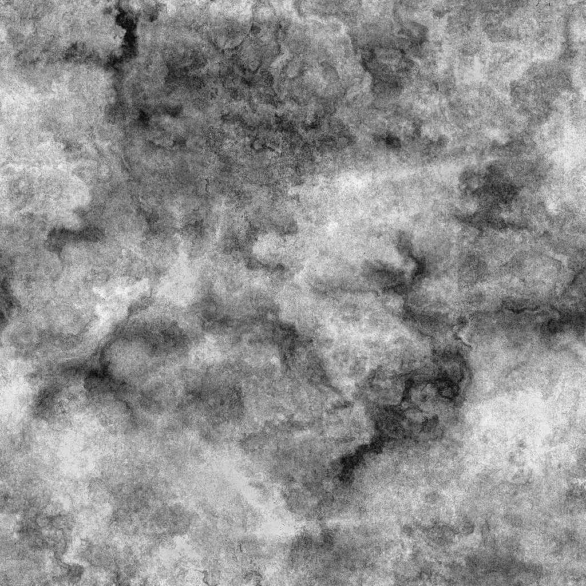

# Ferrugem de desgaste Fina

<table>
<tr style="border: 0;">
<td width="33.33%" style="border: 0;" valign="top">

{width="200px"}

<b>Entrada:</b> Geradores de Textura > Ruídos

</td>
<td width="100.00%" style="border: 0;" valign="top">

## Descrição

O nó **Ferrugem de Desgaste Fina** gera um mapa de desgaste semelhante a uma sobreposição de ferrugem de desgaste fino.

</td>
</tr>
</table>

## Parâmetros

|  |  |
|:---|:---|
| <b>Saldo</b> <i>Flutuante</i> | Ajusta o equilíbrio entre valores escuros e brilhantes. |
| <b>Contraste</b> <i>Flutuante</i> | Ajusta o contraste da imagem. |
| <b>Inverter</b> <i>Booleano</i> | Inverte a saída da imagem, usando uma operação `1-x`. |
| <b>Expansão não quadrada</b> <i>Booleano</i> | Permite a compensação de esmagamento e alongamento com proporções não quadradas. |
| <b>Avançado</b> |  |
| <b>Contraste de Desgaste base</b> <i>Flutuante</i> | Ajusta o contraste da textura de desgaste usada como base para a ferrugem. |
| <b>Intensidade de distorção base</b> <i>Flutuante</i> | Ajusta a intensidade do efeito de distorção aplicado no mapa de desgaste usado como base para a ferrugem. |
| <b>Intensidade das listras</b> <i>Flutuante</i> | Ajusta a intensidade das listras e pontos mais brilhantes sobrepostos na textura base do desgaste. |
| <b>Intensidade de ruído</b> <i>Flutuante</i> | Ajusta a intensidade do ruído aplicado na textura base do desgaste. |
| <b>Intensidade de nitidez</b> <i>Flutuante</i> | Ajusta a intensidade do efeito de nitidez global. |

## Exemplos

<table style="margin-top: 32px; margin-bottom: 32px">
    <tr style="border: 0">
        <td style="border: 0; background: transparent">
            
        </td>
        <td style="border: 0; background: transparent">
            
        </td>
    </tr>
</table>
