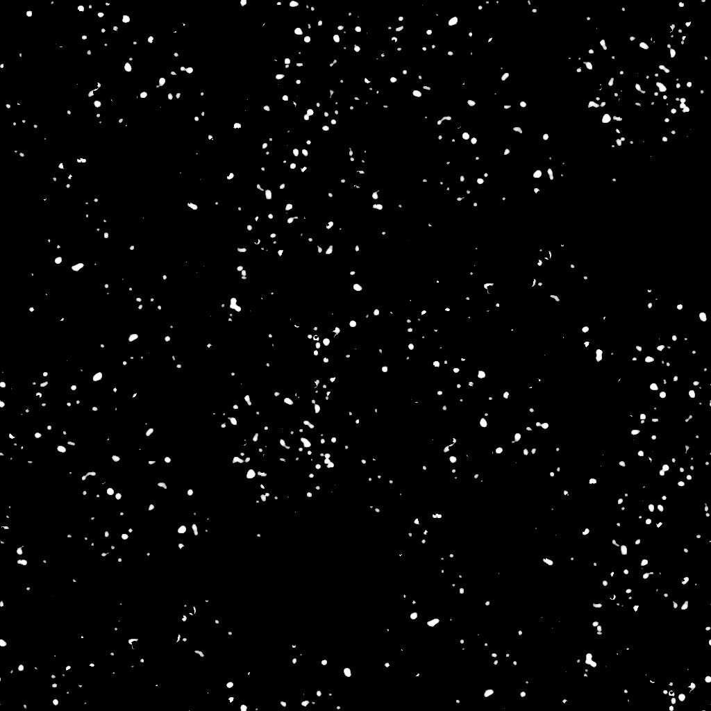
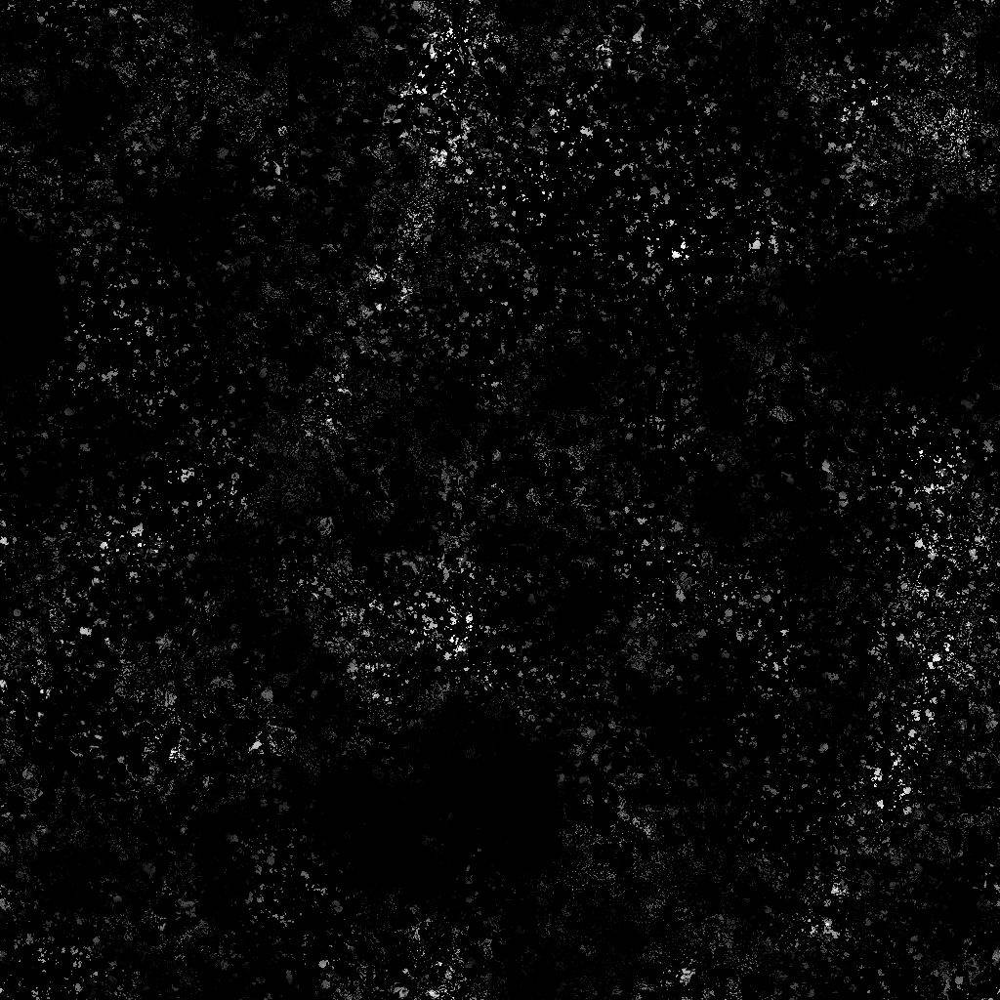

# Pontos de desgaste

<table>
<tr style="border: 0;">
<td width="41.60%" style="border: 0;" valign="top">

{width="200px"}

**Entrada:** *Geradores De Textura* */Ruídos*

**Simples**

</td>
<td width="58.30%" style="border: 0;" valign="top">

## Descrição

O nó **Pontos de Desgaste** gera um mapa de desgaste semelhante a pontos espalhados finos.

</td>
</tr>
</table>

## Parâmetros

* **Equilíbrio** *Flutuante* Ajusta o equilíbrio entre valores escuros e brilhantes.
* **Contraste** *Flutuar* Ajusta o contraste da imagem.
* **Inverter** *Booleano* Inverte a saída da imagem usando uma operação `1-x`.
* **Expansão não quadrada** *Booleano* Habilita a compensação de squash e alongamento com proporções não quadradas.
* Avançado
  * **Detalhes** *Flutuação* Ajusta a quantidade de manchas *distorcidas* e divididas em pontos mais finos.
  * **Cobertura** *Flutuante* Ajusta a cobertura das manchas na imagem.
  * **Contraste de cobertura** *Flutuante* Ajusta o contraste da *máscara* usada para controlar\
    a cobertura das manchas na imagem.

## Imagens de exemplo

<table>
<tr style="border: 0;">
<td style="border: 0;" valign="top">

{width="256px"}

</td>
<td style="border: 0;" valign="top">

{width="256px"}

</td>
</tr>
</table>
