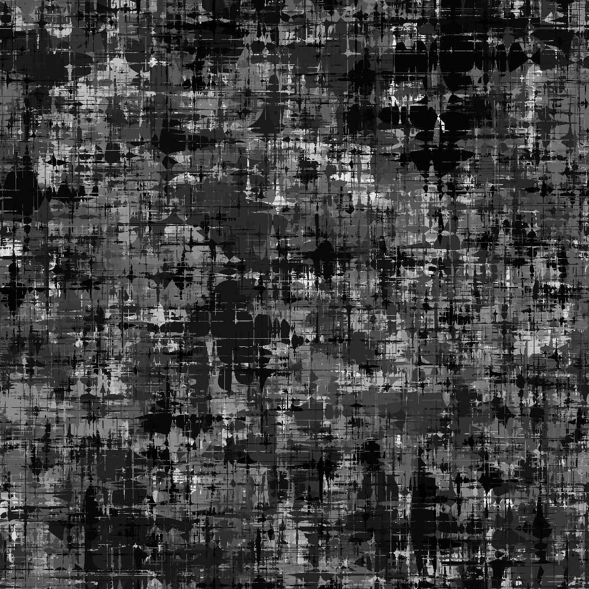

# Voronoi Fractal

<table>
<tr style="border: 0;">
<td width="33.33%" style="border: 0;" valign="top">

{width="200px"}

<b>Entrada:</b> Geradores de Textura > Ruídos

</td>
<td width="100.00%" style="border: 0;" valign="top">

## Descrição

O nó **Voronoi Fractal** gera um ruído de Voronoi 3D *fractal* mapeado para uma imagem 2D usando uma *projeção ortográfica Z-down*.

Este nó pode ser testado com [GBuffers de Cubo](../../../../../../compositing-graphs/nodes-reference-for-com/node-library/texture-generators/patterns/cube-3d-gbuffers/cube-3d-gbuffers.md) como entrada em vez de um mapa baked real (como visto na Imagem de Exemplo abaixo).

>[!WARNING]
>
> Este ruído deve ser usado somente com o *mecanismo de GPU* (por exemplo, **Direct** ou **OpenGL**). Vá para **Ferramentas > Alternar mecanismo...** ou pressione a tecla **F9** para selecionar o mecanismo desejado.

</td>
</tr>
</table>

## Parâmetros

|  |  |
|:---|:---|
| <b>Inverter</b> <i>Booleano</i> | Inverte a imagem de saída. |
| <b>Escala</b> <i>Flutuante</i> | Controla a escala do ruído fractal de Voronoi.  *Observação*: quando o **Enquadramento** está habilitado em *qualquer eixo*, o ajuste de escala é *escalonado*. Isso é esperado. |
| <b>Tamanho</b> <i>Flutuante3</i> | Controla o tamanho do ruído fractal de Voronoi nos eixos **X**, **Y** e **Z**. Valores não uniformes resultam em um efeito de *esticamento ou esmagamento*.  *Observação*: quando a opção **Lado a lado** está habilitada em *qualquer eixo*, o ajuste de tamanho é *escalonado*. Isso é esperado. |
| <b>Deslocamento</b> <i>Flutuante3</i> | Aplica um deslocamento à *posição* do ruído fractal de Voronoi nos eixos **X**, **Y** e **Z**. |
| <b>Desordem</b> <i>Flutuante3</i> | A intensidade do *deslocamento aleatório* aplicado a cada ponto do ruído nos eixos **X**, **Y** e **Z**. |
| <b>Intensidade de Distorção</b> <i>Flutuante</i> | Controla a intensidade de um *efeito de distorção* aplicado no ruído fractal de Voronoi. |
| <b>Multiplicador de Escala de Distorção</b> <i>Precisão decimal</i> | Controla a escala do *padrão de deformação* usado no efeito de distorção controlado pela **Intensidade de Distorção**. |
| <b>Nível Mínimo</b> <i>Inteiro</i> | O *nível mínimo de repetição* usado no padrão fractal. Um intervalo mínimo/máximo mais amplo resulta em um *padrão mais rico* com variação em intervalos de frequência mais amplos. |
| <b>Nível Máximo</b> <i>Inteiro</i> | O *nível máximo de repetição* usado no padrão fractal. Um intervalo mínimo/máximo mais amplo resulta em um *padrão mais rico* com variação em intervalos de frequência mais amplos. |
| <b>Aspereza</b> <i>Precisão decimal</i> | Controla o *equilíbrio* entre *níveis de repetição* baixos e altos no padrão fractal.  *Observação*: um valor de **0** resulta em uma saída *não alinhada* com outros valores baixos que o seguem. Isso é esperado.  *Observação 2*: este parâmetro só está disponível quando o parâmetro **Modo Combinar** está definido como *Adicionar*. |
| <b>Lacunaridades</b> <i>Flutuante</i> | Controla como o padrão fractal *aplicado preenche o espaço*. Um valor *mais alto* resulta em *menos lacunas* no padrão e em um ruído *mais denso*. |
| <b>Opacidade Global</b> <i>Flutuante</i> | Controla o *intervalo* dos valores de ruído fractal de Perlin de 0. |
| <b>Curva arredondada</b> <i>Flutuante</i> | Arredonda a *inclinação* em torno de cada ponto do ruído para torná-lo *convexo*.  *Observação*: este parâmetro não está disponível quando o parâmetro **Style** está definido como *Borda*. |
| <b>Escala de distância</b> <i>Flutuante</i> | Ajusta a *distância do gradiente* ao redor de cada ponto do ruído. |
| <b>Modo de Distância</b> <i>Inteiro</i> | Define o método para *calcular o gradiente de distância* em torno de cada ponto do ruído:  - *Euclidiano* - *Manhattan* - *Chebyshev* - *Minkowski* |
| <b>Número de Minkowski</b> <i>Flutuante</i> | A ordem *p* da distância de Minkowski. Se dividirmos o gradiente de distância em quadrantes, esse número afetará esses quadrantes da seguinte maneira:  - p é *exatamente* 1: reto - p é *inferior* a 1: côncavo - p é *maior* do que 1: Convexo  Valores interessantes:  - *1.0*: distância de Manhattan - *2.0*: distância euclidiana - *Infinito*: distância de Chebyshev   *Observação*: este parâmetro só está disponível quando o parâmetro **Modo de distância** está definido como *Minkowski*. |
| <b>Modo de Mesclagem</b> <i>Inteiro</i> | Define o método de mesclagem de valores de *células sobrepostas* no espaço:  - *Adicionar*: adicionar os valores - *Máx*: manter o *maior* valor - *Mín*: manter o *menor* valor |
| <b>Estilo</b> <i>Inteiro</i> | Define o método *renderizando os dados* do ruído fractal de Voronoi, considerando que o ruído é baseado em um conjunto de pontos no espaço:  - *F1*: a distância ao *ponto mais próximo* no espaço - *F2*: a distância ao *segundo ponto mais próximo* no espaço - *F2-F1* - *F1\* F2 * -* F1/F2 * -* Borda *: a* borda entre cada célula *do ruído no espaço -* Cor aleatória *: atribuir uma* cor simples aleatória* a cada célula do ruído no espaço |
| <b>Thickness de borda</b> <i>Flutuante</i> | Ajusta o thickness das bordas detectadas entre as células do ruído fractal de Voronoi. As bordas são detectadas nos eixos X, Y e Z, portanto, algumas espessuras podem aumentar mais rapidamente do que outras, dependendo da *profundidade* das células.  *Observação*: este parâmetro só está disponível quando o parâmetro **Estilo** está definido como *Borda*. |
| <b>Modo de Distribuição de Cores Aleatórias</b> <i>Inteiro</i> | Define o método de *aquisição* da semente aleatória para a seleção de cores por célula:  - *Distribuição aleatória global*: usar a semente *herdada* pelo nó - *Distribuição manual*: usar uma semente *discreta*  *Observação*: este parâmetro só está disponível quando o parâmetro **Estilo** está definido como *Cor aleatória*. |
| <b>Semente de Cor Aleatória</b> <i>Inteiro</i> | A semente aleatória discreta que deve ser usada para a seleção de cores por célula.  *Observação*: este parâmetro só está disponível quando o parâmetro **Style** está definido como *Cor aleatória* e o parâmetro **Modo de Distribuição de Cor Aleatória** está definido como *Distribuição Manual*. |
| <b>Habilitar divisão em blocos</b> <i>Booleano</i> | Ajusta o ruído fractal de Voronoi de modo que o padrão resultante *se repita* nos eixos X, Y e Z. |

## Exemplos

<table style="margin-top: 32px; margin-bottom: 32px">
    <tr style="border: 0">
        <td style="border: 0; background: transparent">
            
        </td>
        <td style="border: 0; background: transparent">
            
        </td>
        <td style="border: 0; background: transparent">
            
        </td>
        <td style="border: 0; background: transparent">
            
        </td>
        <td style="border: 0; background: transparent">
            
        </td>
        <td style="border: 0; background: transparent">
            
        </td>
        <td style="border: 0; background: transparent">
            
        </td>
        <td style="border: 0; background: transparent">
            
        </td>
    </tr>
</table>
