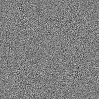

# Ruído branco

<table>
<tr style="border: 0;">
<td style="border: 0;" valign="top">

<table>
<tr style="border: 0;">
<td width="33.33%" style="border: 0;" valign="top">

{width="200px"}

<b>Entrada:</b> geradores de textura > Ruídos

</td>
<td width="100.00%" style="border: 0;" valign="top">

## Descrição

Gera um ruído branco usando um dos três métodos disponíveis para definir diferentes formas de histograma: uniforme, gaussiano e triângulo.

</td>
</tr>
</table>

## Saídas

|  |  |
| --- | --- |
| <b>Saída</b> *Tons de cinza* | O ruído gerado como bitmap em tons de cinza. |

## Parâmetros

|  |  |
| --- | --- |
| <b>Distribuição de ruído</b> Inteiro | O método de distribuição dos ingredientes para definir uma forma de histograma:<ul data-preserve-html="true"> <li data-preserve-html="true"><i>Uniforme:</i> Um histograma simples.</li> <li data-preserve-html="true"><i>Gaussiano:</i> um histograma que representa uma distribuição normal, semelhante a uma curva em forma de sino.</li> <li data-preserve-html="true"><i>Triângulo:</i> Um histograma triangular.</li> </ul> |
| <b>Desordem</b> Flutuante | Desloca os ingredientes do ruído.    Isso pode ser usado para animar o ruído. |
| <b>Velocidade do distúrbio</b> flutuante | Ajusta a distância de deslocamento aplicada pelo parâmetro <b>Desordem</b>.    Isso pode ser usado para controlar a velocidade de deslocamento ao animar o ruído. |

## Exemplos

<table>
<tr style="border: 0;">
<td style="border: 0;" valign="top">

{zoomable="yes"}

</td>
<td style="border: 0;" valign="top">

{zoomable="yes"}

</td>
</tr>
</table>

</td>
<td style="border: 0;" valign="top">

</td>
<td style="border: 0;" valign="top">

</td>
</tr>
</table>
