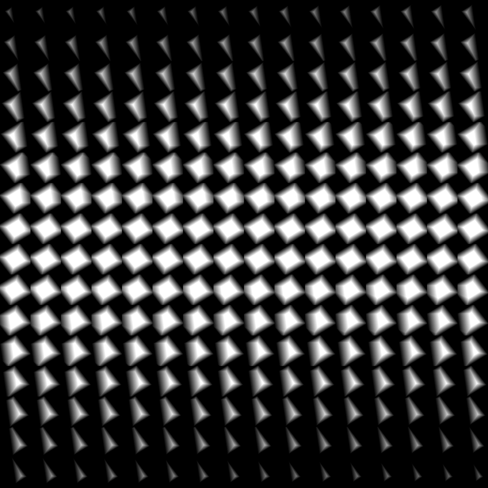

# Máscara de volume 3D

<table>
<tr style="border: 0;">
<td width="41.60%" style="border: 0;" valign="top">

{width="256px"}

**Entrada:** Gerador*/Padrão*

**Simples**

</td>
<td width="58.30%" style="border: 0;" valign="top">

## Descrição

O nó **Máscara de Volume 3D** gera uma representação de uma *forma primitiva* com base no mapa de entrada **Posição**.

</td>
</tr>
</table>

## Parâmetros

### Entradas

* **Posição** *Cor*\
  O mapa que descreve as *coordenadas de espaço 3D* nas quais a primitiva é representada.\
  As coordenadas **X/Y/Z** são mapeadas para os canais **R/G/B**, respectivamente.

### Parâmetros

* **Forma** *Inteiro*\
  A forma primitiva que deve ser representada:
  * *Cubo*- *Cilindro*- *Esfera*
* **Escala** *Flutuante*\
  Define a escala *global* da primitiva, aplicada *uniformemente* em todos os eixos.
* **Tamanho** *Flutuante3*\
  Define o tamanho da forma em cada eixo.
* **Entrada de Posição** *Inteiro*\
  O método de *representar espaço* através da entrada **Posição**:
  * *Posição UV*: use um *mapa UV*. As coordenadas X/Y (U/V) são mapeadas para os canais R/G, respectivamente. Presume-se que o eixo Z seja o vetor *ortogonal à frente*.
  * *Posição do espaço mundial*: use um *mapa de posições* para mapear a primitiva no espaço 3D. As coordenadas X/Y/Z são mapeadas para os canais R/G/B, respectivamente.
* **Posição UV** *Flutuante2*\
  A posição da primitiva no espaço UV.\
  *Observação*: este parâmetro só está disponível quando o parâmetro **Entrada de Posição** está definido como *Posição UV*.
* **Posição** *Flutuante3*\
  A posição da primitiva no espaço do mundo.\
  *Observação*: este parâmetro só está disponível quando o parâmetro **Entrada de Posição** está definido como *Posição do Espaço Mundial*.
* **Rotação** *Flutuante3*\
  Define a rotação da forma no espaço global.
* **Largura da Difusão** *Flutuante*\
  Ajusta a largura do *gradiente de atenuação* da superfície primitiva para dentro.

## Imagens de exemplo

<table>
<tr style="border: 0;">
<td style="border: 0;" valign="top">

{width="256px"}

</td>
<td style="border: 0;" valign="top">

{width="256px"}

</td>
<td style="border: 0;" valign="top">

{width="256px"}

</td>
<td style="border: 0;" valign="top">

{width="256px"}

</td>
</tr>
</table>
