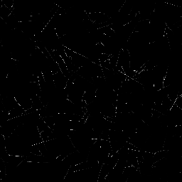

# Gerador de Scratches

<table>
<tr style="border: 0;">
<td width="33.33%" style="border: 0;" valign="top">

<b>Em:</b> Textura Geradores > Padrões

</td>
<td width="100.00%" style="border: 0;" valign="top">

## Descrição

Isso coloca riscos aleatórios com várias opções de personalização, por exemplo, permitindo definir a direção, a distribuição e a distorção.

Há uma versão especial de Scratches Generator, Scratches Generator Normal, que gera Normalmaps com base na profundidade desses arranhões. A maioria das opções é exatamente a mesma, mas ela tem alguns parâmetros extras claramente marcados para as configurações de Normal (veja abaixo).

</td>
</tr>
</table>

## Parâmetros

|  |  |
|:---|:---|
| <b>Número de Spline</b> <i>1 - 512</i> | Quantidade de arranhões (splines) para inserir. |
| <b>Máximo De Segmentos Por Spline</b> <i>2 - 256</i> | Quantidade de segmentos/subdivisões no comprimento de um rascunho. Leva a curvas e distorções mais suaves. O efeito é mais perceptível com valores de Distorção mais altos. |
| <b>Rotação de spline</b> <i>0.0 - 1.0</i> | Rotação uniforme de todos os splines, para orientá-los em uma direção. |
| <b>Rotação de spline aleatória</b> <i>0.0 - 1.0</i> | Variação de ângulo, gira aleatoriamente cada spline. |
| <b>Escala de spline</b> <i>0.0 - 1.0</i> | Dimensiona uniformemente todos os splines. |
| <b>Escala de spline aleatória</b> <i>0.0 - 1.0</i> | Dimensiona aleatoriamente cada spline individualmente. |
| <b>Distorção de spline</b> <i>0.0 - 1.0</i> | Nível de distorção uniforme em todas as linhas. |
| <b>Distorção de spline aleatória</b> <i>0.0 - 1.0</i> | Aleatório o nível de distorção de cada spline individualmente. |
| <b>Frequência de Distorção da spline</b> <i>0.0 - 1.0</i> | Define a frequência de distorção e controla a escala de detalhes da distorção. |
| <b>Largura da spline</b> <i>0.0 - 2.0</i> | Define a largura de todas as linhas uniformemente. |
| <b>Largura da spline aleatória</b> <i>0.0 - 1.0</i> | Dispõe aleatoriamente a largura da spline individualmente. |
| <b>Posição da spline aleatória</b> <i>0.0 - 1.0</i> | Dispõe aleatoriamente a posição de cada spline individualmente. Quanto menor esse valor, mais splines serão agrupadas no centro da tela. Pode ser usado para criar manchas de arranhões. |
| <b>Definir a largura da spline em px</b> <i>Falso/Verdadeiro</i> | Determina as unidades usadas para as configurações de largura da spline. |
| <b>Luminância aleatória (somente versão em tons de cinza)</b> <i>0.0 - 1.0</i> | Dispõe aleatoriamente a luminância de cada spline individualmente. |
| <b>Intensidade normal (somente versão normal)</b> <i>0.0 - 1.0</i> | Define a intensidade do efeito Normal para cada spline globalmente. |
| <b>Intensidade normal aleatória (somente versão normal)</b> <i>0.0 - 1.0</i> | Dispõe aleatoriamente a intensidade normal para cada spline individualmente. |
| <b>Formato normal (somente versão normal)</b> <i>DirectX, OpenGL</i> | Alterna entre diferentes formatos de Mapas Normais (inverte o canal verde). |
| <b>Modo de Atenuação</b> <i>Nenhum, Início, Fim, Início + Fim</i> | Define se e em que direção os splines desaparecem. |
| <b>Comprimento do fade</b> <i>0.0 - 1.0</i> | Define a duração do efeito de fade, se ativado acima. |
| <b>Expansão não quadrada</b> <i>Falso/Verdadeiro</i> | Permite a compensação de esmagamento e alongamento com proporções não quadradas. |

## Exemplos

<table style="margin-top: 32px; margin-bottom: 32px">
    <tr style="border: 0">
        <td style="border: 0; background: transparent">
            
        </td>
        <td style="border: 0; background: transparent">
            
        </td>
    </tr>
</table>
