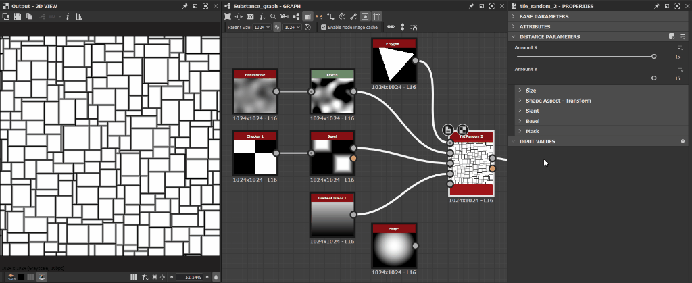

# Mosaico aleatório 2

<table>
<tr style="border: 0;">
<td width="41.60%" style="border: 0;" valign="top">

{width="200px"}

**Entrada:** *Geradores De Textura* */Padrões*

**Complexo**

</td>
<td width="58.30%" style="border: 0;" valign="top">

## Descrição

O nó **Bloco Aleatório 2** gera blocos adjacentes de tamanhos aleatórios e proporções de height para largura.

A grade pode ser ajustada ao *inclinar* aleatoriamente os lados das formas para quebrar os ângulos.

As formas podem ser ajustadas com opções de *dimensionamento*, *chanfro*, *arredondamento dos cantos*, bem como *rotação distorcida*.

Esses ajustes podem ser controlados por *mapas de entrada*.

Uma saída dedicada permite que você insira os **UVs** da forma em **Flood Fill para (...)** nós para aplicar a variação adicional.

</td>
</tr>
</table>

## Parâmetros

### Entradas

* **Mapa de Tamanho Aleatório** *Tons de Cinza*\
  A imagem de entrada em tons de cinza que controla a escala aleatória das formas.\
  Seu impacto é controlado pelo parâmetro **Multiplicador de Mapa de Entrada de Tamanho Aleatório**.
* **Mapa de Inclinação Aleatório** *Tons de Cinza* A imagem de entrada em tons de cinza que controla a inclinação aleatória das formas.\
  Seu impacto é controlado pelo parâmetro **Multiplicador de Mapa de Entrada Inclinado Aleatório**.
* **Mapa do Raio dos Cantos Arredondados** *Tons de Cinza*\
  A imagem de entrada em tons de cinza que controla o raio dos cantos arredondados das formas.\
  Seu impacto é controlado pelo **Mapa de Entrada do Raio dos Cantos Arredondados** parâmetro.
* **Mapa de distância de chanfro** *Tons de cinza*\
  A imagem de entrada em tons de cinza que controla o chanfro das formas.\
  Seu impacto é controlado pelo **Módulo de Mapa de Entrada de Distância de Chanfro.** parâmetro.
* **Mapa de máscaras** *Tons de cinza*\
  A imagem de entrada em tons de cinza que controla o mascaramento das formas.\
  Seu impacto é controlado pelos parâmetros **Início da Entrada do Mapa de Máscara** e **Fim da Entrada do Mapa de Máscara**.

### Parâmetros

* **Valor X** *Inteiro*\
  O número de células no eixo **X**.
* **Valor Y** *Inteiro*\
  O número de células no eixo **Y**.
* Tamanho
  * **Multiplicador de Tamanho Aleatório** *Flutuante*\
    Aplica um ajuste *global* à intensidade do dimensionamento aleatório.
  * **Multiplicador de Mapa de Entrada de Tamanho Aleatório** *Flutuante*\
    Ajusta a intensidade do dimensionamento aleatório usando os valores *amostrados* da entrada **Mapa de Tamanho Aleatório**.
  * **Tamanho Aleatório X** *Flutuante*\
    Ajusta a intensidade do dimensionamento aleatório no eixo **X** *somente*.
  * **Tamanho Aleatório Y** *Flutuante*\
    Ajusta a intensidade do dimensionamento aleatório no eixo **Y** *somente*.
  * **Distribuição de Tamanho Aleatório** *Inteiro*\
    Controla o método de distribuição de valores de dimensionamento aleatório:
    * *Uniforme*: a escala aleatória é aplicada da *mesma forma* em todas as células
    * *Ruído azul*: a escala aleatória é *ajustada* usando um padrão de ruído azul
* Forma - Transformar
  * **Thickness interstício** *Flutuante* Ajusta o thickness do espaço entre as formas. É *igual para todas as formas*.
  * **Multiplicador de Posição Aleatória** *Flutuante*\
    Aplica um deslocamento de posição aleatório à forma até ela *atingindo a borda da célula*.
  * **Raio dos cantos arredondados** *Flutuante* Ajusta o *raio* dos cantos arredondados das formas. Um valor de **0** significa que nenhum arredondamento foi aplicado.\
    *Observação*: este efeito não pode ser aplicado quando o parâmetro **Habilitar por Controle de Chanfro de Eixo** está definido como *True*.
  * **Mapa De Entrada Do Raio Dos Cantos Arredondados Mult.** *Flutuante* Ajusta a intensidade com que o mapa de entrada **Mapa do Raio dos Cantos Arredondados** afeta o raio dos cantos arredondados.\
    O mapa atua como um multiplicador de *por pixel* para o parâmetro **Raio dos cantos arredondados**.\
    *Observação*: este efeito não pode ser aplicado quando o parâmetro **Habilitar por Controle de Chanfro de Eixo** está definido como *True*.
  * **Multiplicador de Escala** *Flutuante*\
    Ajusta o tamanho de cada forma, como uma proporção da *área de sua célula*.
  * **Escala aleatória** *Flutuação* Ajusta a intensidade com que uma escala aleatória é aplicada a *cada* forma.
  * **Rotação** *Flutuar* Gira as formas em suas células movendo cada *canto* para seu *vizinho* ao longo da borda da célula.\
    Este método resulta em alguma quantidade de *distorção* e *dimensionamento* aplicados à forma em seus giros.
  * **Rotação aleatória** *Flutuação* Ajusta a intensidade com que uma quantidade aleatória de rotação é aplicada a cada forma.\
    O método de rotação está descrito no parâmetro **Rotação**.
  * **Posição dos cantos aleatória** *Flutuar* Distorce as formas aplicando um valor aleatório de *deslocamento* em cada um de seus *cantos* ao longo da borda da célula.
* Inclinar
  * **Multiplicador de inclinação aleatória** *Flutuante*\
    Aplica um ajuste *global* à intensidade da inclinação aleatória.
  * **Multiplicador de Mapa de Entrada Inclinado Aleatório** *Flutuante*\
    Ajusta a intensidade da inclinação aleatória usando os valores *amostrados* da entrada **Mapa de inclinação aleatória**.
  * **Inclinação Aleatória X** *Flutuante*\
    Ajusta a intensidade da inclinação aleatória\
    no eixo **X** *somente*.
  * **Inclinação aleatória Y** *Flutuante*\
    Ajusta a intensidade da inclinação aleatória\
    no eixo **Y** *somente*.
  * **Distribuição inclinada aleatória** *Inteiro*\
    Controla o método de distribuição de valores de inclinação aleatórios:
    * *Uniforme*: a inclinação aleatória é aplicada da *mesma maneira* em todas as células
    * *Ruído azul*: a inclinação aleatória é *ajustada* usando um padrão de ruído azul
* Chanfro
  * **Modo de distância de chanfro** *Inteiro*\
    Define o método de *aquisição da distância* pela qual as formas devem ser chanfradas:
    * *Em relação ao tamanho da grade*: as formas são chanfradas pela *proporção especificada de seu tamanho de grade*- *Em relação ao tamanho da forma*: as formas são chanfradas pela *proporção especificada de seu tamanho*
    * *Em relação ao tamanho da imagem*: as formas são chanfradas pela *proporção especificada da imagem*
  * **Multiplicador de Distância do Chanfro** *Flutuante*\
    Aplica um ajuste *global* à distância do chanfro.
  * **Mapa de Entrada de Distância de Chanfro Mult.** *Flutuante*\
    Ajusta a distância do chanfro usando o mapa de entrada **Mapa de distância de chanfro** como um multiplicador de *por pixel*.
  * **Curva arredondada chanfrada** *Flutuante*\
    Ajusta a intensidade do arredondamento aplicado ao ângulo de chanfro para torná-lo mais *convexo*.
  * **Habilitar Controle de Chanfro por Eixo** *Booleano*\
    Quando *Verdadeiro*, o chanfro pode ser aplicado e ajustado *separadamente* nos eixos **X** e **Y**.\
    *Observação*: este *cancela* o efeito **Cantos arredondados**.
  * **Distância Do Chanfro X** *Flutuante*\
    Ajusta a distância do chanfro no eixo **X** *somente*. Essa distância depende do valor do parâmetro **Modo de distância de chanfro**.\
    *Observação*: este parâmetro só está disponível quando o parâmetro **Habilitar por Controle de Chanfro de Eixo** está definido como *True*.
  * **Distância do chanfro Y** *Flutuante*\
    Ajusta a distância do chanfro no eixo **Y** *somente*. Essa distância depende do valor do parâmetro **Modo de distância de chanfro**.\
    *Observação*: este parâmetro só está disponível quando o parâmetro **Habilitar por Controle de Chanfro de Eixo** está definido como *True*.
* Máscara
  * **Inversão aleatório de máscara** *Booleano*\
    Inverte a máscara aleatória de formas.
  * **Início Aleatório da Máscara** *Flutuante*\
    Para uma determinada **Distribuição aleatória**, o mascaramento pseudoaleatório é aplicado seguindo uma *ordem específica* de uma forma inicial para uma forma final. Este parâmetro permite *deslocar o índice* da forma *inicial*.\
    *Observação*: determina um limite de *intervalo de valores* para mascaramento. Portanto, o valor pode ser *maior* do que o valor de **Fim aleatório da máscara**.
  * **Fim aleatório da máscara** *Flutuante* Para uma determinada **Distribuição aleatória**, o mascaramento pseudo-aleatório é aplicado seguindo uma *ordem específica* de uma forma inicial para uma forma final. Este parâmetro permite *deslocar o índice* da forma *fim*.\
    *Observação*: determina um limite de *intervalo de valores* para mascaramento. Portanto, o valor pode ser *maior* do que o valor de **Início aleatório da máscara**.
  * **Inverter máscara por área da célula** *Booleano*\
    Inverte o mascaramento de formas pela área de suas células.
  * **Início da Máscara por Área de Célula** *Flutuante*\
    Ajusta o limite mínimo de *1&rbrace; da área da célula para mascarar formas.*\
    *Observação*: determina um limite de *intervalo de valores* para mascaramento. Portanto, o valor pode ser *maior* do que o valor **Fim da Máscara por Área de Célula**.
  * **Fim da Máscara por Área de Célula** *Flutuante* Ajusta o *limite máximo* da área da célula para mascarar formas.\
    *Observação*: determina um limite de *intervalo de valores* para mascaramento. Portanto, o valor pode ser *menor* do que o valor **Início da Máscara por Área de Célula**.
  * **Inversão de entrada de mapa de máscara** *Booleano*\
    Inverte o mascaramento de formas pelo mapa de entrada **Mapa de máscaras**.
  * **Início da Entrada do Mapa de Máscaras** *Flutuante*\
    Ajusta o *valor mínimo de tons de cinza* no mapa de entrada **Mapa de Máscaras** para o mascaramento de formas.\
    *Observação*: determina um limite de *intervalo de valores* para mascaramento. Portanto, o valor pode ser *maior* do que o valor **Fim de entrada do mapa de máscaras**.
  * **Fim de entrada do mapa de máscaras** *Flutuante* Ajusta o *valor máximo em tons de cinza* no mapa de entrada **Mapa de máscaras** para formas de mascaramento.\
    *Observação*: determina um limite de *intervalo de valores* para mascaramento. Portanto, o valor pode ser *menor* do que o valor de **Início da Entrada do Mapa de Máscaras**.

## Imagens de exemplo

<table>
<tr style="border: 0;">
<td style="border: 0;" valign="top">

{width="256px"}

</td>
<td style="border: 0;" valign="top">

{width="256px"}

</td>
<td style="border: 0;" valign="top">

{width="256px"}

</td>
<td style="border: 0;" valign="top">

{width="512px"}

</td>
<td style="border: 0;" valign="top">

{width="512px"}

</td>
<td style="border: 0;" valign="top">

{width="512px"}

</td>
<td style="border: 0;" valign="top">

{width="340px"}

</td>
</tr>
</table>
