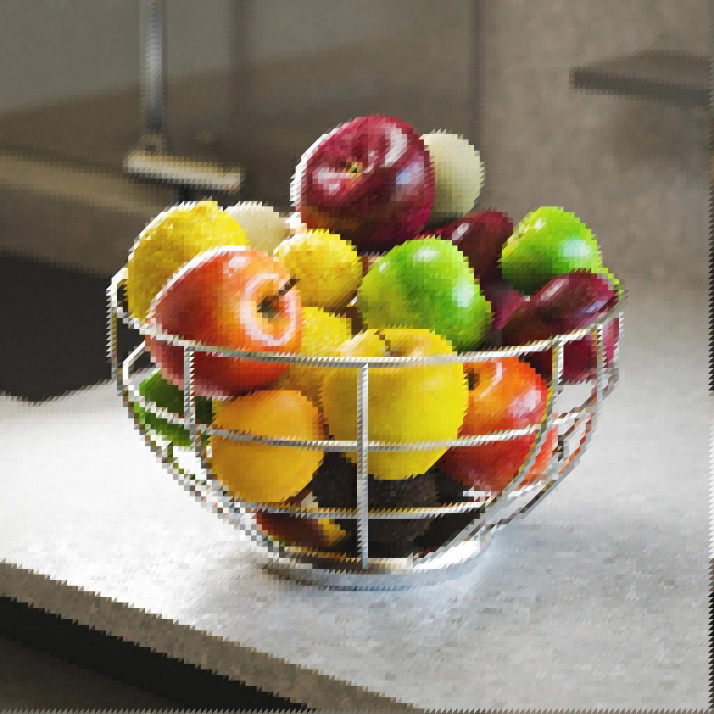

# Triangle Grid

<table>
<tr style="border: 0;">
<td width="41.60%" style="border: 0;" valign="top">

{width="200px"}

{width="200px"}

<b>Em:</b> Geradores De Textura > Padrões

</td>
<td width="58.30%" style="border: 0;" valign="top">

## Descrição

O nó **Triangle Grid** gera uma representação em tons de cinza de uma *superfície triangulada* de *vértices* no espaço 3D, usando uma projeção ortográfica em Z para baixo.

O parâmetro **Saída de cores** permite selecionar os dados usados para a representação, resultando em vários estilos visuais.\
As *posições* dos vértices podem ser ajustadas, o que afeta a malha gerada.

</td>
</tr>
</table>

<table>
<tr style="border: 0;">
<td style="border: 0;" valign="top">

</td>
<td style="border: 0;" valign="top">

### Conectores de saída

</td>
<td style="border: 0;" valign="top">

### Parâmetros

</td>
</tr>
</table>

## Conectores de entrada

|  |  |
| --- | --- |
| <b>Height</b> *Tons de cinza* PRIMÁRIO | A entrada da imagem em tons de cinza usada para mapear o *height* - isto é, a posição Z - dos vértices.    A influência dessa entrada é controlada pelo parâmetro &#39;Multiplicador de Entrada de Height&#39;. |
| <b>Mapa vetorial</b> *Cor* | A entrada da imagem colorida usada para mapear o *deslocamento* dos vértices nos eixos X e Y.    Os deslocamentos X/Y são mapeados para os canais R/G da imagem, respectivamente.    A influência dessa entrada é controlada pelo parâmetro &#39;Vetor Map Deslocamento&#39;. |
| <b>Entrada de cores</b> *Cor* | A entrada da imagem colorida usada para mapear a *cor* dos vértices, segmentos ou triângulos.    Essa entrada é usada quando o parâmetro &#39;Origem da cor&#39; é definido como &#39;Entrada da cor&#39;. |

## Conectores de saída

|  |  |
| --- | --- |
| <b>Saída</b> *Cor* | A imagem de saída. |

## Parâmetros

|  |  |
| --- | --- |
| <b>Saída de cores</b> *Inteiro* | O método de representação da superfície triangulada:<ul data-preserve-html="true"> <li data-preserve-html="true"><b>Por vértice:</b> uma cor é atribuída a cada vértice e interpolada pela superfície do triângulo</li> <li data-preserve-html="true"><b>Por Triângulo:</b> uma cor simples é atribuída a cada triângulo</li> <li data-preserve-html="true"><b>Linha Fina</b><b>:</b> aplica um contorno aos segmentos entre vértices</li> <li data-preserve-html="true"><b>Distância até a Borda</b><b>:</b> renderiza a distância até o segmento mais próximo em cada triângulo</li> <li data-preserve-html="true"><b>Centro</b><b>:</b> renderiza a distância normalizada para o baricentro de cada triângulo</li> </ul> |
| <b>Triangulação</b> *Inteiro* | Define o método de triangulação para a superfície, isto é, a qual *par de vértices opostos* em um &#39;quad&#39; deve ser conectado:<ul data-preserve-html="true"> <li data-preserve-html="true"><b>Automático:</b> seleciona automaticamente o par de vértices que resulta em triângulos <i>voltados para o menos longe</i> da câmera  <b>45°:</b> conecta vértices opostos que resultam em uma linha <i>girada em 45 graus</i> em relação ao eixo X-direito</li> <li data-preserve-html="true"><b>-45°:</b> conectar vértices opostos que resultam em uma linha <i>virada -45 graus</i> relativa ao eixo X-direito</li> <li data-preserve-html="true"><b>Quincux horizontal:</b> alterna a orientação da triangulação <i>em cada duas linhas</i> de vértices</li> <li data-preserve-html="true"><b>Quincux vertical:</b> alterna a orientação da triangulação <i>a cada duas colunas</i> de vértices  </li> </ul> |
| <b>Valor X</b> *Inteiro* | A quantidade de vértices gerados no eixo X. |
| <b>Valor Y</b> *Inteiro* | A quantidade de vértices gerados no eixo Y. |
| <b>Multiplicador de Posição Aleatória</b> *Flutuante* | Ajusta a intensidade do efeito de distorção principal. |
| <b>Posição Aleatória</b> *Flutuante2* | Ajusta a intensidade do deslocamento aleatório aplicado às posições X e Y de cada vértice, relativamente ao *tamanho de sua célula* na grade.   Este deslocamento *empilha* com os parâmetros <b>Deslocamento Quincux</b> e <b>Deslocamento de Mapa Vetorial</b>. |
| <b>Deslocamento de Mapas Vetoriais</b> *Flutuante* | Ajusta a quantidade *global* de deslocamento aplicada a cada vértice usando os valores *amostrados* da entrada <b>Mapa Vetorial</b>.    Este deslocamento *empilha* com os parâmetros <b>Posição aleatória</b> e <b>Deslocamento Quincux</b>. |
| <b>Deslocamento X De Quincux</b> *Flutuante* | Aplica a quantidade especificada de deslocamento a *todas as outras linhas* de vértices, relativamente ao *tamanho de sua célula* na grade.   Esta *pilha* de deslocamento com os parâmetros <b>Posição Aleatória</b> e <b>Deslocamento de Mapa Vetorial</b>. |
| <b>Deslocamento Quincux Y</b> *Flutuante* | Aplica o valor especificado de deslocamento a *todas as outras colunas* de vértices, relativamente ao *tamanho de sua célula* na grade.    Esta *pilha* de deslocamento com os parâmetros <b>Posição Aleatória</b> e <b>Deslocamento de Mapa Vetorial</b>. |
| <b>Rotação</b> *Flutuante* | Aplica a quantidade de rotação *especificada* a cada vértice em torno de sua *posição base*, ou seja, sua posição *antes* de deslocamento aleatório e deslocamento serem aplicados.    Esta rotação *empilha* com o parâmetro <b>Desordem de rotação</b>. |
| <b>Distúrbio de Rotação</b> *Flutuante* | Aplica uma quantidade de rotação *aleatória* a cada vértice em torno de sua *posição base* - isto é, sua posição *antes* de deslocamento aleatório e deslocamento serem aplicados.    Esta rotação *empilha* com o parâmetro <b>Rotação</b>. |
| <b>Multiplicador de Entrada de Height</b> *Flutuante* | Ajusta a posição Z de cada vértice usando os valores *amostrados* da entrada <b>Height</b>.    Este deslocamento *pilhas* com o parâmetro <b>Height Aleatório</b>. |
| <b>Height aleatório</b> *Flutuante* | Aplica um deslocamento aleatório à posição Z de cada vértice.  Este deslocamento *empilha* com o parâmetro <b>Multiplicador de Entrada de Height</b>. |
| <b>Modo de Mesclagem</b> *Inteiro* | Define o método de mesclagem dos valores de *triângulos sobrepostos*. O modo permite selecionar *qual* dos triângulos deve ser visível: <ul data-preserve-html="true"> <li data-preserve-html="true"><b>Mín:</b> texto</li> <li data-preserve-html="true"><b>Máx:</b> texto</li> <li data-preserve-html="true"><b>Teste de Profundidade</b>: Texto</li> <li data-preserve-html="true"><b>Mesclagem de Alpha:</b> texto</li> </ul>Observação: os modos de mesclagem disponíveis dependem do valor do parâmetro <b>Saída de cores</b>. |
| <b>Origem de cores</b> *Inteiro* *Disponível quando o parâmetro &#39;Color Output&#39; está definido como &#39;Per Vertex&#39;, &#39;Per Triangle&#39; ou &#39;Thin Line&#39;.* | Define o método de *aquisição da cor*, ou seja, luminância, que deve ser atribuído ao vértice, triângulo ou segmento, dependendo do modo selecionado de <b>Saída de cores</b>:<ul data-preserve-html="true"> <li data-preserve-html="true"><b>Height</b><b>:</b> use o height do vértice como luminância</li> <li data-preserve-html="true"><b>Aleatório</b><b>:</b> use um valor de luminância aleatório</li> <li data-preserve-html="true"><b>Entrada de cores</b><b>:</b> use o valor da amostra da entrada <b style="">Entrada de cores</b></li> </ul> |
| <b>Opacidade da Fonte de Cores</b> *Flutuante* *Disponível quando o parâmetro &#39;Color Output&#39; está definido como &#39;Thin Line&#39;.* | Controla a *substituição* do valor de <b>Cor da Linha</b> pelos valores resultantes da <b>Origem da Cor</b> selecionada.   Observação: quando esse valor é definido como 1, o parâmetro <b>Cor da Linha</b> não tem impacto. |
| <b>Distância até o Thickness de Borda</b> *Flutuante* *Disponível quando o parâmetro &#39;Color Output&#39; está definido como &#39;Distance to Edge&#39;.* | Define o thickness do gradiente de distância. Um valor mais baixo resulta em um gradiente *menor*. |
| <b>Cor da linha</b> *Flutuante/Flutuante4* *Disponível quando o parâmetro &#39;Color Output&#39; está definido como &#39;Thin Line&#39;.* | O valor de luminância dos segmentos.   Observação: quando o valor de <b>Opacidade da origem de cores</b> é definido como 1, esse parâmetro não tem impacto. |
| <b>Cor do plano de fundo</b> *Flutuante/Flutuante4* *Disponível quando o parâmetro &#39;Color Output&#39; está definido como &#39;Thin Line&#39;.* | O valor de luminância do fundo visível entre os segmentos.   Observação: quando o <b>Modo de Mesclagem</b> estiver definido como *Máx*, o plano de fundo substituirá os segmentos em que está *mais claro*, conforme esperado. |
| <b>Modo de Distribuição de Cores Aleatórias</b> *Inteiro* *Disponível quando o parâmetro &#39;Color Output&#39; está definido como &#39;Per Vertex&#39;, &#39;Per Triangle&#39; ou &#39;Thin Line&#39; e o parâmetro &#39;Color Source&#39; está definido como &#39;Random&#39;.* | O método de aquisição da semente utilizado na distribuição de cores pseudo-aleatórias:<ul data-preserve-html="true"> <li data-preserve-html="true"><b>Propagação Aleatória Global</b><b>:</b> herda a propagação do gráfico do nó</li> <li data-preserve-html="true"><b>Semente Manual</b><b>:</b> use uma semente discreta personalizada</li> </ul> |
| <b>Semente de Cor Aleatória</b> *Inteiro* *Disponível quando o parâmetro &#39;Random Color Seed Mode&#39; está definido como &#39;Manual Seed&#39; e o parâmetro &#39;Color Source&#39; está definido como &#39;Random&#39;.* | O valor de semente discreto usado na distribuição de cores pseudo-aleatória. |
| <b>Expansão não quadrada</b> *Booleano* | Permite a compensação de esmagamento e alongamento com proporções não quadradas. |

## Imagens de exemplo

<table>
<tr style="border: 0;">
<td style="border: 0;" valign="top">

{zoomable="yes"}

</td>
<td style="border: 0;" valign="top">

{zoomable="yes"}

</td>
<td style="border: 0;" valign="top">

{zoomable="yes"}

</td>
</tr>
</table>

<table>
<tr style="border: 0;">
<td style="border: 0;" valign="top">

{zoomable="yes"}

</td>
<td style="border: 0;" valign="top">

{zoomable="yes"}

</td>
<td style="border: 0;" valign="top">

{zoomable="yes"}

</td>
</tr>
</table>

<table>
<tr style="border: 0;">
<td style="border: 0;" valign="top">

{zoomable="yes"}

</td>
<td style="border: 0;" valign="top">

{zoomable="yes"}

</td>
</tr>
</table>
