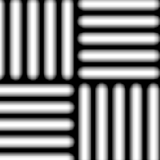

# Trança 1

<table>
<tr style="border: 0;">
<td style="border: 0;" valign="top">

{width="128px"}

## Trança 1

**Entrada:** *Geradores De Textura**/Padrões*

**Simples**

</td>
<td style="border: 0;" valign="top">

## Descrição

Gera um padrão de tecelagem simples.

## Parâmetros

* **Divisão em blocos gráficos**: *1 - 16*\
  Define a quantidade de vezes que o resultado deve ser colocado lado a lado.
* **Girar 45 Graus**: *Falso/Verdadeiro*
* **Expansão não quadrada**: *Falso/Verdadeiro*\
  Permite a compensação de esmagamento e alongamento com proporções não quadradas.

## Imagens de exemplo

</td>
</tr>
</table>
