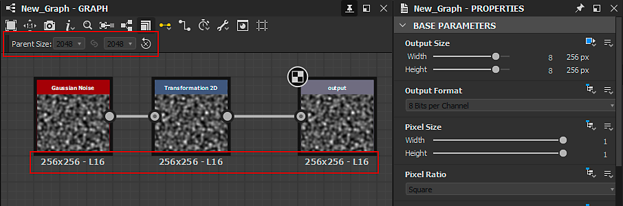

# Tamanho da saída

É o primeiro dos <b>parâmetros base</b> de um gráfico e, junto com o <b>Formato de saída</b> (ou profundidade de bits), é essencial entender bem, pois tem um grande impacto na saída de um gráfico, dentro do Designer e em outros aplicativos, como um arquivo de [ativos publicados do Substance 3D (SBSAR)](../publishing-asset-files/publishing-substance-3d-asset-files-sbsar.md).

>[!TIP]
>
> É altamente recomendável adquirir uma boa compreensão da [herança em gráficos de Substance](../../compositing-graphs/inheritance-compositing/inheritance-in-substance-compositing-graphs.md) como base para usar a propriedade Tamanho de Saída de forma eficiente.

>[!NOTE]
>
> Use o botão de bloqueio  para que o valor de Height *corresponda* ao valor de Largura.

<table>
<tr style="border: 0;">
<td width="100.00%" style="border: 0;" valign="top">

## Potência de 2 valores

O parâmetro Tamanho de saída determina a resolução da saída de *textura* por um gráfico ou nó.

Uma textura que é um objeto na computação gráfica vinculado por algumas restrições impostas pela maneira como o hardware de processamento gráfico executa seus cálculos. Uma dessas restrições é que a textura deve representar uma imagem cuja contagem de pixels em X e Y é uma *potência de dois*.

</td>
<td width="33.33%" style="border: 0;" valign="top">

| Potência de 2 | Pixels |
| --- | --- |
| 7 | 128 |
| 8 | 256 |
| 9 | 512 |
| 10 | 1024 |
| 11 | 2048 |
| 12 | 4096 |
| 13 | 8192 |

</td>
</tr>
</table>

A propriedade Tamanho de saída usa *etapas logarítmicas* para mapear facilmente aumentos de potência de dois (por exemplo, 256, 512, 1024, ...) em uma *escala linear* (por exemplo, 8, 9, 10, ...). Isso significa que aumentar ou diminuir o valor do Tamanho de saída em X ou Y em 1 é semelhante a multiplicar ou dividir a resolução atual por 2.

Isso também se aplica quando o valor do Tamanho de Saída é controlado por uma [função](../../function-graphs/function-graphs.md), na qual a função deve gerar os valores logarítmicos de destino (relativos ou absolutos) em vez da resolução de destino.

>[!IMPORTANT]
>
> O aumento ou a diminuição da resolução em X e Y multiplica ou divide a contagem de pixels por *4*, o que tem um impacto significativo no *desempenho* e na *área ocupada pela memória* de um gráfico.\
> Portanto, recomendamos usar a *resolução mais baixa* realmente necessária para obter o resultado desejado. Manter as resoluções sob controle é uma das muitas nossas [diretrizes de otimização de desempenho](../../best-practices/performance-optimization/performance-optimization-guidelines.md).

>[!NOTE]
>
> Em [Gráficos de função](../../function-graphs/function-graphs.md), as `$size` e `$sizelog2` [variáveis de sistema](../../function-graphs/variables/system-variables/system-variables.md) retornam um valor Float2 correspondente à resolução atual do nó ou gráfico como uma contagem de pixels brutos ou uma potência de dois, respectivamente.\
> Por exemplo, para uma imagem 1024\*512, `$size` retorna `(1024,512)` enquanto `$sizelog2` retorna `(10,9)`.

## Tamanho relativo

Quando a propriedade Tamanho de Saída usa um *Método de herança Relativo a...*, seu valor é expresso como um modificador *relativamente ao valor logarítmico herdado*.

Modificadores relativos à resolução herdada variam de -12 a +12 em uma escala logarítmica, com o padrão sendo 0. Isso significa que cada etapa acima ou abaixo resulta na duplicação ou na redução da resolução para a metade. A tabela à direita fornece um exemplo de como a resolução relativa é alterada em uma dimensão para um valor herdado de 9 (ou seja, 512 = 2^9) e 11 (ou seja, 2048 = 2^11):

Observe que, acima de 8196, o tamanho é *limitado*. Este limite é controlado pela configuração <b>Limite de Tamanho de Cozimento</b> na seção <b>Geral</b> das [Preferências](../../interface/preferences-window/preferences-window.md). Observe que trabalhar com resoluções muito grandes inclui um custo de desempenho proporcional e espaço de memória exponencial. Além disso, os limites no processamento gráfico limitam fortemente o tamanho máximo de uma textura.

| -5 | -4 | -3 | -2 | -1 | 0 | +1 | +2 | +3 | +4 | +5 |
| --- | --- | --- | --- | --- | --- | --- | --- | --- | --- | --- |
| 16 | 32 | 64 | 128 | 256 | <b>512</b> | 1024 | 2048 | 4096 | 8196 | 8196 |
| 64 | 128 | 256 | 512 | 1024 | <b>2048</b> | 4096 | 8196 | 8196 | 8196 | 8196 |

>[!NOTE]
>
> Abaixo de 16, a resolução está *não* limitada, mas não é recomendável diminuir, pois não há ganhos de desempenho abaixo desse limite. Pelo contrário, o desempenho na verdade *cai* devido à implementação específica do <b>mecanismo de Substance</b>. Portanto, use 16x16 como resolução mínima geral em gráficos de Substance.

## Alterar o método de herança

Na maioria dos casos, o [método de herança](../../compositing-graphs/inheritance-compositing/inheritance-in-substance-compositing-graphs.md) padrão para a propriedade Tamanho de Saída é o seguinte, dependendo do item:

* Gráfico: *Relativo ao pai*
* Nó: *Relativo à entrada* - os valores herdados pela [entrada Primária](../../compositing-graphs/inheritance-compositing/inheritance-in-substance-compositing-graphs.md) do nó são usados neste caso
* Nó [Bitmap](../../compositing-graphs/nodes-reference-for-com/atomic-nodes/bitmap/bitmap.md): *Absoluto* - consulte a página [Recurso de bitmap](../../resources/bitmap-resource/bitmap-resource.md) e as [diretrizes de otimização de desempenho](../../best-practices/performance-optimization/performance-optimization-guidelines.md) para saber por que isso ocorre

Exiba as propriedades de um nó ou gráfico clicando nesse item e, no painel [Propriedades](../../interface/properties/properties.md), localize a propriedade <b>Tamanho da Saída</b> na seção <b>Parâmetros base</b>. Clique no menu suspenso método de herança e selecione o método de herança desejado.

{width="512px"}

## Exemplos de problemas

Se você for um novo usuário do [Adobe Substance 3D Designer](https://www.adobe.com/br/products/substance3d-designer.html), poderá ter alguns problemas comuns. Listaremos alguns exemplos abaixo, juntamente com as soluções.

+++Problema 1
** Problema**

A configuração **Tamanho do Pai** está *esmaecida* e o gráfico usa uma resolução 256\*256 indesejada.

Nas propriedades do gráfico, o método de herança da propriedade Tamanho de Saída foi definido como *Absoluto*, o que interrompe a herança em favor de um valor arbitrário.

** Solução**

Defina o método de herança do Tamanho de saída do gráfico como *Relativo ao pai*.

+++

+++Problema 2
** Problema**

Acima, você verá um caso em que a saída de um gráfico resulta em uma resolução diferente (512\*512) da definida no pai (1024\* 1024), apesar do gráfico estar definido como *Em relação ao pai*.

O problema vem do nó [Bitmap](../../compositing-graphs/nodes-reference-for-com/atomic-nodes/bitmap/bitmap.md). O padrão é o método de herança *Absoluto*, selecionado 512\*512 como uma resolução baseada no [recurso de bitmap](../../resources/bitmap-resource/bitmap-resource.md). O nó conectado a ele é definido como *Relativo à entrada*, herdando assim seu Tamanho de Saída do nó Bitmap.

** Solução**

Defina o método de herança do Tamanho de Saída do nó Bitmap como *Relativo ao pai*, resolvendo o problema mais abaixo na cadeia.

+++

+++Problema 3
** Problema**

Acima, você verá um problema em que a resolução salta muito mais alto na metade da cadeia, resultando em uma resolução de saída muito mais alta do que a definida pelo pai.

O problema é causado por um modificador relativo de 3 no nó [Transformação 2D](../../compositing-graphs/nodes-reference-for-com/atomic-nodes/transformation-2d/transformation-2d.md), tornando a saída 8 vezes maior.

** Solução**

Defina os modificadores relativos de Largura e Height como 0, não levando a nenhum upscaling.

+++
