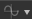

# Criar e editar uma função

## Criar uma função

Para criar uma função, basta clicar no ícone de função  e escolher “**Função Vazia**”.

## Editar uma função

Uma vez que uma função tenha sido criada, você pode modificá-la clicando no ícone da função novamente ou escolhendo Editar na lista suspensa.

Em seguida, você entrará no modo de função do gráfico.

## O gráfico de função

O gráfico de função funciona da mesma maneira que outros tipos de gráfico no Designer: com um editor de nó.

## Criar nós

Você pode criar nós clicando com o botão direito do mouse no gráfico e escolhendo “Adicionar elemento” ou pressionando a barra de espaço:

{width="600px"}

## Definir uma saída

Ao contrário do gráfico de Substance, a função não tem nó “Output”, você tem que especificar qual nó no gráfico é a saída da função.

Você pode definir uma saída clicando com o botão direito do mouse em um nó e escolhendo <b>”Definir como nó de saída”.</b>

O conjunto de nós como uma saída ficará amarelo.

>[!NOTE]
>
> **Tipo de saída**
> 
> O nó que você deseja definir como saída deve conter o mesmo tipo de valor que o parâmetro que controla. Caso contrário, a opção “Definir como nó de saída” ficará acinzentada.

>[!WARNING]
>
> Uma função deve ter uma saída para funcionar. Você verá um aviso em seu gráfico se sua função não tiver nenhum conjunto de saída.
