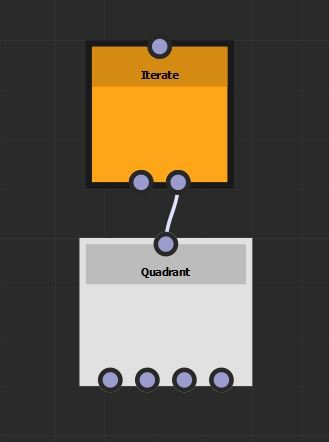

# Iterar e `$number` variável

O nó Iterar renderizará os nós conectados à saída direita durante o tempo especificado pelo valor de Iterações.

| 

 | 1 iteração: o padrão gaussiano é renderizado uma vez |
| --- | --- |
| 

 | 10 iterações: o padrão gaussiano é renderizado 10 vezes no mesmo local |

Ao usar um nó Iterar, você pode usar a variável `$number` para obter o valor de iteração atual. `$number` é um valor float e começa em 0.

<table>
<tr style="border: 0;">
<td style="border: 0;" valign="top">

{width="300px"}

</td>
<td style="border: 0;" valign="top">

{width="300px"}

</td>
</tr>
</table>

Esta função, definida no parâmetro Deslocamento de padrão, será executada 10 vezes, uma para cada padrão.

O primeiro padrão tem um valor `$number` igual a 0 e é renderizado na coordenada (0, 0). O segundo padrão tem um valor de `$number` igual a 1 e é renderizado na coordenada (0,1, 0) (1 x 0,1 = 0,1) e assim por diante para os próximos padrões.
