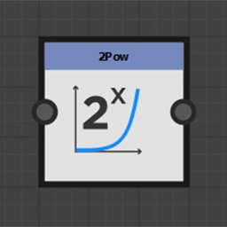
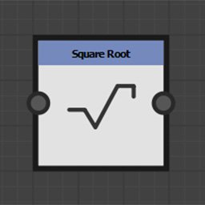
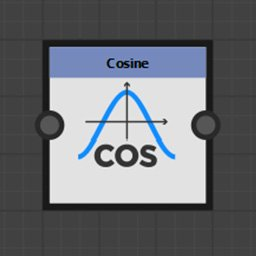

# Nós de função

Os nós de função transformam o valor de entrada de acordo com a função matemática que representam.

Embora seus conectores de entrada geralmente não sejam tipados, eles não suportam todos os tipos de valor.

## Lista de nós

+++Pot

Retorna a primeira entrada elevada à potência da segunda entrada: <b>X^Y</b>.

+++

+++2Pow

Retorna 2 à potência do valor de entrada: <b>2^X</b>.

+++

+++Raiz quadrada

Retorna a raiz quadrada de seu valor de entrada: <b> √X</b>.

+++

+++Exponencial

Retorna o valor exponencial de seu valor de entrada: <b>e^X</b>

<b>e</b> é aproximadamente igual a 2,7182818.

+++

+++Logaritmo

Retorna o logaritmo natural de seu valor de entrada: <b>ln(X)</b>.

+++

+++Logaritmo base 2

Retorna o logaritmo de base 2 de seu valor de entrada: <b>log2(X)</b>.

+++

+++Absoluto

Retorna o valor absoluto de sua entrada: <b>abs(X)</b>.

+++

+++Teto

Arredonda o valor de entrada para cima. Retorna o menor valor inteiro não menor que X: <b>ceil(X)</b>.

+++

+++Piso

Arredonda o valor de entrada para baixo. Retorna o maior valor inteiro não maior que X: <b>floor(X)</b>.

+++

+++Interpolação linear

Retorna a interpolação linear entre dois valores na função de um valor flutuante: <b>(1 - X)\*A + X\*B</b>.

+++

+++Mínimo

Retorna o menor dos dois valores de entrada: <b>min(A, B)</b>.

+++

+++Máximo

Retorna o maior dos dois valores de entrada: <b>max(A, B)</b>.

+++

+++Cosseno

Retorna o cosseno de seu valor de entrada em radianos: <b>cos(X)</b>.

+++

+++Seno

Retorna o seno de seu valor de entrada em radianos: <b>sin(X)</b>.

+++

+++Tangente

Retorna a tangente de seu valor de entrada em radianos: <b>tan(X)</b>.

+++

+++Tangente do arco 2

Retorna o ângulo entre o vetor 2D de entrada e a horizontal.

É o recíproco da função <b>Cartesiana</b>.

Não é necessário alternar o componente X e Y do vetor de entrada como na função <b>atan2</b> comum.

+++

+++Cartesiano

Converte coordenadas polares em coordenadas cartesianas.

É o recíproco da <b>função Arc tangent 2 </b>: <b>Comprimento \* Float2(cos(Angle), sin(Angle).</b>

Coordenadas polares são uma distância da origem e um ângulo em radianos da horizontal.

+++

+++Aleatória

Retorna um valor aleatório entre 0 e o valor de entrada <b>X</b>.

+++
