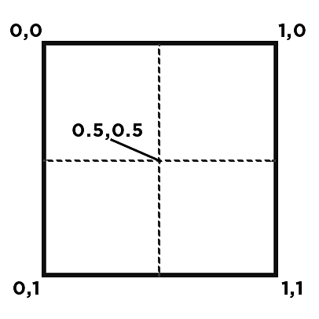

# Nós do Sampler

Estes nós obtêm uma amostra de um valor em uma imagem de entrada nas coordenadas 2D fornecidas:

<b>Cinza de Amostra</b> faz a amostragem de um valor de luminância na <b>Posição</b> de entrada em uma imagem em tons de cinza e o gera como um valor de <b>Flutuante</b>.

<b>Amostra de cor</b> faz a amostragem de um valor RGBA na entrada <b>Posição </b> em uma imagem colorida e a gera como um valor <b>Flutuante4</b>, em que os componentes R, G, B e A são mapeados para os componentes X, Y, Z e W, respectivamente.

<table>
<tr style="border: 0;">
<td width="100.00%" style="border: 0;" valign="top">

As coordenadas começam no canto superior esquerdo de uma entrada e variam entre 0 e 1 horizontal e verticalmente.

As posições fora deste intervalo são tratadas de acordo com o <b>Modo de endereçamento</b> selecionado (veja abaixo).

</td>
<td width="33.33%" style="border: 0;" valign="top">

</td>
</tr>
</table>

>[!NOTE]
>
> A entrada <b>Position</b> deve ser um valor Float2 em que as coordenadas X e Y da imagem são mapeadas para os componentes X e Y do valor, respectivamente

## Parâmetros

+++Imagem de entrada
Permite selecionar qual entrada de nó usar para amostragem.

A lista se adapta dinamicamente às entradas conectadas no momento. Isso significa que as entradas são adicionadas à medida que você conecta entradas de nó.

A numeração das entradas começa em 0, de modo que uma imagem conectada à primeira entrada do nó seja listada como *Imagem de entrada 0*.

+++

+++Modo de filtragem
Permite definir como tratar a interpolação quando os pixels da imagem de amostra não são mapeados exatamente para a imagem de saída, devido a diferenças de resolução.

<b>Mais Próximo</b>\
O pixel será mapeado para o destino *no estado em que se encontra* na coordenada correspondente. Se o destino for de resolução mais baixa, o pixel pode ser totalmente ignorado. Se o destino tiver uma resolução maior, ele será mapeado para todos os pixels que cubram sua extensão. A saída é *mais nítida* e terá uma aparência levemente *com alias*.

<b>Filtragem bilinear</b>\
Um processo de filtragem é aplicado à imagem de origem para que os pixels sejam mapeados para a resolução de destino de forma que *suavize* as transições entre pixels. A saída é *mais suave* e parecerá levemente *desfocada*.

+++

+++Modo de endereçamento
Controla como os valores de posição fora do intervalo [0;1] são tratados.

<b>Repetir</b>\
Executa um loop sobre o intervalo [0;1] à medida que o valor aumenta.\
Por exemplo: 3.4 é 0.4, -1.7 é 0.3.

<b>Restringir para Borda</b>\
Restringe valores fora do intervalo [0;1] para o limite mais próximo.\
Por exemplo: .3.4 é 1, -1.7 é 0.

+++
