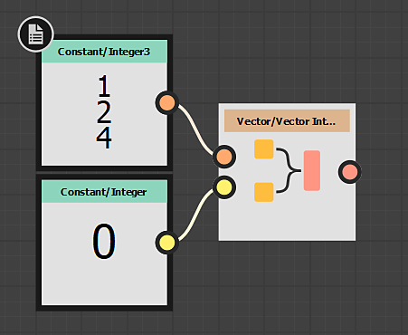

# Nós de vetor e de oscilação

Os nós de vetor e de oscilação permitem construir e desconstruir nós de vetor de e em componentes separados, respectivamente.Eles são semelhantes à [Mesclagem de RGBA](../../../../compositing-graphs/nodes-reference-for-com/node-library/filters/channels/rgba-merge/rgba-merge.md) e à [Divisão de RGBA](../../../../compositing-graphs/nodes-reference-for-com/node-library/filters/channels/rgba-split/rgba-split.md), mas depois para Gráficos de Função. Eles também são um método primo para conversão entre tipos de Dados de Vetor, pois [Converter](../../../../function-graphs/nodes-reference-for-fun/atomic-function-nodes/cast-nodes/cast-nodes.md)não é uma opção em muitos casos.

## Nós vetoriais

<table>
<tr style="border: 0;">
<td style="border: 0;" valign="top">

Os nós de vetor permitem combinar vetores ou elementos com menos componentes, em vetores com mais componentes. Há algumas regras ou limitações específicas para nós de vetor:

* Os Nós de Vetor têm **apenas duas entradas**, mesmo se o Vetor resultante tiver mais de 2 componentes.
* As Entradas de Vetor **não estão limitadas a um tipo**: elas podem receber qualquer componente menor como entrada.
* A ordem da saída do resultado é determinada pela **ordem das Entradas**.

Isso significa que os seguintes métodos são mais bem usados:

* Construa um vetor 4 de duas maneiras: conecte dois vetores de dois componentes ou conecte um vetor de um componente e um de três componentes.
* Se você deseja construir um Vetor de 3 ou 4 componentes a partir de um único Inteiro ou Precisão decimal, deve primeiro fazer pelo menos uma combinação de Vetor 2 antes de poder combiná-los em um Vetor de 3 componentes.

Pense bem sobre a ordem das conexões. A ordem de conexão das entradas é ilustrada abaixo.

{width="200px"}

Exemplo à Esquerda Conecta primeiro um Inteiro(1) e depois um Inteiro 3. O resultado é como abaixo

| Saída | X | Y | Z | L |
| --- | --- | --- | --- | --- |
| Entrada 1 | 0 |  |  |  |
| Entrada 2 |  | 1 | 2 | 4 |

{width="200px"}

O exemplo à esquerda troca as entradas em torno do primeiro exemplo, primeiro Inteiro 3, depois um Inteiro(1).

| Saída | X | Y | Z | L |
| --- | --- | --- | --- | --- |
| Entrada 1 | 1 | 2 | 4 |  |
| Entrada 2 |  |  |  | 0 |

</td>
<td style="border: 0;" valign="top">

| 

 | 

 | 

 |
| --- | --- | --- |
| **Inteiro2 vetorial** | **Inteiro Vetorial3** | **Inteiro vetorial4** |
| 

 | 

 | 

 |
| **Vetor flutuante 2** | **Vetor flutuante 3** | **Vetor flutuante 4** |

</td>
</tr>
</table>

## Nós do Swizzle

<table>
<tr style="border: 0;">
<td style="border: 0;" valign="top">

Os nós Swizzle desconstroem ou dividem componentes de vetores de vários componentes, permitindo que você utilize os componentes X, Y, Z e W individualmente, bem como trocá-los. As seguintes regras e limitações se aplicam:

* Os nós do assistente têm **somente uma saída**.
* Os Nós de Suspensão **obtêm qualquer entrada** do tipo correto (Int ou Float).

### Dividir componentes

O caso de uso mais comum para Swizzle é usá-lo para dividir componentes, como frenar um Integer4 em 4 inteiros individuais. As limitações significam que você precisará de quatro nós inteiros Swizzle separados para isso.

Qualquer outro tipo de divisão também é possível para um Inteiro4, como dois Inteiros2, ou um Inteiro e um Inteiro3, novamente tendo em mente que cada resultado precisa de seu próprio nó.

### Trocar/Alternar componentes

Como o nome sugere, o Crivo pode ser usado para alterar a ordem dos valores ou até mesmo substituir valores. Você pode alterar a ordem de X,Y,Z,W para W,Y,X,Z e pode alterar os valores de X,Y,Z,W para X,X,X,W, por exemplo.

</td>
<td style="border: 0;" valign="top">

| 

 | 

 | 

 | 

 |
| --- | --- | --- | --- |
| **Inteiro do Assistente** | **Suspiro** **Inteiro2** | **Suspiro** **Inteiro3** | **Suspiro** **Inteiro4** |
| 

 | 

 | 

 | 

 |
| **Suspiro** **Flutuante** | **Panorama** **Flutuante2** | **Panorama** **Flutuante3** | **Panorama** **Flutuante4** |

</td>
</tr>
</table>
