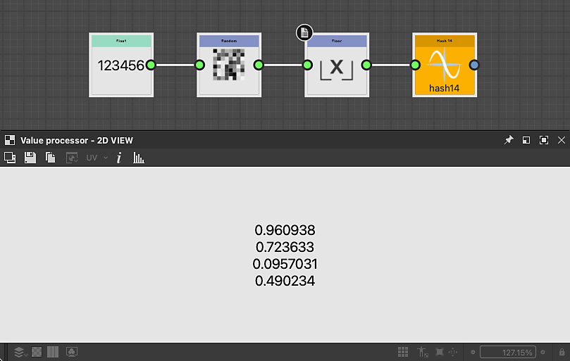

# Funções de hash

<table>
<tr style="border: 0;">
<td width="33.33%" style="border: 0;" valign="top">

{width="200px"}

<b>Em:</b> Funções > Aleatório

</td>
<td width="100.00%" style="border: 0;" valign="top">

## Descrição

Calcula um valor pseudo-aleatório entre 0 e 1, com base em um valor de entrada usado como uma semente.

O número no título mostra o tipo de valor de entrada e saída. Por exemplo: Hash 23 assume um valor float2 como entrada e gera um valor float3.

</td>
</tr>
</table>

Quando um nó Hash gera um valor de vários componentes, cada componente tem um valor pseudo-aleatório diferente.

Versões disponíveis, com seu tipo de entrada e tipo de saída:

<table>
<tr style="border: 0;">
<td style="border: 0;" valign="top">

<b>Hash 11:</b> Precisão decimal → Precisão decimal

<b>Hash 14:</b> Precisão decimal → Precisão decimal 4

<b>Hash 21:</b> Precisão decimal 2 → Precisão decimal

<b>Hash 22:</b> Precisão decimal2 → Precisão decimal2

</td>
<td style="border: 0;" valign="top">

<b>Hash 24:</b> Precisão decimal2 → Precisão decimal4

<b>Hash31:</b> Precisão decimal 3 → Precisão decimal

<b>Hash 32:</b> Precisão decimal3 → Precisão decimal2

</td>
</tr>
</table>

## Conectores de entrada

|  |  |
| --- | --- |
| <b>Entrada</b> | O valor usado como uma semente para calcular a saída pseudo-aleatória. |

## Exemplos

<table>
<tr style="border: 0;">
<td style="border: 0;" valign="top">

{zoomable="yes"}

</td>
<td style="border: 0;" valign="top">

{zoomable="yes"}

</td>
</tr>
</table>
