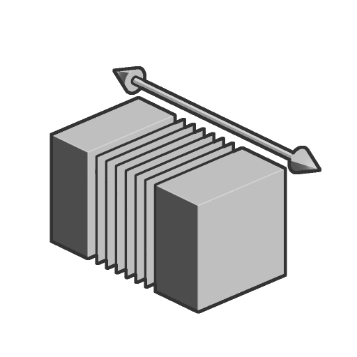

# Elongate

<table>
<tr style="border: 0;">
<td width="33.33%" style="border: 0;" valign="top">

<b>Em:</b> Função SDF > Transformar

</td>
<td width="100.00%" style="border: 0;" valign="top">

## Descrição

Alongar uma forma SDF de uma posição ajustável. De forma linear e eficaz, estende o volume de uma forma SDF começando com uma fatia ajustável.

</td>
</tr>
</table>

>[!INFO]
> 
> Para saber mais sobre conceitos e fluxos de trabalho que envolvem Funções SDF, acesse a página dedicada: [Trabalhando com Funções SDF](../../working-with-sdf-functions.md)

## Entradas

|  |  |
| :--- | :--- |
| <b>FDS</b> *Flutuante* | A forma SDF de entrada. |
| <b>Alongamento</b> *Flutuante3* | O comprimento do alongamento nos eixos X, Y, Z. |
| <b>Posição central</b> *Flutuante3* | A posição do espaço global a partir do qual a forma será alongada. Ou seja, a posição da fatia que está sendo alongada. |
| <b>P</b> *Flutuante3* | A posição do espaço mundial transformado. Use esta entrada para aplicar transformações adicionais usando os nós <b>Deslocamento P</b> e <b>Girar P</b>.  <i>Padrão: a posição do espaço mundial não transformado.</i> |
